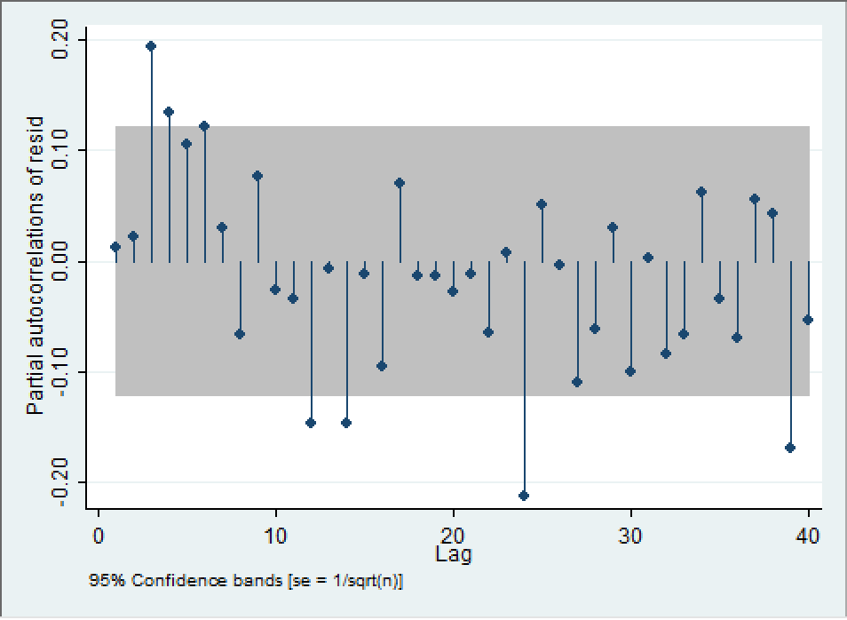

```{r, echo=FALSE, message= FALSE}
library(kableExtra)
library(tidyverse)
```

# Introduction
There are multiple factors that contribute to rises and declines in Nonfarm Employment in Florida. In that regard, this is an investigation on several factors and their proposed effects on the total number of nonfarm jobs in the Florida Job market. In this investigation, a list of variables from FRED (Federal Reserve Economic Database) will function as independent variables for the dependent variable of nonfarm jobs. These variables are: Civilian Labor Force in Florida (fl_lf), New Private Housing Units Authorized by Building Permits for Florida (fl_bp), US Employment Population Ratio: 25 - 54 years (us_epr25to54). All of these variables are monthly non-seasonally adjusted and require multiple modifications to build models that can actually display the significance in relationships between the variables. 

A new set of challenges arise in this analysis. Autocorrelation and Weak dependence now needed to be accounted for. Developing a dyamically complete model to represent the data is also valid, as this is the best case to produce a model that accounts for both deterministic and Autoregressive components of the data. The Breusch-Godfrey test comes in to play here for the testing of how dynamic this model is. 


# Part A 

1) Here is a model:
$$y_t = \alpha + \delta t + \rho y_{t-1} + \beta x_{t-1} + r_1 $$
$$y_t - y_{t-1} = (\alpha + \delta t + \rho y_{t-1} + \beta x_{t-1} + r_t) - (\alpha + \delta (t-1) + \rho y_{t-2} + \beta x_{t-2} + r_{t-1})$$
After Differencing:
$$\Delta y_t = \delta + \rho (y_{t-1} - y_{t-2}) + \beta (x_{t-1} - x_{t-2}) + (r_{t} - r_{t-1}) $$
$$\Delta y_t = \delta + \rho \Delta y_{t-1} + \beta \Delta x_{t-1} + \Delta r_{t}$$
2) The first difference of a new model is: 
$$\Delta y_t = \delta - \phi  + 2\phi t + \rho \Delta y_{t-1} + \beta \Delta x_{t-1} + \Delta r_t$$
The original Model of this difference is:
$$y_t = \delta t - \phi t + \phi (t^2 + 1) + \rho (y_{t-1}) + \beta (x_{t-1}) + r_t $$
This model exhibits an accelerating time trend. This would mean that differencing and accounting for lags would not entirely get rid of a time trend. A time trend would steal be required for the model to become stationary.

3) A new model has residuals that follow an AR(1) process. This model needs to be differenced. The original model is 
$$y_t = \alpha + \delta t + \rho y_{t-1} + \beta x_{t-1} + r_t$$
Where $r_t = \gamma r_{t-1} + \varepsilon_t$ and $\varepsilon_t$ is *ideally* white noise. Writing this dynamical model:
$$y_t = \alpha + \delta t + \rho y_{t-1} + \beta x_{t-1} + \gamma r_{t-1} + \varepsilon_t$$
This model in first differences: 
$$\Delta y_t = \rho \Delta y_{t-1} + \beta \Delta x_{t-1} + \gamma (\Delta y_{t-1} + \rho \Delta y_{t-2} + \beta \Delta x_{t-1} ) + \Delta \varepsilon_t$$

# Autocorrelograms and Partial Autocorrelograms
The entire list of variables involve nonfarm employment, the number of approved building permits, the labor force, and the prime employment rate (ages 25-54). These predictors could each have their own respective autocorrelations. This will try to be deduced with Autocorrelograms (ACs) and Partial Autocorrelograms (PACs).
```{r, echo = FALSE, out.width="55%", out.height="25%", fig.cap="Autocorrelograms of the variables", fig.show="hold", fig.align='center'}
knitr::include_graphics(c("AC_nonfarm.png", 
                          "AC_lf.png", 
                          "AC_bp.png", 
                          "AC_epr.png"))
```
\cleardoublepage
```{r, echo = FALSE, out.width="59%", out.height="25%", fig.cap="Partial Autocorrelograms of the variables", fig.show="hold", fig.align='center'}
knitr::include_graphics(c("PAC_nonfarm.png", 
                          "PAC_lf.png", 
                          "PAC_bp.png", 
                          "PAC_epr.png"))
```

Looking at the Autocorrelograms and Partial Autocorrelograms, it seems reasonable to assume that all of these variables are AR(1) processes since there is no sharp dropoff in correlation after the first few lags in the ACs. For each of these variables there still seems to be some statistical significance in the effects of multiple months ago on today. This can also be seen in the PAC as the effects of past months still have significance despite the effect of last month being removed. 

# Dickey-Fuller tests for unit roots
Seeing that there was some evidence of autocorrelation in the correlograms, the Dickey-Fuller test for unit roots will be conducted on each variable to see which lags may be relevant for this result to exist.

\cleardoublepage
|    | Test Statistic | 1% Critical Value | 5% Critical Value | 10% Critical Value |
|----|----------------|-------------------|-------------------|--------------------|
|Z(t)|    -3.447      |      -3.985       |     -3.425        |      -3.130        |
MacKinnon approximate p-value for Z(t) = 0.0455

|D.ln_fl_no~m| Coef. | Std. Err. | t | P>\|t\| | [95% Conf. Interval] |
|----|----------------|-------------------|-------------------|--------------------|
         L1. |  -.0125543 |  .0036426   | -3.45  |  0.001   | -.0197173   -.0053914
         LD. |  -.0016386 |  .0257588  |   -0.06 |   0.949 |    -.0522914    .0490143
        L2D. |  -.0081846 |  .0257419   | -0.32 |   0.751  |  -.0588042    .0424351
        L3D. |   .0107332 |  .0255801   |  0.42 |  0.675  |  -.0395683    .0610347
        L4D. |   .0024337 |  .0255626  |   0.10 |  0.924  |  -.0478334    .0527008
        L5D. |  -.0162627 |  .0255374  |   -0.64 |   0.525  |  -.0664801    .0339548
        L6D. |   .0476972 |  .0255517   |  1.87 |  0.063  |  -.0025484    .0979427
        L7D. |  -.0171747 |  .0255546   | -0.67 |  0.502  |  -.0674261    .0330768
        L8D. |  -.0153147 |  .0255342  |  -0.60 |  0.549  |  -.0655259    .0348964
        L9D. |  -.0053613 |   .025545 |   -0.21 |  0.834  |  -.0555938    .0448713
       L10D. |  -.0424083 |  .0255539 |   -1.66 |  0.098  |  -.0926583    .0078418
       L11D. |   .0264836 |  .0256701  |    1.03 | 0.303   |  -.023995    .0769621
       L12D. |   .8678931 |  .0257733  |   33.67 | 0.000  |   .8172116    .9185747
      _trend |   .0000185 |  5.42e-06   |  3.40 | 0.001    | 7.79e-06    .0000291
       _cons |   .1076319 |  .0312131   |  3.45 |  0.001  |   .0462536    .1690103
\begin{center}
Table 1. Dickey-Fuller Test for nonfarm employment
\end{center}


                           
|    | Test Statistic | 1% Critical Value | 5% Critical Value | 10% Critical Value |
|----|----------------|-------------------|-------------------|--------------------|
|Z(t)|     -1.768     |       -3.985      |       -3.425      |      -3.130        |
MacKinnon approximate p-value for Z(t) = 0.7197

|D.ln_fl_lf | Coef. | Std. Err. | t | P>\|t\| | [95% Conf. Interval] |
|----|----------------|-------------------|-------------------|--------------------|
         L1. |  -.0145241 |  .0082127  |  -1.77 |  0.078  |  -.0306738  - .0016256 |
         LD. |  -.0765454 |  .0440377  | -1.74  | 0.083   | -.1631424   -  .0100516 |
        L2D. |   .0235824 |  .0440775  |  0.54  | 0.593   |  -.063093   - .1102578 |
        L3D. |  -.0265862 |  .0440144  | -0.60  | 0.546   | -.1131374   - .0599651 |
        L4D. |  -.0107586 |  .0437954  | -0.25  | 0.806   | -.0968793  -  .0753621 |
        L5D. |  -.0938664 |  .0438477  | -2.14  | 0.033   | -.1800899 -  -.0076429 |
        L6D. |  -.1923623 |  .0437026  | -4.40  | 0.000   | -.2783005 -  -.1064242 |
        L7D. |  -.0659403 |  .0437567  | -1.51  | 0.133   | -.1519848   - .0201042 |
        L8D. |  -.0039238 |  .0431203  | -0.09  | 0.928   | -.0887169   - .0808694 |
        L9D. |  -.0651803 |  .0431157  | -1.51  | 0.131   | -.1499644   - .0196039 |
       L10D. |  -.0175563 |  .0432789  | -0.41  | 0.685   | -.1026614   - .0675488 |
       L11D. |   .0379697 |  .0432671  |  0.88  | 0.381   |  -.047112  -  .1230514 |
       L12D. |   .5274722 |  .0431257  | 12.23  | 0.000   |  .4426684 -   .612276  |
      _trend |   .0000183 |  .0000118  |  1.55  | 0.122  | -4.93e-06   -  .0000416 |
       _cons |   .2290598 |  .1284606  |  1.78  | 0.075  | -.0235491  - .4816686 |
\begin{center}
Table 2. Dickey-Fuller Test for labor force
\end{center}


\cleardoublepage

|    | Test Statistic | 1% Critical Value | 5% Critical Value | 10% Critical Value |
|----|----------------|-------------------|-------------------|--------------------|
| Z(t)|     -1.624    |      -3.985       |     -3.425        |       -3.130       |
MacKinnon approximate p-value for Z(t) = 0.7827


| D.ln_fl_bp   | Coef. | Std. Err. | t | P>\|t\| | [95% Conf. Interval] |
|----|----------------|-------------------|-------------------|--------------------|
         L1. |  -.0256093 |  .0157655  |  -1.62 |  0.105 |   -.0566148    .0053962
         LD. |  -.4892327  | .0536997   | -9.11 |  0.000 |   -.5948422   -.3836233
        L2D. |  -.1676299 |  .0597639   | -2.80 |  0.005 |   -.2851658    -.050094
        L3D. |   .0339165  | .0601481   |  0.56 |  0.573 |   -.0843749     .152208
        L4D. |    -.04808 |  .0603769   | -0.80 |  0.426 |   -.1668214    .0706614
        L5D. |  -.0291366  | .0603882   | -0.48 |  0.630 |   -.1479001     .089627
        L6D. |  -.0232757 |  .0601083   | -0.39 |  0.699 |   -.1414889    .0949375
        L7D. |  -.1033175  | .0599992   | -1.72 |  0.086 |   -.2213162    .0146811
        L8D. |  -.0443521 |  .0600408   | -0.74 |  0.461 |   -.1624323    .0737282
        L9D. |   .0357027 |   .059966   |  0.60 |  0.552 |   -.0822307     .153636
       L10D. |    .135494  | .0599421   |  2.26 |  0.024 |    .0176078    .2533802
       L11D. |   .0551154 |  .0593962   |  0.93 |  0.354 |   -.0616973    .1719282
       L12D. |   .2231371  | .0522915   |  4.27 |  0.000 |     .120297    .3259772
      _trend |   6.10e-06 |  .0000722   |  0.08 |  0.933 |   -.0001359    .0001481
       _cons |   .2330947  | .1500049   |  1.55 |  0.121 |   -.0619152    .5281046
\begin{center}
Table 3. Dickey-Fuller Test for Florida Building Permits
\end{center}


|    | Test Statistic | 1% Critical Value | 5% Critical Value | 10% Critical Value |
|----|----------------|-------------------|-------------------|--------------------|
|Z(t)|      -2.751    |      -3.985       |     -3.425        |       -3.130       |    
MacKinnon approximate p-value for Z(t) = 0.2154


D.ln_us_epr   | Coef. | Std. Err. | t | P>\|t\| | [95% Conf. Interval] |
|----|----------------|-------------------|-------------------|--------------------|
         L1. |  -.0191058 |  .0069443 |   -2.75 |  0.006  |  -.0327613   -.0054503
         LD. |   .0136959  |  .034809  |   0.39 |  0.694  |  -.0547537    .0821454
        L2D. |   .0390844 |  .0345956 |    1.13 |  0.259  |  -.0289454    .1071142
        L3D. |  -.1010787 |  .0344628  |  -2.93 |  0.004  |  -.1688474     -.03331
        L4D. |   .0568803 |  .0342825 |    1.66 |  0.098  |   -.010534    .1242945
        L5D. |    .009185  | .0343904  |   0.27 |  0.790  |  -.0584413    .0768113
        L6D. |  -.1049015 |  .0342864 |   -3.06 |  0.002  |  -.1723234   -.0374796
        L7D. |   .0106907  | .0340971 |    0.31 |  0.754  |  -.0563589    .0777403
        L8D. |   .0145465 |   .033832 |    0.43 |  0.667  |  -.0519818    .0810748
        L9D. |  -.0886587  | .0337554 |   -2.63 |  0.009  |  -.1550365   -.0222809
       L10D. |  -.0147671 |   .033599 |   -0.44 |  0.661  |  -.0808374    .0513031
       L11D. |   .0838082 |  .0335472 |    2.50 |  0.013  |   .0178399    .1497764
       L12D. |   .7299487 |  .0337793 |   21.61 |  0.000  |    .663524    .7963734
      _trend |  -2.84e-06 |  1.90e-06 |   -1.49 |  0.136  |  -6.59e-06    8.98e-07
       _cons |   .0792443 |  .0288557 |    2.75 |  0.006  |   .0225015    .1359871
\begin{center}
Table 4. Dickey-Fuller Test for prime-age employment
\end{center}
\cleardoublepage

For the null hypothesis, that there is no unit root ($\rho = 0$), all three of the predictor variables can have their null hypotheses rejected. These variables being (all log) the number of blueprint approval, the employment rate, and the size of the civilian labor force. The Dickey-Fuller test does not allow for the rejection of the null hypothesis for the nonfarm employment rate. For the former variables, this means that there is high evidence that the $\rho$ value is very close to 1 and that the series for each of these independent variables is non-stationary. It would seem that some differencing should be done in order to create a more stationary time 
series. 

# The Autoregressive Distributed Lag Model
In order to estimate a model that might be relevant to this analysis, there must be a dynamically complete model with stationarity and little to no autocorrelation. This model will involve a full cycle of lags (12 months, 1 year) as well as the 24th lag (two years). The same will be done with the other 3 variables and monthly indicators will be added along with a time trend. All of this will be done using just the past 20 years of data, since it is hard to believe that data from before then would be helpful now. All of this will be compared to the predictand of the differenced nonfarm employment.

Choosing this particular lag structure was due in particular to the intuition that a full year before can be relatively impactful on the results of this year. From looking at graphs in the first part of this investigation, it would also seem that there is not an accelerating time trend. Looking at this model should also help to prove that as well, since the time trend will no longer be needed and its significance would be lessened. The differencing of each of the independent variables is conducive in that it helps eliminate the effects of a time trend.

```{r, echo = FALSE, comment=NA, warning=FALSE}
mycolnames <- c(" ", "ln_nonfarm")

regression1 <- read_csv("ardl_full.csv", col_types = cols(), na = character()) %>%
  data.frame() %>% 
  noquote() %>% 
  kable(format = "latex", longtable = TRUE, caption = "Table 5. Autoregressive Distributed Lag Model") %>% 
  kable_styling(position = "center", latex_options = c("striped", "HOLD_position"))
regression1
```

As mentioned above, it looks like the time trend is no longer significant. This is mostly due to the fact that the differences done to the ARDL model account for the time trend and thus incorporate its significance. The model also shows that the months after may all have a small negative effect on the nonfarm employent in florida. One might assume that the significance of this time period is due to the tourist season starting for the summer, causing nonfarm employment to take a small dip toward the negative once the season is in full swing. The nonfarm employment of a full year ago and 2 full years ago are very significant in todays nonfarm employment. This could be because employment statistics are done every year and there is typically a drive to hire more to raise the employment rate. A PAC should help with further analysis.
\cleardoublepage
```{r, echo = FALSE, out.width="69%", out.height="30%", fig.cap="PAC of the residuals of the ARDL model", fig.show="hold", fig.align='center'}

```

The PAC of the residuals shows a slight pattern that persists through lags of the data. There is a high significance in the 24th lag, meaning that the results of two years ago might highly affect today. Just as seen when looking at the ARDL model. There might be serial correlation but there is not enough evidence to assume. To obtain the evidence, a Breusch Godfrey LM test for autocorrelation will be done.

# The Breusch-Godfrey LM Test for Autocorrelation

At this stage in this analytical development, a Breusch-Godfrey test is employed with up to 24 lags (2 full years) to see if there is a cumulative effect of the past lags that persist through time. The test is normally done with the simulation of a $\chi ^2$ Distribution that is then tested for the null hypothesis of no autocorrelation. Rejecting the null here would mean that the n-lags (cumulative) of the past effect the present day in a way that is significant.

This model was chosen as it seems to be a relatively parsimonious model that contains an entire cycle for all of the independent variables as well as the 1st, 12th, and 24th lag of the nonfarm employment. They also include the monthly indicators without the time trend. The time trend does not seem to be accelerating so the differencing of the model accounts for trend in the time series. This model also includes just the last 20 years since it is believable that any longer would skew the data, as the prime employment ( ages 25 to 54) would be well past prime after 20 years. 
\cleardoublepage

|    lags(p) |          chi2     |        df         |      Prob > chi2   |
|----|-------|-------------------|-------------------|--------------------|
       1     |          0.017    |           1        |      0.8960   
       2     |          0.044    |            2       |      0.9785 
       3     |          5.011   |            3        |      0.1710
       4     |          5.994    |           4        |      0.1996
       5     |          9.451     |          5        |      0.0924
       6     |         11.068      |         6        |      0.0863
       7     |         11.643     |          7        |      0.1129
       8     |         11.664     |          8        |      0.1668
       9     |         13.670     |          9        |      0.1346
      10     |         13.689     |         10        |      0.1876
      11     |         14.551     |         11        |      0.2040
      12     |         33.743     |         12        |      0.0007
      13     |         34.538     |         13        |      0.0010
      14     |         39.737     |         14        |      0.0003
      15     |         39.828     |         15        |      0.0005
      16     |         41.420     |         16        |      0.0005
      17     |         41.673     |         17        |      0.0007
      18     |         42.094     |         18        |      0.0011
      19     |         45.559     |         19        |      0.0006
      20     |         45.559     |         20        |      0.0009
      21     |         45.616     |         21        |      0.0014
      22     |         47.882     |         22        |      0.0011
      23     |         48.195     |         23        |      0.0016
      24     |         61.111     |         24        |      0.0000
\begin{center}
Table 6. Breusch-Godfrey Test for autocorrelation
\end{center}

The results of the Breusch Godfrey test are surprising. It would seem that the cumulative effect of the last 24 months are very significant on the nonfarm employment. This makes some sense, as very generally put, if the amount of building permits approved, civilian labor force, and employment rate all increased two years ago, it might be true that nonfarm employment would also increase since the infrastructure and workforce are already present and have not retired. It is also shown that the cumulative effects of the last 12 months are significant for most likely the same reason with every cumulative month measure in-between 12 and 24 also being significant. Autocorrelation persists despite additions to the model. Something else must be done.

# Newey-West Standard Errors
Despite all of the model additions there still seems to be some autocorrelation that exists in the model. This could likely be due to there being some relationship in the residuals not being accounted for, or maybe that the errors themselves are correlated with past versions of themselves. If this is the case, the coefficients found for any model with these parameters will not reflect the true relationship underlying the data. The autocorrelated errors will pick up some of the effects of other variables. 

Looking at the regression output from the most recent model, one can see that the standard errors for the variables seem to be eerily patterned. These errors seem to hover around the same number for successive lags. So it is very possible that there is, in fact, serially correlated standard errors. A solution to this particular problem comes in the form of robust standardized errors. Specifically here, Newey-West standard errors will be used to alleviate the effect of autocorrelation amongst the errors. 

To try to illustrate the effects, a very parsimonious model will be compared with a model using Newey-West standard errors. The PACs of their respective residuals will be shown below.
\cleardoublepage
```{r, echo = FALSE, out.width="49%", out.height="30%", fig.cap="Left: PAC without Newey West. Right: PAC with Newey-West", fig.show="hold", fig.align='center'}
knitr::include_graphics(c("WO-newey.png", "W-newey.png"))
```

Now the same graphics, but with the ARDL model from before:

```{r, echo = FALSE, out.width="49%", out.height="30%", fig.cap="Left: PAC without Newey West. Right: PAC with Newey-West", fig.show="hold", fig.align='center'}
knitr::include_graphics(c("WO-newey_ardl.png", "W-newey_ardl.png"))
```


# Conclusions
This investigation started with the evaluation of autocorrelation and weak dependence. It was shown that the different variables were autocorrelated with ACs and PACS and was concluded that differencing the data would prove instrumental in removing autocorrelation. The Dickey-Fuller test was then ran on each of the variables to test for the unit root hypothesis. For all of the Dickey-Fuller Tests, the null hypothesis, that there is no serial correlation, was rejected at the significance level of 5% for Lags 12. The null was rejected for other lags as well and a model was created from this information.

The model was an attempt at creating a dynamically complete Autoregressive Distributed Lag Model that included lags 1 through 12 as well as lag 24 for each of the independent variables. This model also included the lagged dependent variable, a time trend, and a monthly indicator. The results of this model were interesting, as it allowed for the removal of the time trend, showed a high RMSE, and developed a better understanding of how the errors might be autocorrelated. Since there was no accelerating trend, the time detrend in the model was no longer significant. The time trend, not being significant and being accounted for in the differenced and lagged model, was removed in the model used in the Breusch-Godfrey test. The high RMSE of this model shows decent promise, but it is most likely oerfitting to the data. Model selection is needed to be done to see if the model is overfit but it seems to be likely given that the RMSE is so low. The errors also showed a relatively unique but identifiable pattern in that all of the lagged standard errors of the independent variables remained around the same range. This property seemed to be worth further investigating to see if the errors were serially correlated.

The Breusch-Godfrey test was conducted to provide more proof that autocorrelation persisted through out many lags in the model. The test showed that the cumulative effects of the past 12 to the past 24 months are all significant to the present day. This is a surprising result as it means that the autocorrelation is absolutely present and it is effecting the data as far as two years out.

Seeing that the autocorrelation problem was not disappearing, the next step was to address the option that maybe the errors were serially correlated. This would mean that past errors, $\varepsilon_t$ have a high chance of affecting the present error, $\varepsilon _t$. Assuming there was serial correlation in the errors, Newey-West robust standard errors were applied to the model to hopefully identify and be rid of the serial correlation. PACs of the residuals were made comparing the models. The PAC of the residuals were the same for both models. It would seem that the errors were not serially correlated. It would seem that better model selection would need to be done in general. 

\cleardoublepage
# Appendix A: Clean Do-file

```{r, eval = FALSE}
clear 
set more off

* Importing the data
*cd "/Users/angelsarmiento/Documents/Graduate/First Year/Time Series/STATA/HW2"

import delimited "data.csv"

*Creating monthly time date
rename date datestring
gen datec=date(datestring,"YMD")
gen mdate=mofd(datec)
format mdate %tm
tsset mdate


*Converting all string values to Float. Ignoring NA values.
* ALL OF THESE VARIABLES WERE RENAMED IN R
destring fl_lf, replace ignore("NA")
destring fl_bp, replace ignore("NA")
destring us_epr_25to54, replace ignore("NA")

* Creating log versions of the variables 
gen ln_fl_nonfarm = ln(fl_nonfarm)
gen ln_fl_lf = ln(fl_lf)
gen ln_fl_bp = ln(fl_bp)
gen ln_us_epr = ln(us_epr_25to54)

*Finding the correlations of each variable with respect to a single time lag
cor ln_fl_nonfarm l1.ln_fl_nonfarm
cor ln_fl_lf l1.ln_fl_lf
cor ln_fl_bp l1.ln_fl_bp
cor ln_us_epr l1.ln_us_epr

*Looks like serial correlation to me 

*Autocorrelogram and PAC for each variable
ac ln_fl_nonfarm
pac ln_fl_nonfarm

ac ln_fl_lf
pac ln_fl_lf

ac ln_fl_bp
pac ln_fl_bp

ac ln_us_epr
pac ln_us_epr

*Dickey Fuller Test for each variable.
estimates clear
dfuller ln_fl_nonfarm if tin(1988m1, 2019m12), trend lags(12) regress
eststo dfuller_1
*esttab dfuller_1 using "dfuller_nonfarm.csv", replace

dfuller ln_fl_lf if tin(1988m1, 2019m12), trend lags(12) regress
eststo dfuller_2
*esttab dfuller_2 using "dfuller_lf.csv", replace

dfuller ln_fl_bp if tin(1988m1, 2019m12), trend lags(12) regress
eststo dfuller_3
*esttab dfuller_3 using "dfuller_bp.csv", replace

dfuller ln_us_epr if tin(1988m1, 2019m12), trend lags(12) regress
eststo dfuller_4
*esttab dfuller_4 using "dfuller_epr.csv", replace

esttab dfuller_* using "all_dfuller.csv", replace

generate month = month(mdate)

reg d.ln_fl_nonfarm l(1,12, 24)d.ln_fl_nonfarm l(1/12,24)d.ln_fl_lf l(1/12,24)d.ln_fl_bp l(1/12,24)d.ln_us_epr i.month mdate if tin(1998m1, 2019m11)
eststo ardl 
esttab ardl using "ardl.csv", replace
*PAc of the residuals
predict resid if e(sample)==1, residual 
pac resid


*Breusch Godfrey Test
reg d.ln_fl_nonfarm l(1,12,24)d.ln_fl_nonfarm l(1/12)d.ln_fl_lf l(1/12,24)d.ln_fl_bp l(1/12)d.ln_us_epr i.month if tin(1998m1, 2019m11)
estat bgodfrey, lag(1/24)
eststo bgodfrey_1
esttab bgodfrey_1 using "bgodfrey.csv", replace

predict resstatic, residual
pac resstatic


*model without Newey-West
reg d.ln_fl_nonfarm l(0/4)d.ln_fl_bp i.month
predict residua if e(sample)==1, residual 
pac residua

*Model with Newey West
newey d.ln_fl_nonfarm l(0/4)d.ln_fl_bp i.month, lag(4)
predict residu if e(sample)==1, residual 
pac residu


reg d.ln_fl_nonfarm l(1,12,24)d.ln_fl_nonfarm l(1/12)d.ln_fl_lf l(1/12,24)d.ln_fl_bp l(1/12)d.ln_us_epr i.month if tin(1998m1, 2019m11)
predict resid_ardl_wo if e(sample)==1, residual 
pac resid_ardl_wo

newey d.ln_fl_nonfarm l(1,12,24)d.ln_fl_nonfarm l(1/12)d.ln_fl_lf l(1/12,24)d.ln_fl_bp l(1/12)d.ln_us_epr i.month if tin(1998m1, 2019m11), lag(12)
predict resid_ardl if e(sample) ==1, residual
pac resid_ardl

```

\cleardoublepage
# Appendix B: Log File
```{eval = FALSE}
---------------------------------------------------------------------------------
      name:  <unnamed>
       log:  Y:\Documents\Graduate\First Year\Time Series\STATA\HW2\Log_1.smcl
  log type:  smcl
 opened on:  12 Feb 2020, 01:00:29

. do "C:\Users\ANGELS~1\AppData\Local\Temp\STD01000000.tmp"

. 
. clear 

. set more off

. 
. * Importing the data
. *cd "/Users/angelsarmiento/Documents/Graduate/First Year/Time Series/STATA/HW2"
. 
. import delimited "data.csv"
(6 vars, 971 obs)
. 
. *Creating monthly time date
. rename date datestring

. gen datec=date(datestring,"YMD")

. gen mdate=mofd(datec)

. format mdate %tm

. tsset mdate
        time variable:  mdate, 1939m1 to 2019m11
                delta:  1 month

. 
. 
. 
. *Converting all string values to Float. Ignoring NA values.
. * ALL OF THESE VARIABLES WERE RENAMED IN R
. destring fl_lf, replace ignore("NA")
fl_lf: characters N A removed; replaced as long
(444 missing values generated)

. destring fl_bp, replace ignore("NA")
fl_bp: characters N A removed; replaced as int
(588 missing values generated)

. destring us_epr_25to54, replace ignore("NA")
us_epr_25to54: characters N A removed; replaced as double
(108 missing values generated)

. 
. * Creating log versions of the variables 
. gen ln_fl_nonfarm = ln(fl_nonfarm)

. gen ln_fl_lf = ln(fl_lf)
(444 missing values generated)

. gen ln_fl_bp = ln(fl_bp)
(588 missing values generated)

. gen ln_us_epr = ln(us_epr_25to54)
(108 missing values generated)

. 
. *Finding the correlations of each variable with respect to a single time lag
. cor ln_fl_nonfarm l1.ln_fl_nonfarm
(obs=970)

             |                 L.
             | ln_fl_~m ln_fl_~m
-------------+------------------
ln_fl_nonf~m |
         --. |   1.0000
         L1. |   0.9999   1.0000


. cor ln_fl_lf l1.ln_fl_lf
(obs=526)

             |                 L.
             | ln_fl_lf ln_fl_lf
-------------+------------------
    ln_fl_lf |
         --. |   1.0000
         L1. |   0.9998   1.0000


. cor ln_fl_bp l1.ln_fl_bp
(obs=382)

             |                 L.
             | ln_fl_bp ln_fl_bp
-------------+------------------
    ln_fl_bp |
         --. |   1.0000
         L1. |   0.9478   1.0000


. cor ln_us_epr l1.ln_us_epr
(obs=862)

             |                 L.
             | ln_us_~r ln_us_~r
-------------+------------------
   ln_us_epr |
         --. |   1.0000
         L1. |   0.9820   1.0000


. 
. *Looks like serial correlation to me 
. 
. *Autocorrelogram and PAC for each variable
. ac ln_fl_nonfarm

. pac ln_fl_nonfarm

. 
. ac ln_fl_lf

. pac ln_fl_lf

. 
. ac ln_fl_bp

. pac ln_fl_bp

. 
. ac ln_us_epr

. pac ln_us_epr

. 
. *Dickey Fuller Test for each variable.
. estimates clear

. dfuller ln_fl_nonfarm if tin(1988m1, 2019m12), trend lags(12) regress

Augmented Dickey-Fuller test for unit root         Number of obs   =       383

                               ---------- Interpolated Dickey-Fuller ---------
                  Test         1% Critical       5% Critical      10% Critical
               Statistic           Value             Value             Value
------------------------------------------------------------------------------
 Z(t)             -3.447            -3.985            -3.425            -3.130
------------------------------------------------------------------------------
MacKinnon approximate p-value for Z(t) = 0.0455

------------------------------------------------------------------------------
D.ln_fl_no~m |      Coef.   Std. Err.      t    P>|t|     [95% Conf. Interval]
-------------+----------------------------------------------------------------
ln_fl_nonf~m |
         L1. |  -.0125543   .0036426    -3.45   0.001    -.0197173   -.0053914
         LD. |  -.0016386   .0257588    -0.06   0.949    -.0522914    .0490143
        L2D. |  -.0081846   .0257419    -0.32   0.751    -.0588042    .0424351
        L3D. |   .0107332   .0255801     0.42   0.675    -.0395683    .0610347
        L4D. |   .0024337   .0255626     0.10   0.924    -.0478334    .0527008
        L5D. |  -.0162627   .0255374    -0.64   0.525    -.0664801    .0339548
        L6D. |   .0476972   .0255517     1.87   0.063    -.0025484    .0979427
        L7D. |  -.0171747   .0255546    -0.67   0.502    -.0674261    .0330768
        L8D. |  -.0153147   .0255342    -0.60   0.549    -.0655259    .0348964
        L9D. |  -.0053613    .025545    -0.21   0.834    -.0555938    .0448713
       L10D. |  -.0424083   .0255539    -1.66   0.098    -.0926583    .0078418
       L11D. |   .0264836   .0256701     1.03   0.303     -.023995    .0769621
       L12D. |   .8678931   .0257733    33.67   0.000     .8172116    .9185747
      _trend |   .0000185   5.42e-06     3.40   0.001     7.79e-06    .0000291
       _cons |   .1076319   .0312131     3.45   0.001     .0462536    .1690103
------------------------------------------------------------------------------

. eststo dfuller_1

. *esttab dfuller_1 using "dfuller_nonfarm.csv", replace
. 
. dfuller ln_fl_lf if tin(1988m1, 2019m12), trend lags(12) regress

Augmented Dickey-Fuller test for unit root         Number of obs   =       383

                               ---------- Interpolated Dickey-Fuller ---------
                  Test         1% Critical       5% Critical      10% Critical
               Statistic           Value             Value             Value
------------------------------------------------------------------------------
 Z(t)             -1.768            -3.985            -3.425            -3.130
------------------------------------------------------------------------------
MacKinnon approximate p-value for Z(t) = 0.7197

------------------------------------------------------------------------------
D.ln_fl_lf   |      Coef.   Std. Err.      t    P>|t|     [95% Conf. Interval]
-------------+----------------------------------------------------------------
    ln_fl_lf |
         L1. |  -.0145241   .0082127    -1.77   0.078    -.0306738    .0016256
         LD. |  -.0765454   .0440377    -1.74   0.083    -.1631424    .0100516
        L2D. |   .0235824   .0440775     0.54   0.593     -.063093    .1102578
        L3D. |  -.0265862   .0440144    -0.60   0.546    -.1131374    .0599651
        L4D. |  -.0107586   .0437954    -0.25   0.806    -.0968793    .0753621
        L5D. |  -.0938664   .0438477    -2.14   0.033    -.1800899   -.0076429
        L6D. |  -.1923623   .0437026    -4.40   0.000    -.2783005   -.1064242
        L7D. |  -.0659403   .0437567    -1.51   0.133    -.1519848    .0201042
        L8D. |  -.0039238   .0431203    -0.09   0.928    -.0887169    .0808694
        L9D. |  -.0651803   .0431157    -1.51   0.131    -.1499644    .0196039
       L10D. |  -.0175563   .0432789    -0.41   0.685    -.1026614    .0675488
       L11D. |   .0379697   .0432671     0.88   0.381     -.047112    .1230514
       L12D. |   .5274722   .0431257    12.23   0.000     .4426684     .612276
      _trend |   .0000183   .0000118     1.55   0.122    -4.93e-06    .0000416
       _cons |   .2290598   .1284606     1.78   0.075    -.0235491    .4816686
------------------------------------------------------------------------------

. eststo dfuller_2

. *esttab dfuller_2 using "dfuller_lf.csv", replace
. 
. dfuller ln_fl_bp if tin(1988m1, 2019m12), trend lags(12) regress

Augmented Dickey-Fuller test for unit root         Number of obs   =       370

                               ---------- Interpolated Dickey-Fuller ---------
                  Test         1% Critical       5% Critical      10% Critical
               Statistic           Value             Value             Value
------------------------------------------------------------------------------
 Z(t)             -1.624            -3.985            -3.425            -3.130
------------------------------------------------------------------------------
MacKinnon approximate p-value for Z(t) = 0.7827

------------------------------------------------------------------------------
D.ln_fl_bp   |      Coef.   Std. Err.      t    P>|t|     [95% Conf. Interval]
-------------+----------------------------------------------------------------
    ln_fl_bp |
         L1. |  -.0256093   .0157655    -1.62   0.105    -.0566148    .0053962
         LD. |  -.4892327   .0536997    -9.11   0.000    -.5948422   -.3836233
        L2D. |  -.1676299   .0597639    -2.80   0.005    -.2851658    -.050094
        L3D. |   .0339165   .0601481     0.56   0.573    -.0843749     .152208
        L4D. |    -.04808   .0603769    -0.80   0.426    -.1668214    .0706614
        L5D. |  -.0291366   .0603882    -0.48   0.630    -.1479001     .089627
        L6D. |  -.0232757   .0601083    -0.39   0.699    -.1414889    .0949375
        L7D. |  -.1033175   .0599992    -1.72   0.086    -.2213162    .0146811
        L8D. |  -.0443521   .0600408    -0.74   0.461    -.1624323    .0737282
        L9D. |   .0357027    .059966     0.60   0.552    -.0822307     .153636
       L10D. |    .135494   .0599421     2.26   0.024     .0176078    .2533802
       L11D. |   .0551154   .0593962     0.93   0.354    -.0616973    .1719282
       L12D. |   .2231371   .0522915     4.27   0.000      .120297    .3259772
      _trend |   6.10e-06   .0000722     0.08   0.933    -.0001359    .0001481
       _cons |   .2330947   .1500049     1.55   0.121    -.0619152    .5281046
------------------------------------------------------------------------------

. eststo dfuller_3

. *esttab dfuller_3 using "dfuller_bp.csv", replace
. 
. dfuller ln_us_epr if tin(1988m1, 2019m12), trend lags(12) regress

Augmented Dickey-Fuller test for unit root         Number of obs   =       383

                               ---------- Interpolated Dickey-Fuller ---------
                  Test         1% Critical       5% Critical      10% Critical
               Statistic           Value             Value             Value
------------------------------------------------------------------------------
 Z(t)             -2.751            -3.985            -3.425            -3.130
------------------------------------------------------------------------------
MacKinnon approximate p-value for Z(t) = 0.2154

------------------------------------------------------------------------------
D.ln_us_epr  |      Coef.   Std. Err.      t    P>|t|     [95% Conf. Interval]
-------------+----------------------------------------------------------------
   ln_us_epr |
         L1. |  -.0191058   .0069443    -2.75   0.006    -.0327613   -.0054503
         LD. |   .0136959    .034809     0.39   0.694    -.0547537    .0821454
        L2D. |   .0390844   .0345956     1.13   0.259    -.0289454    .1071142
        L3D. |  -.1010787   .0344628    -2.93   0.004    -.1688474     -.03331
        L4D. |   .0568803   .0342825     1.66   0.098     -.010534    .1242945
        L5D. |    .009185   .0343904     0.27   0.790    -.0584413    .0768113
        L6D. |  -.1049015   .0342864    -3.06   0.002    -.1723234   -.0374796
        L7D. |   .0106907   .0340971     0.31   0.754    -.0563589    .0777403
        L8D. |   .0145465    .033832     0.43   0.667    -.0519818    .0810748
        L9D. |  -.0886587   .0337554    -2.63   0.009    -.1550365   -.0222809
       L10D. |  -.0147671    .033599    -0.44   0.661    -.0808374    .0513031
       L11D. |   .0838082   .0335472     2.50   0.013     .0178399    .1497764
       L12D. |   .7299487   .0337793    21.61   0.000      .663524    .7963734
      _trend |  -2.84e-06   1.90e-06    -1.49   0.136    -6.59e-06    8.98e-07
       _cons |   .0792443   .0288557     2.75   0.006     .0225015    .1359871
------------------------------------------------------------------------------

. eststo dfuller_4

. *esttab dfuller_4 using "dfuller_epr.csv", replace
. 
. esttab dfuller_* using "all_dfuller.csv", replace
(output written to all_dfuller.csv)

. 
. generate month = month(mdate)

. 
. reg d.ln_fl_nonfarm l(1,12, 24)d.ln_fl_nonfarm l(1/12,24)d.ln_fl_lf l(1/12,24)d
> .ln_fl_bp l(1/12,24)d.ln_us_epr i.month mdate if tin(1998m1, 2019m11)

      Source |       SS       df       MS              Number of obs =     263
-------------+------------------------------           F( 51,   211) =   29.76
       Model |  .021651496    51  .000424539           Prob > F      =  0.0000
    Residual |  .003009742   211  .000014264           R-squared     =  0.8780
-------------+------------------------------           Adj R-squared =  0.8485
       Total |  .024661238   262  .000094127           Root MSE      =  .00378

-------------------------------------------------------------------------------
D.            |
ln_fl_nonfarm |      Coef.   Std. Err.      t    P>|t|     [95% Conf. Interval]
--------------+----------------------------------------------------------------
ln_fl_nonfarm |
          LD. |  -.0926289   .0454177    -2.04   0.043    -.1821595   -.0030984
        L12D. |   .4439241   .0688348     6.45   0.000      .308232    .5796162
        L24D. |    .291822   .0638739     4.57   0.000     .1659093    .4177346
              |
     ln_fl_lf |
          LD. |  -.0556758    .115152    -0.48   0.629    -.2826715    .1713199
         L2D. |   -.057551   .1169958    -0.49   0.623    -.2881813    .1730794
         L3D. |   .1354078   .1177589     1.15   0.251    -.0967268    .3675424
         L4D. |  -.0342497   .1179634    -0.29   0.772    -.2667874     .198288
         L5D. |  -.2338712   .1189406    -1.97   0.051    -.4683354    .0005929
         L6D. |  -.0588163   .1152554    -0.51   0.610    -.2860159    .1683833
         L7D. |   .2287214   .1142333     2.00   0.047     .0035366    .4539061
         L8D. |  -.1067951   .1170737    -0.91   0.363     -.337579    .1239889
         L9D. |   .2547314   .1211662     2.10   0.037       .01588    .4935828
        L10D. |   .1270005    .118602     1.07   0.285    -.1067962    .3607972
        L11D. |  -.1307699   .1143857    -1.14   0.254    -.3562551    .0947152
        L12D. |  -.0083341   .1210023    -0.07   0.945    -.2468623    .2301941
        L24D. |   .0975144   .1260169     0.77   0.440     -.150899    .3459279
              |
     ln_fl_bp |
          LD. |   .0032259   .0019625     1.64   0.102    -.0006426    .0070945
         L2D. |   .0059268   .0023776     2.49   0.013     .0012399    .0106136
         L3D. |   .0036507   .0025365     1.44   0.152    -.0013493    .0086508
         L4D. |   .0045628   .0025887     1.76   0.079    -.0005403    .0096658
         L5D. |   .0047385   .0026375     1.80   0.074    -.0004608    .0099378
         L6D. |   .0020864   .0025827     0.81   0.420    -.0030048    .0071776
         L7D. |   .0050004    .002515     1.99   0.048     .0000427    .0099581
         L8D. |   .0051572   .0024943     2.07   0.040     .0002403    .0100741
         L9D. |   .0057232   .0024619     2.32   0.021     .0008701    .0105764
        L10D. |   .0047575   .0024956     1.91   0.058     -.000162     .009677
        L11D. |   .0055407   .0024112     2.30   0.023     .0007876    .0102938
        L12D. |   .0038981   .0020361     1.91   0.057    -.0001157    .0079119
        L24D. |  -.0025663   .0016539    -1.55   0.122    -.0058266    .0006939
              |
    ln_us_epr |
          LD. |  -.0127732   .1274416    -0.10   0.920    -.2639951    .2384488
         L2D. |    .076887   .1304395     0.59   0.556    -.1802445    .3340186
         L3D. |  -.2081819   .1346919    -1.55   0.124     -.473696    .0573322
         L4D. |  -.0293166   .1358049    -0.22   0.829    -.2970249    .2383916
         L5D. |   .4055814   .1416527     2.86   0.005     .1263455    .6848173
         L6D. |   .0825257    .140612     0.59   0.558    -.1946585      .35971
         L7D. |  -.3195117   .1225496    -2.61   0.010    -.5610903   -.0779332
         L8D. |   .2065095   .1296339     1.59   0.113    -.0490341     .462053
         L9D. |   -.309785   .1310277    -2.36   0.019    -.5680761   -.0514939
        L10D. |  -.2639625   .1254417    -2.10   0.037     -.511242    -.016683
        L11D. |   .1449821   .1213844     1.19   0.234    -.0942994    .3842636
        L12D. |   .0455053   .1452646     0.31   0.754    -.2408504    .3318611
        L24D. |   -.221349    .154407    -1.43   0.153     -.525727     .083029
              |
        month |
           5  |  -.0027484   .0014909    -1.84   0.067    -.0056874    .0001905
           6  |  -.0017019   .0020924    -0.81   0.417    -.0058266    .0024228
           7  |  -.0037321   .0028513    -1.31   0.192    -.0093528    .0018886
           8  |  -.0051651   .0037928    -1.36   0.175    -.0126417    .0023115
           9  |    -.00554   .0045092    -1.23   0.221    -.0144288    .0033488
          10  |  -.0060617   .0052786    -1.15   0.252    -.0164673    .0043439
          11  |  -.0080129   .0061866    -1.30   0.197    -.0202084    .0041825
          12  |  -.0087661   .0068832    -1.27   0.204    -.0223347    .0048026
              |
        mdate |   .0000352   .0000285     1.23   0.219     -.000021    .0000913
        _cons |  -.0160835    .013545    -1.19   0.236    -.0427844    .0106175
-------------------------------------------------------------------------------

. eststo ardl 

. esttab ardl using "ardl.csv", replace
(output written to ardl.csv)

. *PAc of the residuals
. predict resid if e(sample)==1, residual 
(708 missing values generated)

. pac resid

. 
. 
. *Breusch Godfrey Test
. reg d.ln_fl_nonfarm l(1,12,24)d.ln_fl_nonfarm l(1/12)d.ln_fl_lf l(1/12,24)d.ln_
> fl_bp l(1/12)d.ln_us_epr i.month if tin(1998m1, 2019m11)

      Source |       SS       df       MS              Number of obs =     263
-------------+------------------------------           F( 48,   214) =   31.43
       Model |  .021597452    48  .000449947           Prob > F      =  0.0000
    Residual |  .003063786   214  .000014317           R-squared     =  0.8758
-------------+------------------------------           Adj R-squared =  0.8479
       Total |  .024661238   262  .000094127           Root MSE      =  .00378

-------------------------------------------------------------------------------
D.            |
ln_fl_nonfarm |      Coef.   Std. Err.      t    P>|t|     [95% Conf. Interval]
--------------+----------------------------------------------------------------
ln_fl_nonfarm |
          LD. |  -.0928733   .0453482    -2.05   0.042    -.1822596    -.003487
        L12D. |   .4223739   .0676589     6.24   0.000     .2890106    .5557372
        L24D. |   .3119833   .0629607     4.96   0.000     .1878808    .4360858
              |
     ln_fl_lf |
          LD. |  -.0661962   .1146952    -0.58   0.564    -.2922732    .1598809
         L2D. |  -.0681369   .1169093    -0.58   0.561    -.2985781    .1623044
         L3D. |   .1024949   .1148005     0.89   0.373    -.1237897    .3287796
         L4D. |  -.0421614   .1169222    -0.36   0.719     -.272628    .1883051
         L5D. |  -.2229006   .1166555    -1.91   0.057    -.4528416    .0070404
         L6D. |  -.0602908   .1146018    -0.53   0.599    -.2861836    .1656021
         L7D. |   .2068269   .1135664     1.82   0.070     -.017025    .4306789
         L8D. |  -.0870709   .1144841    -0.76   0.448    -.3127318      .13859
         L9D. |   .2298264   .1184066     1.94   0.054    -.0035661    .4632189
        L10D. |   .1097941   .1181921     0.93   0.354    -.1231758     .342764
        L11D. |   -.116315   .1142516    -1.02   0.310    -.3415175    .1088876
        L12D. |   .0590175   .1105669     0.53   0.594    -.1589222    .2769573
              |
     ln_fl_bp |
          LD. |   .0032351   .0019349     1.67   0.096    -.0005788     .007049
         L2D. |   .0053535   .0023617     2.27   0.024     .0006982    .0100087
         L3D. |   .0030278   .0025087     1.21   0.229    -.0019172    .0079727
         L4D. |   .0035367   .0025383     1.39   0.165    -.0014666      .00854
         L5D. |    .004315   .0026309     1.64   0.102    -.0008709    .0095008
         L6D. |   .0020719    .002587     0.80   0.424    -.0030274    .0071712
         L7D. |   .0049716   .0025189     1.97   0.050     6.56e-06    .0099366
         L8D. |   .0053367   .0024953     2.14   0.034     .0004182    .0102553
         L9D. |   .0057484   .0024563     2.34   0.020     .0009067    .0105901
        L10D. |   .0053161   .0024826     2.14   0.033     .0004227    .0102096
        L11D. |   .0054666   .0023935     2.28   0.023     .0007488    .0101845
        L12D. |    .004315   .0020265     2.13   0.034     .0003205    .0083094
        L24D. |  -.0027936   .0016258    -1.72   0.087    -.0059982    .0004111
              |
    ln_us_epr |
          LD. |  -.0054782   .1273583    -0.04   0.966    -.2565156    .2455591
         L2D. |    .095191   .1299347     0.73   0.465    -.1609248    .3513068
         L3D. |  -.1588557   .1265068    -1.26   0.211    -.4082147    .0905032
         L4D. |  -.0286396   .1338505    -0.21   0.831    -.2924738    .2351947
         L5D. |   .4145147   .1405367     2.95   0.004     .1375012    .6915281
         L6D. |   .0994047   .1403424     0.71   0.480    -.1772257    .3760351
         L7D. |  -.3033355   .1223545    -2.48   0.014    -.5445099   -.0621611
         L8D. |   .1788148   .1279439     1.40   0.164    -.0733769    .4310065
         L9D. |  -.2775429   .1257502    -2.21   0.028    -.5254106   -.0296751
        L10D. |  -.2428093   .1247626    -1.95   0.053    -.4887304    .0031117
        L11D. |    .124513   .1198223     1.04   0.300    -.1116702    .3606961
        L12D. |  -.0987727   .1186935    -0.83   0.406    -.3327308    .1351853
              |
        month |
           5  |   -.001582   .0011789    -1.34   0.181    -.0039057    .0007416
           6  |   .0007852   .0010596     0.74   0.459    -.0013034    .0028737
           7  |  -.0005038   .0011228    -0.45   0.654     -.002717    .0017093
           8  |  -.0008509   .0015619    -0.54   0.586    -.0039295    .0022278
           9  |   .0002907   .0010806     0.27   0.788    -.0018393    .0024208
          10  |   .0003717   .0011274     0.33   0.742    -.0018505     .002594
          11  |  -.0005666   .0009844    -0.58   0.566     -.002507    .0013738
          12  |  -.0002873    .001148    -0.25   0.803    -.0025502    .0019756
              |
        _cons |   .0005494   .0010264     0.54   0.593    -.0014738    .0025726
-------------------------------------------------------------------------------

. estat bgodfrey, lag(1/24)

Breusch-Godfrey LM test for autocorrelation
---------------------------------------------------------------------------
    lags(p)  |          chi2               df                 Prob > chi2
-------------+-------------------------------------------------------------
       1     |          0.017               1                   0.8960
       2     |          0.044               2                   0.9785
       3     |          5.011               3                   0.1710
       4     |          5.994               4                   0.1996
       5     |          9.451               5                   0.0924
       6     |         11.068               6                   0.0863
       7     |         11.643               7                   0.1129
       8     |         11.664               8                   0.1668
       9     |         13.670               9                   0.1346
      10     |         13.689              10                   0.1876
      11     |         14.551              11                   0.2040
      12     |         33.743              12                   0.0007
      13     |         34.538              13                   0.0010
      14     |         39.737              14                   0.0003
      15     |         39.828              15                   0.0005
      16     |         41.420              16                   0.0005
      17     |         41.673              17                   0.0007
      18     |         42.094              18                   0.0011
      19     |         45.559              19                   0.0006
      20     |         45.559              20                   0.0009
      21     |         45.616              21                   0.0014
      22     |         47.882              22                   0.0011
      23     |         48.195              23                   0.0016
      24     |         61.111              24                   0.0000
---------------------------------------------------------------------------
                        H0: no serial correlation

. eststo bgodfrey_1

. esttab bgodfrey_1 using "bgodfrey.csv", replace
(output written to bgodfrey.csv)

. 
. predict resstatic, residual
(613 missing values generated)

. pac resstatic

. 
. 
. 
. *model without Newey-West
. reg d.ln_fl_nonfarm l(0/4)d.ln_fl_bp i.month

      Source |       SS       df       MS              Number of obs =     378
-------------+------------------------------           F( 16,   361) =    1.91
       Model |  .002991119    16  .000186945           Prob > F      =  0.0184
    Residual |  .035306536   361  .000097802           R-squared     =  0.0781
-------------+------------------------------           Adj R-squared =  0.0372
       Total |  .038297655   377  .000101585           Root MSE      =  .00989

------------------------------------------------------------------------------
D.           |
ln_fl_nonf~m |      Coef.   Std. Err.      t    P>|t|     [95% Conf. Interval]
-------------+----------------------------------------------------------------
    ln_fl_bp |
         D1. |  -.0066544   .0036826    -1.81   0.072    -.0138965    .0005876
         LD. |  -.0150368   .0042658    -3.52   0.000    -.0234257   -.0066478
        L2D. |  -.0022239   .0043553    -0.51   0.610    -.0107889    .0063411
        L3D. |  -.0047428   .0042394    -1.12   0.264    -.0130798    .0035943
        L4D. |  -.0051737   .0036904    -1.40   0.162     -.012431    .0020837
             |
       month |
          2  |   .0039464   .0025891     1.52   0.128    -.0011452     .009038
          3  |   .0034298   .0025192     1.36   0.174    -.0015245     .008384
          4  |   .0026387   .0025444     1.04   0.300     -.002365    .0076424
          5  |   .0010039   .0025208     0.40   0.691    -.0039535    .0059612
          6  |   .0032243   .0025626     1.26   0.209    -.0018152    .0082638
          7  |  -.0002813   .0025501    -0.11   0.912    -.0052962    .0047336
          8  |  -.0039087   .0025173    -1.55   0.121    -.0088591    .0010417
          9  |   .0030851   .0025761     1.20   0.232    -.0019809    .0081512
         10  |   .0033142   .0025302     1.31   0.191    -.0016615    .0082899
         11  |   .0026077   .0025458     1.02   0.306    -.0023988    .0076142
         12  |   .0027936    .002326     1.20   0.231    -.0017807    .0073678
             |
       _cons |  -.0002449   .0017829    -0.14   0.891    -.0037511    .0032612
------------------------------------------------------------------------------

. predict residua if e(sample)==1, residual 
(593 missing values generated)

. pac residua

. 
. *Model with Newey West
. newey d.ln_fl_nonfarm l(0/4)d.ln_fl_bp i.month, lag(4)

Regression with Newey-West standard errors          Number of obs  =       378
maximum lag: 4                                      F( 16,   361)  =      2.81
                                                    Prob > F       =    0.0003

------------------------------------------------------------------------------
D.           |             Newey-West
ln_fl_nonf~m |      Coef.   Std. Err.      t    P>|t|     [95% Conf. Interval]
-------------+----------------------------------------------------------------
    ln_fl_bp |
         D1. |  -.0066544   .0035887    -1.85   0.065    -.0137119     .000403
         LD. |  -.0150368   .0036394    -4.13   0.000    -.0221937   -.0078798
        L2D. |  -.0022239   .0043037    -0.52   0.606    -.0106873    .0062395
        L3D. |  -.0047428   .0048093    -0.99   0.325    -.0142005     .004715
        L4D. |  -.0051737   .0036142    -1.43   0.153    -.0122811    .0019338
             |
       month |
          2  |   .0039464   .0019473     2.03   0.043     .0001168    .0077759
          3  |   .0034298   .0019771     1.73   0.084    -.0004583    .0073179
          4  |   .0026387   .0018841     1.40   0.162    -.0010665    .0063438
          5  |   .0010039    .001854     0.54   0.589    -.0026421    .0046498
          6  |   .0032243   .0018456     1.75   0.081    -.0004052    .0068538
          7  |  -.0002813   .0021169    -0.13   0.894    -.0044442    .0038817
          8  |  -.0039087   .0023153    -1.69   0.092    -.0084619    .0006445
          9  |   .0030851   .0018231     1.69   0.091       -.0005    .0066703
         10  |   .0033142   .0018847     1.76   0.080    -.0003921    .0070205
         11  |   .0026077   .0018666     1.40   0.163     -.001063    .0062784
         12  |   .0027936   .0017302     1.61   0.107     -.000609    .0061962
             |
       _cons |  -.0002449   .0014652    -0.17   0.867    -.0031264    .0026365
------------------------------------------------------------------------------

. predict residu if e(sample)==1, residual 
(593 missing values generated)

. pac residu

. 
. 
. 
. reg d.ln_fl_nonfarm l(1,12,24)d.ln_fl_nonfarm l(1/12)d.ln_fl_lf l(1/12,24)d.ln_
> fl_bp l(1/12)d.ln_us_epr i.month if tin(1998m1, 2019m11)

      Source |       SS       df       MS              Number of obs =     263
-------------+------------------------------           F( 48,   214) =   31.43
       Model |  .021597452    48  .000449947           Prob > F      =  0.0000
    Residual |  .003063786   214  .000014317           R-squared     =  0.8758
-------------+------------------------------           Adj R-squared =  0.8479
       Total |  .024661238   262  .000094127           Root MSE      =  .00378

-------------------------------------------------------------------------------
D.            |
ln_fl_nonfarm |      Coef.   Std. Err.      t    P>|t|     [95% Conf. Interval]
--------------+----------------------------------------------------------------
ln_fl_nonfarm |
          LD. |  -.0928733   .0453482    -2.05   0.042    -.1822596    -.003487
        L12D. |   .4223739   .0676589     6.24   0.000     .2890106    .5557372
        L24D. |   .3119833   .0629607     4.96   0.000     .1878808    .4360858
              |
     ln_fl_lf |
          LD. |  -.0661962   .1146952    -0.58   0.564    -.2922732    .1598809
         L2D. |  -.0681369   .1169093    -0.58   0.561    -.2985781    .1623044
         L3D. |   .1024949   .1148005     0.89   0.373    -.1237897    .3287796
         L4D. |  -.0421614   .1169222    -0.36   0.719     -.272628    .1883051
         L5D. |  -.2229006   .1166555    -1.91   0.057    -.4528416    .0070404
         L6D. |  -.0602908   .1146018    -0.53   0.599    -.2861836    .1656021
         L7D. |   .2068269   .1135664     1.82   0.070     -.017025    .4306789
         L8D. |  -.0870709   .1144841    -0.76   0.448    -.3127318      .13859
         L9D. |   .2298264   .1184066     1.94   0.054    -.0035661    .4632189
        L10D. |   .1097941   .1181921     0.93   0.354    -.1231758     .342764
        L11D. |   -.116315   .1142516    -1.02   0.310    -.3415175    .1088876
        L12D. |   .0590175   .1105669     0.53   0.594    -.1589222    .2769573
              |
     ln_fl_bp |
          LD. |   .0032351   .0019349     1.67   0.096    -.0005788     .007049
         L2D. |   .0053535   .0023617     2.27   0.024     .0006982    .0100087
         L3D. |   .0030278   .0025087     1.21   0.229    -.0019172    .0079727
         L4D. |   .0035367   .0025383     1.39   0.165    -.0014666      .00854
         L5D. |    .004315   .0026309     1.64   0.102    -.0008709    .0095008
         L6D. |   .0020719    .002587     0.80   0.424    -.0030274    .0071712
         L7D. |   .0049716   .0025189     1.97   0.050     6.56e-06    .0099366
         L8D. |   .0053367   .0024953     2.14   0.034     .0004182    .0102553
         L9D. |   .0057484   .0024563     2.34   0.020     .0009067    .0105901
        L10D. |   .0053161   .0024826     2.14   0.033     .0004227    .0102096
        L11D. |   .0054666   .0023935     2.28   0.023     .0007488    .0101845
        L12D. |    .004315   .0020265     2.13   0.034     .0003205    .0083094
        L24D. |  -.0027936   .0016258    -1.72   0.087    -.0059982    .0004111
              |
    ln_us_epr |
          LD. |  -.0054782   .1273583    -0.04   0.966    -.2565156    .2455591
         L2D. |    .095191   .1299347     0.73   0.465    -.1609248    .3513068
         L3D. |  -.1588557   .1265068    -1.26   0.211    -.4082147    .0905032
         L4D. |  -.0286396   .1338505    -0.21   0.831    -.2924738    .2351947
         L5D. |   .4145147   .1405367     2.95   0.004     .1375012    .6915281
         L6D. |   .0994047   .1403424     0.71   0.480    -.1772257    .3760351
         L7D. |  -.3033355   .1223545    -2.48   0.014    -.5445099   -.0621611
         L8D. |   .1788148   .1279439     1.40   0.164    -.0733769    .4310065
         L9D. |  -.2775429   .1257502    -2.21   0.028    -.5254106   -.0296751
        L10D. |  -.2428093   .1247626    -1.95   0.053    -.4887304    .0031117
        L11D. |    .124513   .1198223     1.04   0.300    -.1116702    .3606961
        L12D. |  -.0987727   .1186935    -0.83   0.406    -.3327308    .1351853
              |
        month |
           5  |   -.001582   .0011789    -1.34   0.181    -.0039057    .0007416
           6  |   .0007852   .0010596     0.74   0.459    -.0013034    .0028737
           7  |  -.0005038   .0011228    -0.45   0.654     -.002717    .0017093
           8  |  -.0008509   .0015619    -0.54   0.586    -.0039295    .0022278
           9  |   .0002907   .0010806     0.27   0.788    -.0018393    .0024208
          10  |   .0003717   .0011274     0.33   0.742    -.0018505     .002594
          11  |  -.0005666   .0009844    -0.58   0.566     -.002507    .0013738
          12  |  -.0002873    .001148    -0.25   0.803    -.0025502    .0019756
              |
        _cons |   .0005494   .0010264     0.54   0.593    -.0014738    .0025726
-------------------------------------------------------------------------------

. predict resid_ardl_wo if e(sample)==1, residual 
(708 missing values generated)

. pac resid_ardl_wo

. 
. newey d.ln_fl_nonfarm l(1,12,24)d.ln_fl_nonfarm l(1/12)d.ln_fl_lf l(1/12,24)d.l
> n_fl_bp l(1/12)d.ln_us_epr i.month if tin(1998m1, 2019m11), lag(12)

Regression with Newey-West standard errors          Number of obs  =       263
maximum lag: 12                                     F( 48,   214)  =    268.04
                                                    Prob > F       =    0.0000

-------------------------------------------------------------------------------
D.            |             Newey-West
ln_fl_nonfarm |      Coef.   Std. Err.      t    P>|t|     [95% Conf. Interval]
--------------+----------------------------------------------------------------
ln_fl_nonfarm |
          LD. |  -.0928733   .0578079    -1.61   0.110    -.2068191    .0210725
        L12D. |   .4223739   .1450686     2.91   0.004     .1364277    .7083202
        L24D. |   .3119833   .1235832     2.52   0.012      .068387    .5555796
              |
     ln_fl_lf |
          LD. |  -.0661962   .0819303    -0.81   0.420      -.22769    .0952976
         L2D. |  -.0681369   .1112317    -0.61   0.541     -.287387    .1511133
         L3D. |   .1024949   .0975813     1.05   0.295    -.0898486    .2948385
         L4D. |  -.0421614   .0852443    -0.49   0.621    -.2101875    .1258646
         L5D. |  -.2229006   .1055979    -2.11   0.036    -.4310458   -.0147554
         L6D. |  -.0602908   .1250475    -0.48   0.630    -.3067733    .1861918
         L7D. |   .2068269   .1004729     2.06   0.041     .0087836    .4048703
         L8D. |  -.0870709   .1066424    -0.82   0.415    -.2972749    .1231331
         L9D. |   .2298264   .1569053     1.46   0.144    -.0794514    .5391043
        L10D. |   .1097941   .1092318     1.01   0.316     -.105514    .3251022
        L11D. |   -.116315   .1270997    -0.92   0.361    -.3668425    .1342126
        L12D. |   .0590175   .1021344     0.58   0.564    -.1423007    .2603358
              |
     ln_fl_bp |
          LD. |   .0032351   .0021398     1.51   0.132    -.0009828     .007453
         L2D. |   .0053535   .0023792     2.25   0.025     .0006639    .0100431
         L3D. |   .0030278   .0032706     0.93   0.356     -.003419    .0094745
         L4D. |   .0035367   .0034502     1.03   0.306    -.0032641    .0103374
         L5D. |    .004315   .0028928     1.49   0.137     -.001387    .0100169
         L6D. |   .0020719   .0028162     0.74   0.463    -.0034792     .007623
         L7D. |   .0049716    .003809     1.31   0.193    -.0025364    .0124795
         L8D. |   .0053367   .0028986     1.84   0.067    -.0003767    .0110502
         L9D. |   .0057484   .0027433     2.10   0.037     .0003411    .0111557
        L10D. |   .0053161   .0025564     2.08   0.039     .0002771    .0103552
        L11D. |   .0054666   .0022234     2.46   0.015     .0010841    .0098492
        L12D. |    .004315   .0013412     3.22   0.001     .0016713    .0069586
        L24D. |  -.0027936   .0019438    -1.44   0.152     -.006625    .0010379
              |
    ln_us_epr |
          LD. |  -.0054782   .1317183    -0.04   0.967    -.2651096    .2541531
         L2D. |    .095191   .1377321     0.69   0.490    -.1762942    .3666763
         L3D. |  -.1588557   .1078428    -1.47   0.142    -.3714259    .0537144
         L4D. |  -.0286396   .0958126    -0.30   0.765    -.2174968    .1602177
         L5D. |   .4145147   .1459318     2.84   0.005     .1268668    .7021626
         L6D. |   .0994047   .1547955     0.64   0.521    -.2057145    .4045238
         L7D. |  -.3033355   .1117579    -2.71   0.007    -.5236227   -.0830484
         L8D. |   .1788148   .1386088     1.29   0.198    -.0943986    .4520283
         L9D. |  -.2775429   .1730533    -1.60   0.110    -.6186502    .0635645
        L10D. |  -.2428093    .111921    -2.17   0.031    -.4634181   -.0222006
        L11D. |    .124513    .133401     0.93   0.352    -.1384352    .3874611
        L12D. |  -.0987727    .133744    -0.74   0.461    -.3623971    .1648516
              |
        month |
           5  |   -.001582   .0011209    -1.41   0.160    -.0037914    .0006274
           6  |   .0007852   .0009216     0.85   0.395    -.0010315    .0026018
           7  |  -.0005038   .0010542    -0.48   0.633    -.0025818    .0015742
           8  |  -.0008509   .0022665    -0.38   0.708    -.0053183    .0036166
           9  |   .0002907   .0011491     0.25   0.801    -.0019743    .0025557
          10  |   .0003717   .0009772     0.38   0.704    -.0015544    .0022979
          11  |  -.0005666    .000742    -0.76   0.446    -.0020291    .0008959
          12  |  -.0002873   .0007169    -0.40   0.689    -.0017004    .0011258
              |
        _cons |   .0005494   .0011513     0.48   0.634    -.0017199    .0028187
-------------------------------------------------------------------------------

. predict resid_ardl if e(sample) ==1, residual
(708 missing values generated)

. pac resid_ardl

. 
. 
. 
. 
. 
. 
end of do-file


```


