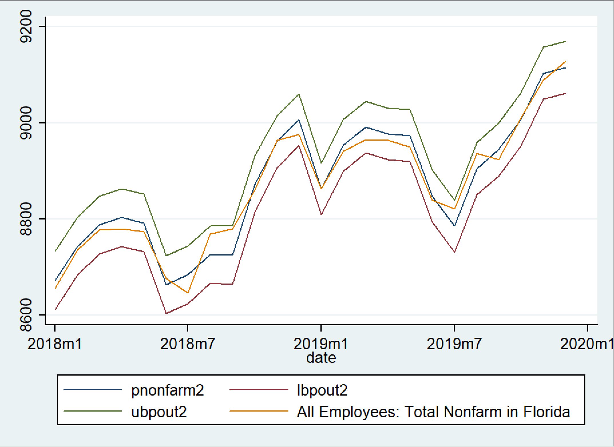

```{r setup, include=FALSE}
knitr::opts_chunk$set(echo = FALSE, comment = NA, message = FALSE, warning = FALSE, dev = 'pdf')
```

```{r}
#library Import
library(caret)
library(tidyverse)

library(patchwork)
library(kableExtra)
library(tsibble)

set.seed(23)
```

# Introduction

This investigation is a continuation of the previous one focused on model selection given multiple criteria. In this investigation, forecasting of nonfarm employment will be done after training the model of subsets of the data and finding the most important variables. The four models from the last investigation are used here for this purpose and compared with their respective out-of-sample RMSEs. After comparing these models, the predictions for actual nonfarm employment will be found, to demonstrate the predictive powers of the models.  

\qquad After model selection, naturally the next step is to generate point and interval forecasts of future data that is not found in the original data. By splitting the data into two subsets, this will be done to test the chosen models ability to predict values it has never "seen". With this idea, the point and interval forecasts are calculated for the entire year of 2019 to assess the model's out-of-sample predictive power. Once the model has been adequately tested, it will be used to predict values from 2020 and analysed from there. 


```{r}
#importing the data
data <- read_csv("data.csv") %>% na.omit() 

data <- data[order(data$DATE, decreasing = TRUE),]


data[3:6] <- log(data[3:6])
data[,1] <- NULL

colnames(data)[2:5] <- c("ln_fl_nonfarm", "ln_fl_lf", "ln_us_epr", "ln_fl_bp")

months <- yearmonth(data$DATE) %>% 
  format(format = "%m") %>% 
  as.factor()
data['months'] <- months

data2 <- data
```

# Model Selection

From the last investigation, four ARDL models were created with the intention of having the best possible fit to the data. Now, they will be repurposed for prediction. The four different models are as follows:

\begin{equation}
  \Delta y_{t} = \beta_0 + \sum\limits_{(a,l) = 0}^{12} \beta_a L_l \Delta y_{t-1} + \sum\limits_{b,k}^{12} \beta_b L_l \Delta X_{lf, t} + \sum\limits_{c,k}^{12} \beta_c L_l \Delta X_{bp, t} + \sum\limits_{d,k}^{12} \beta_d L_l \Delta X_{epr, t} + \beta_e X_m + DATE + \varepsilon_t 
\end{equation}

Where *DATE* is a time trend, $k = 0, 1, 2, 3, ... 12$, $l = 1, 2, 3, ... 12$, $m$ is the month from $1, 2, 3, ... 12$, and $L$ is the lag. 

\begin{equation}
\Delta y_{t} = \beta_0 + \sum\limits_{(a,l) = 0}^{12} \beta_a L_l \Delta y_{t-1} + \sum\limits_{b,k}^{2} \beta_b L_l \Delta X_{lf, t} + \sum\limits_{c,k}^{2} \beta_c L_l \Delta X_{bp, t} + \sum\limits_{d,k}^{2} \beta_d L_l \Delta X_{epr, t} + \beta_e X_m + DATE + \varepsilon_t 
\end{equation}

Where *DATE* is a time trend, $k = 0, 1, 2$, $l = 1, 2, 3, ... 12$, $m$ is the month from $1, 2, 3, ... 12$, and $L_l$ is the lag at value $l$ for prediction purposes. 

\begin{equation}
\Delta y_{t} = \beta_0 + \sum\limits_{(a,l) = 0}^{12} \beta_a L_l \Delta y_{t-1} + \sum\limits_{b,k}^{2, 12} \beta_b L_l \Delta X_{lf, t} + \sum\limits_{c,k}^{2, 12} \beta_c L_l \Delta X_{bp, t} + \sum\limits_{d,k}^{2, 12} \beta_d L_l \Delta X_{epr, t} + \beta_e X_m + DATE + \varepsilon_t
\end{equation}

Where *DATE* is a time trend, $k = 0, 1, 2\ or\ 12$, $l = 1, 2, 3, ... 12$, $m$ is the month from $1, 2, 3, ... 12$, and $L_l$ is the lag at value $l$ for prediction purposes. 
\begin{equation}
\Delta y_{t} = \beta_0 + \sum\limits_{(a,l) = 0}^{12, 24} \beta_a L_l \Delta y_{t-1} + \sum\limits_{b,k}^{2, 12, 24} \beta_b L_l \Delta X_{lf, t} + \sum\limits_{c,k}^{2, 12, 24} \beta_c L_l \Delta X_{bp, t} + \sum\limits_{d,k}^{2, 12, 24} \beta_d L_l \Delta X_{epr, t} + \beta_e X_m + \varepsilon_t
\end{equation}

```{r}
#Making the four different models
#creating a new dataframe 
#FIRST MODEL
data['d.nonfarm'] <- difference(data$ln_fl_nonfarm, differences = 1)
data['d.nonfarm_lag'] <- difference(data$ln_fl_nonfarm, lag = 12, difference = 1)
data['d.lf_lag'] <- difference(data$ln_fl_lf, lag = 12, differences = 1) 
data['d.fl_bp_lag'] <- difference(data$ln_fl_bp, lag = 12, differences = 1)
data['d.usepr'] <- difference(data$ln_us_epr, lag = 12, differences = 1) 
```

```{r, warning = FALSE}
#LOOCV
model_1 <- train(d.nonfarm ~ d.nonfarm_lag + d.lf_lag + d.fl_bp_lag + d.usepr + months + DATE, 
                 na.action = na.exclude, 
                 data = data,
                 trControl = trainControl(method = "LOOCV"),
                 method = "lm")

#writing results to final table
final_results <- rbind(model_1$results)


```

```{r, warning = FALSE}
#SECOND MODEL
#changing the lag structure
data['d.lf_lag_2'] <- difference(data$ln_fl_lf, lag = 2, differences = 1) 
data['d.fl_bp_lag_2'] <- difference(data$ln_fl_bp, lag = 2, differences = 1)
data['d.usepr_2'] <- difference(data$ln_us_epr, lag = 2, differences = 1) 


model_2 <- train(d.nonfarm ~ d.nonfarm_lag + d.lf_lag_2 + d.fl_bp_lag_2 + d.usepr_2 + months + DATE, 
                 na.action = na.exclude, 
                 data = data,
                 trControl = trainControl(method = "LOOCV"),
                 method = "lm")

final_results <- rbind(final_results, model_2$results)

```

```{r, warning = FALSE}
#THIRD MODEL
data['d.lf_lag_2'] <- difference(data$ln_fl_lf, lag = 2, differences = 1) 
data['d.lf_lag_12'] <- difference(data$ln_fl_lf, lag = 12, differences = 1)
data['d.fl_bp_lag_2'] <- difference(data$ln_fl_bp, lag = 2, differences = 1)
data['d.fl_bp_12'] <- difference(data$ln_fl_bp, lag = 12, differences = 1)
data['d.usepr_2'] <- difference(data$ln_us_epr, lag = 2, differences = 1) 
data['d.usepr_12'] <- difference(data$ln_us_epr, lag = 12, differences = 1)

#LOOCV
model_3 <- train(d.nonfarm ~ d.nonfarm_lag + d.lf_lag_2 + d.lf_lag_12 + d.fl_bp_lag_2 + d.fl_bp_12 + d.usepr_12 + d.usepr_2 + months + DATE, 
                 na.action = na.exclude, 
                 data = data,
                 trControl = trainControl(method = "LOOCV"),
                 method = "lm")

#writing results to final table

final_results <- rbind(final_results, model_3$results)
```

```{r, warning = FALSE}
#FOURTH MODEL
data['d.nonfarm_lag_24'] <- difference(data$ln_fl_nonfarm, lag = 24, difference = 1)
data['d.lf_lag_2'] <- difference(data$ln_fl_lf, lag = 2, differences = 1) 
data['d.lf_lag_12'] <- difference(data$ln_fl_lf, lag = 12, differences = 1)
data['d.lf_lag_24'] <- difference(data$ln_fl_lf, lag = 24, differences = 1)
data['d.fl_bp_lag_2'] <- difference(data$ln_fl_bp, lag = 2, differences = 1)
data['d.fl_bp_12'] <- difference(data$ln_fl_bp, lag = 12, differences = 1)
data['d.fl_bp_24'] <- difference(data$ln_fl_bp, lag = 24, differences = 1)
data['d.usepr_2'] <- difference(data$ln_us_epr, lag = 2, differences = 1) 
data['d.usepr_12'] <- difference(data$ln_us_epr, lag = 12, differences = 1)
data['d.usepr_24'] <- difference(data$ln_us_epr, lag = 24, differences = 1)

#LOOCV
model_4 <- train(d.nonfarm ~ d.nonfarm_lag + d.nonfarm_lag_24 + d.lf_lag_2 + d.lf_lag_12 + d.lf_lag_24 + 
                   d.fl_bp_lag_2 + d.fl_bp_12 + d.fl_bp_24 + d.usepr_2 + d.usepr_12 + d.usepr_24 + months, 
                 na.action = na.exclude, 
                 data = data,
                 trControl = trainControl(method = "LOOCV"),
                 method = "lm")

#writing results to final table

final_results <- rbind(final_results, model_4$results)
```

```{r}
final_results[,1] <- NULL
  
#Matrix of the AIC values
AIC_final <- AIC(model_1$finalModel, model_2$finalModel, model_3$finalModel, 
                  model_4$finalModel)
#Removing the first column
AIC_final[,1] <- NULL

BIC_final <- BIC(model_1$finalModel, model_2$finalModel, model_3$finalModel, 
                  model_4$finalModel)

#removing the first column
BIC_final[,1] <- NULL

#appending them to the results matrix
final_results['AIC'] <- AIC_final
final_results['BIC'] <- BIC_final
final_results['k-fold'] <- c(0.00435401,	0.004178055,	0.00427015,	0.00422084)

#adding rownames
row.names(final_results) <- c("Model 1", "Model 2", "Model 3", "Model 4")

kable(final_results, format = "latex") %>% 
  kable_styling(position = "center", latex_options = "striped")

```
\begin{center}
Table 1. Model Comparison for Nonfarm employment using LOOCV 
\end{center}

From these results, it was concluded that model 2 was the best model due to its relative parsimony and good performance in comparison with the other models. Model 2 explained a great amount of the variance while having a low RMSE as well as AIC and BIC. The plots of these models' performances were then shown as below. 

```{r}
results_final <- data.frame(cbind(predictions = model_1$pred[,1], observations = model_1$pred[,2]))

model_final_1 <- ggplot(results_final, aes(predictions, observations)) +
      geom_point(color = "orange", alpha = 0.5) + 
      geom_smooth(method = "lm", colour = "black")+ ggtitle('Model 1') +
      ggtitle("Model 1") +
      xlab("Predicted") +
      ylab("Observed") +
      theme(plot.title = element_text(color="black",size=12,hjust = 0.5))


results_final_2 <- data.frame(cbind(predictions = model_2$pred[,1], observations = model_2$pred[,2]))

model_final_2 <- ggplot(results_final_2, aes(predictions, observations)) +
      geom_point(color = "darkred", alpha = 0.5) + 
      geom_smooth(method = "lm", colour = "black")+ ggtitle('Model 1') +
      ggtitle("Model 2") +
      xlab("Predicted") +
      ylab("Observed") +
      theme(plot.title = element_text(color="black",size=12,hjust = 0.5))

results_final_3 <- data.frame(cbind(predictions = model_3$pred[,1], observations = model_3$pred[,2]))

model_final_3 <- ggplot(results_final_3, aes(predictions, observations)) +
      geom_point(color = "darkblue", alpha = 0.5) + 
      geom_smooth(method = "lm", colour = "black")+ ggtitle('Model 1') +
      ggtitle("Model 3") +
      xlab("Predicted") +
      ylab("Observed") +
      theme(plot.title = element_text(color="black",size=12,hjust = 0.5))

results_final_4 <- data.frame(cbind(predictions = model_4$pred[,1], observations = model_4$pred[,2]))

model_final_4 <- ggplot(results_final_4, aes(predictions, observations)) +
      geom_point(color = "darkgrey", alpha = 0.8) + 
      geom_smooth(method = "lm", colour = "black")+ ggtitle('Model 5') +
      ggtitle("Model 4") +
      xlab("Predicted") +
      ylab("Observed") +
      theme(plot.title = element_text(color="black", size=12, hjust = 0.5))


require(patchwork)
patchwork = model_final_1 + model_final_2 + model_final_3 + model_final_4

patchwork[[1]] = patchwork[[1]] + theme(axis.title.x = element_blank())

patchwork[[2]] = patchwork[[2]] + theme(axis.title.x = element_blank())

patchwork[[2]] = patchwork[[2]] + theme(axis.text.y = element_blank(),
                                        axis.ticks.y = element_blank(),
                                        axis.title.y = element_blank() )

patchwork[[4]] = patchwork[[4]] + theme(axis.text.y = element_blank(),
                                        axis.ticks.y = element_blank(),
                                        axis.title.y = element_blank() )

patchwork 


```
\begin{center}
Figure. All four models plotted in comparison with one another. 
\end{center}

# Predicting Nonfarm Employment in 2019

In order to see the true predictive power of the models, they are going to be evaluated on data that they are not trained on. This approach is known as the train-validation set approach. By creating this data partition, only the values up to the last year (2019) will be included to then be evaluated on the test data from 2019. All of these predictors have been adjusted to forecast the next year. The plots are seen below in Figure 2 with interval and point forecasts included.

```{r, echo = FALSE, out.width="55%", out.height="25%", fig.cap="Time Series line plots for the four models and predictions of 2019. From left to right: Model 1, 2, 3, 4.", fig.show="hold", fig.align='center'}

knitr::include_graphics(c("TSLINE_pred/model_1_pred.png", 
                          "TSLINE_pred/model_2_pred.png", 
                          "TSLINE_pred/model_3_pred.png", 
                          "TSLINE_pred/model_4_pred.png"))
```


Now, to take a look at the results. Using the true (actual level of nonfarm employment) the results are displayed in the table below. 

```{r}
final_results['OOS RMSE'] <-  c(9.101140364,	9.100578909,	9.100818091,	9.101291455)
final_results['num of vars'] <- c(56, 26, 29, 24)

final_results <- final_results %>% select(c(1,2,4,5,6,7,8))
kable(final_results, format = "latex") %>% 
  kable_styling(position = "center", latex_options = "striped")
```
\begin{center}
Table 2. Results comparison of the four models with out-of-sample RMSE
\end{center}

\qquad With a better score in every single metric, it looks like model 2 is still the best performing model of the bunch. It is also relatively parsimonious while explaining most of the variance in nonfarm employment. The true out of sample predictions have very low RMSEs as well. To develop this model further, transformations will be performed to show the actual level of nonfarm employment predictions. Note that for this model's approximations, normality will be approximately assumed. 


### Estimating the Actual Level of Nonfarm Employment

In order to estimate the true level of nonfarm employment, normality is assumed here. The best model, Model 2, is estimated again and plotted with its forecast (interval and point) for the last 24 months in figure 2. This data is only fitted on data from 1998 to 2018.

```{r, echo = FALSE, out.width="70%", out.height="40%", fig.cap="Time Series line plots for the four models and predictions of 2019", fig.show="hold", fig.align='center'}


```

\qquad It looks as though the model fits really well and manages to catch the upward trend in 2019. Considering the RMSE found in table 2, it is unsurprising but an absolutely great indication of this model's capability of forecasting out-of-sample values for nonfarm employment. It is very unlikely that this model would be adept at generalizing to other states though. The tight following of the pattern of growth in Florida is a likely indication that this model is overfit to Florida data and is thus unfit to the complexities and nuances of other states dependent on different industries and economic factors.

\cleardoublepage
### The Empirical Approach

The empirical approach involves not assuming anything about the data being close to a normal distribution and instead calculating true values without the use of standard errors. This approach still involves using confidence intervals for the interval forecasts however. Using the empirical approach, it is shown that the results are very similar. For ease of reading, both of this plots are placed side-by-side in figure 3. The plot on the left is the out of sample forecasts for the year of 2019 assuming normality, and the right is using the empirical approach. 

```{r, echo = FALSE, out.width="55%", out.height="25%", fig.cap="Left: TS line plot with normality. Right: Empirical approach.", fig.show="hold", fig.align='center'}
knitr::include_graphics(c("TSLINE_pred/nonfarm_pred_best1.png",
                        "TSLINE_pred/emp_pred1.png"))
```

\qquad As stated above, the two graphs are largely similar in their forecasting. The empirical approach shows that the data is pretty well approximated with normality, since the results match up so well. Next, January of 2020 will be forecasted training the model on all of the available data. As stated in previous investigations the data used here is primarily from 1998 to the current year. The Nonfarm employment data goes all the way back to 1980 but was deemed unnecessary to include data so far back. The was decided because its unlikely that the economic position based on the numerous predictors used here is close to the current standing (the past 20 years). Ideally, this prevents overfitting to past shocks based on unforeseen circumstances reflected in the predictors that no longer exist from that time period.  
\cleardoublepage

# Forecasting the Start of 2020

For 2020, the data needs to be taken from the desired start date up until the last possible date before 2020, meaning all of the data up until December of 2019. Included this data in the model training allows for a more accurate prediction for 2020, since it is already known that the model performs well in forecasting (from forecasting 2019 above). Again, the empirical method will be used and the point and interval forecasts will be generated for January 2020. Note that at this current data, the FRED data for January 2020 has now been uploaded. This will be addressed later when a forecast is done to predict February as well. Figure 4 shows the empirical method used to forecast the log of nonfarm employment


```{r, echo = FALSE, out.width="70%", out.height="30%", fig.cap="Empirical approach for the log of nonfarm employment", fig.show="HOLD", fig.align='center'}
knitr::include_graphics(c("TSLINE_pred/emp_notemp_2020.png"))
```

The model looks like it is predicting January 2020 logged nonfarm employment very well. Looks like it has followed the downward trend at the start of the year with its prediction. Employment has gone down by about 3% in the first month of 2020. But what about the true nonfarm employment?


```{r, echo = FALSE, out.width="70%", out.height="30%", fig.cap="Empirical approach for the true nonfarm employment", fig.show="HOLD", fig.align='center'}
knitr::include_graphics(c("TSLINE_pred/emp_pred2_2020.png"))
```

For the first month of 2020, the model has predicted a decline in jobs from around 9190 at the end of 2019 to 9000. The next figure, figure 6, shows the progress of the year of 2019 up until the first month of 2020. As of this date, the data for january is available so the forecast will also include the month of February. 


```{r, echo = FALSE, out.width="55%", out.height="25%", fig.cap="Left: Empirical approach forecast, February 2020.", fig.show="hold", fig.align='center'}
knitr::include_graphics(c("TSLINE_pred/emp_predfeb_2020.png",
                          "TSLINE_pred/emp_predfeb2_2020_o2019.png"))
```
It looks like the model forecasts an increase in nonfarm employment of about 150 in February which is consistent with the past couple of years which all had an increase of about 150 in February. Lets look at just the time from 2019 to 2020.


# Conclusion
From the results of model selection and forecasting, it is clear that we have a fairly robust model for forecasting nonfarm employment in Florida. In the forecasts for the year 2019, the model matched very well to the actual data with an actual nonfarm out-of-sample RMSE of $9.100579$. This very small since the actual data for nonfarm is in the thousands with monthly changes in the hundreds. This cemented further that the model selected in the previous investigation was the best choice for forecasting as well.  

\qquad After testing the best model in its predictions of 2019 nonfarm employment, forecasts of January 2020 were done. The model predicted a 3% degree in nonfarm employment or about a 190 unit decrease in employment. Since the data was available, the month of February was forecasted as well. February saw an increase of about 150 units which was fairly consistent with the monthly trend across multiple years before it. 

\cleardoublepage

# Appendix A: Code

```{r, eval = FALSE, echo = TRUE}

clear 
set more off

* Importing the data
*cd "/Users/angelsarmiento/Documents/Graduate/First Year/Time Series/STATA/HW4"

*import delimited "data.csv"

freduse LNU02300000 FLBPPRIV PERMITNSA FLLFN LNU02300000 LREM25TTUSM156N FLNAN

*renaming variables
*New Private Housing Units Authorized by Building Permits for Florida
rename FLBPPRIV fl_bp

*New Private Housing Units Authorized by Building Permits for USA
rename PERMITNSA us_bp

*Civilian Labor Force in Florida
rename FLLFN fl_lf

*All Employees: Total Nonfarm in Florida
rename FLNAN fl_nonfarm

*Employment Population Ratio
rename LNU02300000 us_epr

*Employment Population Ratio 25 to 54 years old
rename LREM25TTUSM156N us_epr_25to54

*Datestring generation
rename date datestring
gen datec=date(datestring,"YMD")
gen date=mofd(datec)
format date %tm
tsset date

*Natural logs
gen ln_fl_bp = ln(fl_bp)
gen ln_fl_lf = ln(fl_lf)
gen ln_fl_nonfarm = ln(fl_nonfarm)
gen ln_us_epr_bum = ln(us_epr)
gen ln_us_epr = ln(us_epr_25to54)
gen lnus_bp = ln(us_bp)

* Month indicators
generate month=month(datec)
gen m1=0
replace m1=1 if month==1
gen m2=0
replace m2=1 if month==1
gen m3=0
replace m3=1 if month==1
gen m4=0
replace m4=1 if month==1
gen m5=0
replace m5=1 if month==1
gen m6=0
replace m6=1 if month==1
gen m7=0
replace m7=1 if month==1
gen m8=0
replace m8=1 if month==1
gen m9=0
replace m9=1 if month==1
gen m10=0
replace m10=1 if month==1
gen m11=0
replace m11=1 if month==1
gen m12=0
replace m12=1 if month==1


* Model 1
reg d.ln_fl_nonfarm l(1/12)d.ln_fl_nonfarm l(1/12)d.ln_fl_lf l(1/12)d.ln_fl_bp l(1/12)d.ln_us_epr i.month if tin(1998m1, 2018m11)
predict pdln_fl_nonfarm
gen ubpdln_fl_nonfarm=pdln_fl_nonfarm+1.96*e(rmse)
gen lbpdln_fl_nonfarm=pdln_fl_nonfarm-1.96*e(rmse)
tsline pdln_fl_nonfarm lbpd ubpd d.ln_fl_nonfarm if tin(2016m1,2019m11)

*getting standard errors and ln nonfarm predictions
predict stderrfcst1, stdf
predict preln_fl_nonfarm1

*transforming back to nonfarm
gen prenonfarm1 = l.preln_fl_nonfarm1+pdln_fl_nonfarm
gen mseout1=(preln_fl_nonfarm1-ln_fl_nonfarm)^2 if tin(2019m1,2019m11)
gen oosrmse1 = sqrt(mseout1) if tin(2019m1, 2019m11)
* IN CASE IT IS FORGOTTEN, OOS RMSE IS 9.101146

crossfold reg d.ln_fl_nonfarm l(1/12)d.ln_fl_nonfarm l(1/12)d.ln_fl_lf l(1/12)d.ln_fl_bp ///
	l(1/12)d.ln_us_epr i.month if tin(1998m1, 2018m11), k(10)

	
	
	
	
	
	

* Model 2
reg d.ln_fl_nonfarm l(1/12)d.ln_fl_nonfarm l(1/2)d.ln_fl_lf l(1/2)d.ln_fl_bp l(1/2)d.ln_us_epr i.month if tin(1998m1, 2018m12)
predict pdln_fl_nonfarm
gen ubpdln_fl_nonfarm=pdln_fl_nonfarm+1.96*e(rmse)
gen lbpdln_fl_nonfarm=pdln_fl_nonfarm-1.96*e(rmse)
tsline pdln_fl_nonfarm lbpd ubpd d.ln_fl_nonfarm if tin(2016m1,2019m12)

predict stderrfcst2, stdf
predict preln_fl_nonfarm2

gen prenonfarm2 = l.preln_fl_nonfarm2+preln_fl_nonfarm2
gen mseout2=(preln_fl_nonfarm2-ln_fl_nonfarm)^2 if tin(2019m1,2019m11)
gen oosrmse2 = sqrt(mseout2) if tin(2019m1, 2019m11)
*OOS RMSE is 9.10057891

crossfold reg d.fl_nonfarm l(1/12)d.fl_nonfarm l(1/2)d.fl_lf l(1/2)d.fl_bp l(1/2)d.us_epr_25to54 i.month if tin(1998m1, 2018m11), k(10)


* Best model Actual values
reg d.fl_nonfarm l(1/12)d.fl_nonfarm l(1/2)d.fl_lf l(1/2)d.fl_bp l(1/2)d.us_epr_25to54 i.month if tin(1998m1, 2018m12)
predict pdnonfarmout
predict stdfnonfarmout, stdf

gen pnonfarm2=l.fl_nonfarm+pdnonfarmout
gen ubpout2=pnonfarm2+1.96*stdfnonfarmout
gen lbpout2=pnonfarm2-1.96*stdfnonfarmout
tsline pnonfarm2 lbpout2 ubpout2 fl_nonfarm if tin(2018m1,2019m12)


*Empirical Approach
reg d.ln_fl_nonfarm l(1/12)d.ln_fl_nonfarm l(1/2)d.ln_fl_lf l(1/2)d.ln_fl_bp l(1/2)d.ln_us_epr i.month if tin(1998m1, 2018m12)
predict pdln_fl_nonfarm

predict pres if tin(1998m1,2018m12), residual
_pctile pres, percentile(2.5,97.5)
return list
gen lbpdlnoute=pdln_fl_nonfarm+r(r1)
gen ubpdlnoute=pdln_fl_nonfarm+r(r2)


gen exppres=exp(pres) if tin(1998m1,2018m12)
summ exppres
gen prenonfarmoute=exp(l.ln_fl_nonfarm+pdln_fl_nonfarm)*r(mean)
gen ubpoute=exp(l.ln_fl_nonfarm+ubpdlnoute)*r(mean)
gen lbpoute=exp(l.ln_fl_nonfarm+lbpdlnoute)*r(mean)
tsline prenonfarmoute lbpoute ubpoute fl_nonfarm if tin(2018m1,2019m12)


*Adding January of 2020

tsappend, add(1)
replace month=month(dofm(date)) if month==.


reg d.ln_fl_nonfarm l(1/12)d.ln_fl_nonfarm l(1/2)d.ln_fl_lf l(1/2)d.ln_fl_bp l(1/2)d.ln_us_epr i.month if tin(1998m1, 2018m11)
predict pdln_fl_nonfarm2


* log estimate for 2020m1
reg d.ln_fl_nonfarm l(1/12)d.ln_fl_nonfarm l(1/2)d.ln_fl_lf l(1/2)d.ln_fl_bp l(1/2)d.ln_us_epr i.month if tin(1998m1, 2019m12)
predict pdln_fl_nonfarm2

gen ubpdln_fl_nonfarm=pdln_fl_nonfarm2+1.96*e(rmse)
gen lbpdln_fl_nonfarm=pdln_fl_nonfarm2-1.96*e(rmse)
tsline pdln_fl_nonfarm2 lbpd ubpd d.ln_fl_nonfarm if tin(2016m1,2020m1)


* true estimate for 2020m1
reg d.ln_fl_nonfarm l(1/12)d.ln_fl_nonfarm l(1/2)d.ln_fl_lf l(1/2)d.ln_fl_bp l(1/2)d.ln_us_epr i.month if tin(1998m1, 2019m12)
predict pdln_fl_nonfarm3

predict pres if tin(1998m1,2019m12), residual
_pctile pres, percentile(2.5,97.5)
return list
gen lbpdlnoute=pdln_fl_nonfarm3+r(r1)
gen ubpdlnoute=pdln_fl_nonfarm3+r(r2)


gen exppres=exp(pres) if tin(1998m1,2019m12)
summ exppres
gen prenonfarmoute=exp(l.ln_fl_nonfarm+pdln_fl_nonfarm3)*r(mean)
gen ubpoute=exp(l.ln_fl_nonfarm+ubpdlnoute)*r(mean)
gen lbpoute=exp(l.ln_fl_nonfarm+lbpdlnoute)*r(mean)
tsline prenonfarmoute lbpoute ubpoute fl_nonfarm if tin(2018m1,2020m1)


* true estimate for 2020m2
reg d.ln_fl_nonfarm l(1/12)d.ln_fl_nonfarm l(1/2)d.ln_fl_lf l(1/2)d.ln_fl_bp l(1/2)d.ln_us_epr i.month if tin(1998m1, 2019m12)
predict pdln_fl_nonfarm3

predict pres if tin(1998m1,2019m12), residual
_pctile pres, percentile(2.5,97.5)
return list
gen lbpdlnoute=pdln_fl_nonfarm3+r(r1)
gen ubpdlnoute=pdln_fl_nonfarm3+r(r2)


gen exppres=exp(pres) if tin(1998m1,2019m12)
summ exppres
gen prenonfarmoute=exp(l.ln_fl_nonfarm+pdln_fl_nonfarm3)*r(mean)
gen ubpoute=exp(l.ln_fl_nonfarm+ubpdlnoute)*r(mean)
gen lbpoute=exp(l.ln_fl_nonfarm+lbpdlnoute)*r(mean)
tsline prenonfarmoute lbpoute ubpoute fl_nonfarm if tin(2018m1,2020m2)


* true estimate for 2020m2 FINAL PROBLEM
reg d.ln_fl_nonfarm l(1/12)d.ln_fl_nonfarm l(1/2)d.ln_fl_lf l(1/2)d.ln_fl_bp l(1/2)d.ln_us_epr i.month if tin(1998m1, 2019m12)
predict pdln_fl_nonfarm3

predict pres if tin(1998m1,2019m12), residual
_pctile pres, percentile(2.5,97.5)
return list
gen lbpdlnoute=pdln_fl_nonfarm3+r(r1)
gen ubpdlnoute=pdln_fl_nonfarm3+r(r2)


gen exppres=exp(pres) if tin(1998m1,2019m12)
summ exppres
gen prenonfarmoute=exp(l.ln_fl_nonfarm+pdln_fl_nonfarm3)*r(mean)
gen ubpoute=exp(l.ln_fl_nonfarm+ubpdlnoute)*r(mean)
gen lbpoute=exp(l.ln_fl_nonfarm+lbpdlnoute)*r(mean)
tsline prenonfarmoute lbpoute ubpoute fl_nonfarm if tin(2019m1,2020m2)


*Model 3
reg d.ln_fl_nonfarm l(1/12)d.ln_fl_nonfarm l(1/2, 12)d.ln_fl_lf l(1/2, 12)d.ln_fl_bp l(1/2, 12)d.ln_us_epr i.month if tin(1998m1, 2018m11)
predict pdln_fl_nonfarm
gen ubpdln_fl_nonfarm=pdln_fl_nonfarm+1.96*e(rmse)
gen lbpdln_fl_nonfarm=pdln_fl_nonfarm-1.96*e(rmse)
tsline pdln_fl_nonfarm lbpd ubpd d.ln_fl_nonfarm if tin(2016m1,2019m11)

predict stderrfcst3, stdf
predict preln_fl_nonfarm3

gen prenonfarm3 = l.preln_fl_nonfarm3+pdln_fl_nonfarm
gen mseout3=(preln_fl_nonfarm3-ln_fl_nonfarm)^2 if tin(2019m1,2019m11)
gen oosrmse3 = sqrt(mseout3) if tin(2019m1, 2019m11)

crossfold reg d.ln_fl_nonfarm l(1/12)d.ln_fl_nonfarm l(1/2, 12)d.ln_fl_lf l(1/2, 12)d.ln_fl_bp l(1/2, 12)d.ln_us_epr i.month if tin(1998m1, 2018m11), k(10)


*Model 4
reg d.ln_fl_nonfarm l(1/2, 12, 24)d.ln_fl_nonfarm l(1/2, 12, 24)d.ln_fl_lf l(1/2, 12, 24)d.ln_fl_bp l(1/2, 12, 24)d.ln_us_epr i.month if tin(1998m1, 2018m11)
predict pdln_fl_nonfarm
gen ubpdln_fl_nonfarm=pdln_fl_nonfarm+1.96*e(rmse)
gen lbpdln_fl_nonfarm=pdln_fl_nonfarm-1.96*e(rmse)
tsline pdln_fl_nonfarm lbpd ubpd d.ln_fl_nonfarm if tin(2016m1,2019m11)

predict stderrfcst4, stdf
predict preln_fl_nonfarm4

gen prenonfarm4 = l.preln_fl_nonfarm4+pdln_fl_nonfarm
gen mseout4=(preln_fl_nonfarm4-ln_fl_nonfarm)^2 if tin(2019m1,2019m11)
gen oosrmse4 = sqrt(mseout4) if tin(2019m1, 2019m11)

crossfold reg d.ln_fl_nonfarm l(1/2, 12, 24)d.ln_fl_nonfarm l(1/2, 12, 24)d.ln_fl_lf l(1/2, 12, 24)d.ln_fl_bp l(1/2, 12, 24)d.ln_us_epr i.month if tin(1998m1, 2018m11), k(10)


/*

*/
```

\cleardoublepage 
# Appendix B: Log

```{r, eval = FALSE, echo = TRUE}
---------------------------------------------------------------------------------
      name:  <unnamed>
       log:  Y:\Documents\Graduate\First Year\Time Series\STATA\HW4\Log.smcl
  log type:  smcl
 opened on:  26 Mar 2020, 13:04:37

. do "C:\Users\ANGELS~1\AppData\Local\Temp\STD00000000.tmp"

. 
. clear 

. set more off

. 
. * Importing the data
. *cd "/Users/angelsarmiento/Documents/Graduate/First Year/Time Series/STATA/HW4"
. 
. *import delimited "data.csv"
. 
. freduse LNU02300000 FLBPPRIV PERMITNSA FLLFN LNU02300000 LREM25TTUSM156N FLNAN
(866 observations read)
(386 observations read)
(734 observations read)
(529 observations read)
(866 observations read)
(722 observations read)
(973 observations read)

. 
. *renaming variables
. *New Private Housing Units Authorized by Building Permits for Florida
. rename FLBPPRIV fl_bp

. 
. *New Private Housing Units Authorized by Building Permits for USA
. rename PERMITNSA us_bp

. 
. *Civilian Labor Force in Florida
. rename FLLFN fl_lf

. 
. *All Employees: Total Nonfarm in Florida
. rename FLNAN fl_nonfarm

. 
. *Employment Population Ratio
. rename LNU02300000 us_epr

. 
. *Employment Population Ratio 25 to 54 years old
. rename LREM25TTUSM156N us_epr_25to54

. 
. *Datestring generation
. rename date datestring

. gen datec=date(datestring,"YMD")

. gen date=mofd(datec)

. format date %tm

. tsset date
        time variable:  date, 1939m1 to 2020m2
                delta:  1 month

. 
. *Natural logs
. gen ln_fl_bp = ln(fl_bp)
(588 missing values generated)

. gen ln_fl_lf = ln(fl_lf)
(445 missing values generated)

. gen ln_fl_nonfarm = ln(fl_nonfarm)
(1 missing value generated)

. gen ln_us_epr_bum = ln(us_epr)
(108 missing values generated)

. gen ln_us_epr = ln(us_epr_25to54)
(252 missing values generated)

. gen lnus_bp = ln(us_bp)
(240 missing values generated)

. 
. * Month indicators
. generate month=month(datec)

. gen m1=0

. replace m1=1 if month==1
(82 real changes made)

. gen m2=0

. replace m2=1 if month==1
(82 real changes made)

. gen m3=0

. replace m3=1 if month==1
(82 real changes made)

. gen m4=0

. replace m4=1 if month==1
(82 real changes made)

. gen m5=0

. replace m5=1 if month==1
(82 real changes made)

. gen m6=0

. replace m6=1 if month==1
(82 real changes made)

. gen m7=0

. replace m7=1 if month==1
(82 real changes made)

. gen m8=0

. replace m8=1 if month==1
(82 real changes made)

. gen m9=0

. replace m9=1 if month==1
(82 real changes made)

. gen m10=0

. replace m10=1 if month==1
(82 real changes made)

. gen m11=0

. replace m11=1 if month==1
(82 real changes made)

. gen m12=0

. replace m12=1 if month==1
(82 real changes made)

. 
. 
. 
. 
. 
. * Model 1
. reg d.ln_fl_nonfarm l(1/12)d.ln_fl_nonfarm l(1/12)d.ln_fl_lf l(1/12)d.ln_fl_bp 
> l(1/12)d.ln_us_epr i.month if tin(1998m1, 2018m11)

      Source |       SS       df       MS              Number of obs =     251
-------------+------------------------------           F( 59,   191) =   32.81
       Model |  .021801969    59  .000369525           Prob > F      =  0.0000
    Residual |  .002151422   191  .000011264           R-squared     =  0.9102
-------------+------------------------------           Adj R-squared =  0.8824
       Total |  .023953392   250  .000095814           Root MSE      =  .00336

-------------------------------------------------------------------------------
D.            |
ln_fl_nonfarm |      Coef.   Std. Err.      t    P>|t|     [95% Conf. Interval]
--------------+----------------------------------------------------------------
ln_fl_nonfarm |
          LD. |  -.1129275   .0719709    -1.57   0.118    -.2548874    .0290323
         L2D. |  -.1889362   .0726631    -2.60   0.010    -.3322614   -.0456111
         L3D. |   .1341997   .0735647     1.82   0.070    -.0109039    .2793033
         L4D. |   .1333422   .0725687     1.84   0.068    -.0097969    .2764813
         L5D. |   .0944359   .0738085     1.28   0.202    -.0511485    .2400203
         L6D. |   .2022781   .0740299     2.73   0.007     .0562569    .3482992
         L7D. |    .085836   .0745336     1.15   0.251    -.0611788    .2328508
         L8D. |   .0483792   .0743511     0.65   0.516    -.0982755    .1950339
         L9D. |   .2108682   .0726341     2.90   0.004     .0676002    .3541362
        L10D. |  -.1760999   .0716956    -2.46   0.015    -.3175166   -.0346831
        L11D. |   .0370213    .070854     0.52   0.602    -.1027355    .1767781
        L12D. |   .1572158   .0686524     2.29   0.023     .0218016      .29263
              |
     ln_fl_lf |
          LD. |   -.112246   .0854194    -1.31   0.190    -.2807325    .0562405
         L2D. |  -.0501004   .0869864    -0.58   0.565    -.2216778     .121477
         L3D. |  -.1157668   .0879225    -1.32   0.190    -.2891906    .0576571
         L4D. |  -.0172637   .0898078    -0.19   0.848    -.1944062    .1598788
         L5D. |  -.0909624    .090903    -1.00   0.318    -.2702651    .0883403
         L6D. |   .0523294   .0905172     0.58   0.564    -.1262124    .2308712
         L7D. |   .0261816   .0907273     0.29   0.773    -.1527745    .2051377
         L8D. |  -.0870733   .0913249    -0.95   0.342    -.2672082    .0930615
         L9D. |   .1315809   .0901587     1.46   0.146    -.0462537    .3094154
        L10D. |  -.0100498   .0883396    -0.11   0.910    -.1842962    .1641966
        L11D. |   .0510885   .0890295     0.57   0.567    -.1245188    .2266958
        L12D. |  -.0135703   .0886504    -0.15   0.878    -.1884299    .1612892
              |
     ln_fl_bp |
          LD. |   .0025942   .0019429     1.34   0.183    -.0012382    .0064266
         L2D. |   .0023211   .0022641     1.03   0.307    -.0021449     .006787
         L3D. |   .0027376   .0023293     1.18   0.241    -.0018568     .007332
         L4D. |   .0033664    .002327     1.45   0.150    -.0012235    .0079564
         L5D. |   .0017953   .0023263     0.77   0.441    -.0027932    .0063839
         L6D. |   .0022276   .0023281     0.96   0.340    -.0023644    .0068196
         L7D. |   .0021118   .0023032     0.92   0.360    -.0024313    .0066548
         L8D. |    .003037    .002333     1.30   0.195    -.0015647    .0076386
         L9D. |    .003106   .0023421     1.33   0.186    -.0015138    .0077257
        L10D. |    .002817   .0023228     1.21   0.227    -.0017646    .0073986
        L11D. |   .0034027   .0022385     1.52   0.130    -.0010127    .0078182
        L12D. |   .0025089   .0018561     1.35   0.178    -.0011523      .00617
              |
    ln_us_epr |
          LD. |   .4117747   .1203938     3.42   0.001     .1743025    .6492469
         L2D. |   .0272644   .1247579     0.22   0.827    -.2188159    .2733447
         L3D. |   .1222658    .126618     0.97   0.335    -.1274835     .372015
         L4D. |   .1260404   .1260262     1.00   0.319    -.1225415    .3746222
         L5D. |   .0329091   .1277167     0.26   0.797    -.2190073    .2848255
         L6D. |   .0043635   .1270072     0.03   0.973    -.2461533    .2548803
         L7D. |  -.0472202   .1257474    -0.38   0.708    -.2952522    .2008118
         L8D. |  -.1054543   .1250778    -0.84   0.400    -.3521655    .1412568
         L9D. |  -.2043302   .1251956    -1.63   0.104    -.4512737    .0426133
        L10D. |  -.0922526   .1258743    -0.73   0.465    -.3405348    .1560297
        L11D. |  -.1032523   .1256808    -0.82   0.412     -.351153    .1446484
        L12D. |  -.0395552   .1229547    -0.32   0.748    -.2820786    .2029682
              |
        month |
           2  |   .0135165    .003595     3.76   0.000     .0064254    .0206075
           3  |   .0110332   .0043671     2.53   0.012     .0024191    .0196472
           4  |   .0084254   .0049535     1.70   0.091    -.0013451     .018196
           5  |   .0058926   .0046849     1.26   0.210    -.0033482    .0151335
           6  |  -.0004938   .0040942    -0.12   0.904    -.0085695     .007582
           7  |   .0038606   .0035975     1.07   0.285    -.0032354    .0109566
           8  |   .0169606   .0039819     4.26   0.000     .0091065    .0248147
           9  |   .0097836   .0045573     2.15   0.033     .0007946    .0187726
          10  |   .0226674   .0049863     4.55   0.000     .0128321    .0325028
          11  |   .0131083   .0042776     3.06   0.002     .0046709    .0215457
          12  |   .0182785   .0036037     5.07   0.000     .0111704    .0253867
              |
        _cons |  -.0094975   .0029737    -3.19   0.002     -.015363    -.003632
-------------------------------------------------------------------------------

. predict pdln_fl_nonfarm
(option xb assumed; fitted values)
(601 missing values generated)

. gen ubpdln_fl_nonfarm=pdln_fl_nonfarm+1.96*e(rmse)
(601 missing values generated)

. gen lbpdln_fl_nonfarm=pdln_fl_nonfarm-1.96*e(rmse)
(601 missing values generated)

. tsline pdln_fl_nonfarm lbpd ubpd d.ln_fl_nonfarm if tin(2016m1,2019m11)

. 
. *getting standard errors and ln nonfarm predictions
. predict stderrfcst1, stdf
(601 missing values generated)

. predict preln_fl_nonfarm1
(option xb assumed; fitted values)
(601 missing values generated)

. 
. *transforming back to nonfarm
. gen prenonfarm1 = l.preln_fl_nonfarm1+pdln_fl_nonfarm
(602 missing values generated)

. gen mseout1=(preln_fl_nonfarm1-ln_fl_nonfarm)^2 if tin(2019m1,2019m11)
(963 missing values generated)

. gen oosrmse1 = sqrt(mseout1) if tin(2019m1, 2019m11)
(963 missing values generated)

. * IN CASE IT IS FORGOTTEN, OOS RMSE IS 9.101146
. 
. crossfold reg d.ln_fl_nonfarm l(1/12)d.ln_fl_nonfarm l(1/12)d.ln_fl_lf l(1/12)d
> .ln_fl_bp ///
>         l(1/12)d.ln_us_epr i.month if tin(1998m1, 2018m11), k(10)

             |      RMSE 
-------------+-----------
        est1 |  .0046253 
        est2 |  .0029547 
        est3 |  .0040655 
        est4 |  .0045387 
        est5 |  .0061297 
        est6 |  .0032696 
        est7 |  .0040754 
        est8 |  .0043214 
        est9 |   .004285 
       est10 |  .0041803 

. 
.         
.         
.         
.         
.         
.         
. 
. * Model 2
. reg d.ln_fl_nonfarm l(1/12)d.ln_fl_nonfarm l(1/2)d.ln_fl_lf l(1/2)d.ln_fl_bp l(
> 1/2)d.ln_us_epr i.month if tin(1998m1, 2018m12)

      Source |       SS       df       MS              Number of obs =     252
-------------+------------------------------           F( 29,   222) =   68.39
       Model |  .021541945    29  .000742826           Prob > F      =  0.0000
    Residual |  .002411447   222  .000010862           R-squared     =  0.8993
-------------+------------------------------           Adj R-squared =  0.8862
       Total |  .023953392   251  .000095432           Root MSE      =   .0033

-------------------------------------------------------------------------------
D.            |
ln_fl_nonfarm |      Coef.   Std. Err.      t    P>|t|     [95% Conf. Interval]
--------------+----------------------------------------------------------------
ln_fl_nonfarm |
          LD. |  -.0755476   .0666047    -1.13   0.258     -.206806    .0557108
         L2D. |  -.1303667   .0642838    -2.03   0.044    -.2570512   -.0036822
         L3D. |   .2283954   .0641619     3.56   0.000     .1019511    .3548397
         L4D. |   .1462531   .0633982     2.31   0.022     .0213139    .2711924
         L5D. |   .1229901   .0643271     1.91   0.057    -.0037798    .2497599
         L6D. |   .1782685   .0640949     2.78   0.006     .0519561    .3045809
         L7D. |   .0771935   .0647702     1.19   0.235    -.0504496    .2048366
         L8D. |   .0102725   .0640367     0.16   0.873    -.1159252    .1364701
         L9D. |   .1590363   .0622223     2.56   0.011     .0364144    .2816583
        L10D. |  -.2095213   .0602676    -3.48   0.001     -.328291   -.0907515
        L11D. |  -.0253487   .0618289    -0.41   0.682    -.1471953    .0964979
        L12D. |   .1639363   .0613979     2.67   0.008     .0429391    .2849335
              |
     ln_fl_lf |
          LD. |   -.130264   .0765417    -1.70   0.090    -.2811052    .0205773
         L2D. |   .0015661   .0772826     0.02   0.984    -.1507353    .1538676
              |
     ln_fl_bp |
          LD. |   .0018975   .0016261     1.17   0.244    -.0013071    .0051021
         L2D. |   .0024873   .0016171     1.54   0.125    -.0006995    .0056742
              |
    ln_us_epr |
          LD. |   .4597835   .1087219     4.23   0.000     .2455244    .6740425
         L2D. |   .0106252   .1123316     0.09   0.925    -.2107475    .2319979
              |
        month |
           2  |   .0143032    .002691     5.32   0.000     .0090001    .0196063
           3  |   .0104143   .0029942     3.48   0.001     .0045135     .016315
           4  |   .0096334   .0034392     2.80   0.006     .0028557     .016411
           5  |   .0025955   .0033192     0.78   0.435    -.0039456    .0091366
           6  |  -.0000597   .0030659    -0.02   0.984    -.0061017    .0059823
           7  |   .0047158   .0026156     1.80   0.073    -.0004388    .0098704
           8  |   .0186155   .0029044     6.41   0.000     .0128918    .0243392
           9  |   .0122988   .0031888     3.86   0.000     .0060145     .018583
          10  |   .0223593   .0034071     6.56   0.000     .0156449    .0290737
          11  |   .0133751   .0030004     4.46   0.000     .0074621    .0192881
          12  |   .0177892    .002594     6.86   0.000     .0126771    .0229013
              |
        _cons |  -.0098938   .0020946    -4.72   0.000    -.0140216    -.005766
-------------------------------------------------------------------------------

. predict pdln_fl_nonfarm
pdln_fl_nonfarm already defined
r(110);

end of do-file

r(110);

. do "C:\Users\ANGELS~1\AppData\Local\Temp\STD00000000.tmp"

. 
. clear 

. set more off

. 
. * Importing the data
. *cd "/Users/angelsarmiento/Documents/Graduate/First Year/Time Series/STATA/HW4"
. 
. *import delimited "data.csv"
. 
. freduse LNU02300000 FLBPPRIV PERMITNSA FLLFN LNU02300000 LREM25TTUSM156N FLNAN
(866 observations read)
(386 observations read)
(734 observations read)
(529 observations read)
(866 observations read)
(722 observations read)
(973 observations read)

. 
. *renaming variables
. *New Private Housing Units Authorized by Building Permits for Florida
. rename FLBPPRIV fl_bp

. 
. *New Private Housing Units Authorized by Building Permits for USA
. rename PERMITNSA us_bp

. 
. *Civilian Labor Force in Florida
. rename FLLFN fl_lf

. 
. *All Employees: Total Nonfarm in Florida
. rename FLNAN fl_nonfarm

. 
. *Employment Population Ratio
. rename LNU02300000 us_epr

. 
. *Employment Population Ratio 25 to 54 years old
. rename LREM25TTUSM156N us_epr_25to54

. 
. *Datestring generation
. rename date datestring

. gen datec=date(datestring,"YMD")

. gen date=mofd(datec)

. format date %tm

. tsset date
        time variable:  date, 1939m1 to 2020m2
                delta:  1 month

. 
. *Natural logs
. gen ln_fl_bp = ln(fl_bp)
(588 missing values generated)

. gen ln_fl_lf = ln(fl_lf)
(445 missing values generated)

. gen ln_fl_nonfarm = ln(fl_nonfarm)
(1 missing value generated)

. gen ln_us_epr_bum = ln(us_epr)
(108 missing values generated)

. gen ln_us_epr = ln(us_epr_25to54)
(252 missing values generated)

. gen lnus_bp = ln(us_bp)
(240 missing values generated)

. 
. * Month indicators
. generate month=month(datec)

. gen m1=0

. replace m1=1 if month==1
(82 real changes made)

. gen m2=0

. replace m2=1 if month==1
(82 real changes made)

. gen m3=0

. replace m3=1 if month==1
(82 real changes made)

. gen m4=0

. replace m4=1 if month==1
(82 real changes made)

. gen m5=0

. replace m5=1 if month==1
(82 real changes made)

. gen m6=0

. replace m6=1 if month==1
(82 real changes made)

. gen m7=0

. replace m7=1 if month==1
(82 real changes made)

. gen m8=0

. replace m8=1 if month==1
(82 real changes made)

. gen m9=0

. replace m9=1 if month==1
(82 real changes made)

. gen m10=0

. replace m10=1 if month==1
(82 real changes made)

. gen m11=0

. replace m11=1 if month==1
(82 real changes made)

. gen m12=0

. replace m12=1 if month==1
(82 real changes made)

. 
. 
end of do-file

. do "C:\Users\ANGELS~1\AppData\Local\Temp\STD00000000.tmp"

. * Model 2
. reg d.ln_fl_nonfarm l(1/12)d.ln_fl_nonfarm l(1/2)d.ln_fl_lf l(1/2)d.ln_fl_bp l(
> 1/2)d.ln_us_epr i.month if tin(1998m1, 2018m12)

      Source |       SS       df       MS              Number of obs =     252
-------------+------------------------------           F( 29,   222) =   68.39
       Model |  .021541945    29  .000742826           Prob > F      =  0.0000
    Residual |  .002411447   222  .000010862           R-squared     =  0.8993
-------------+------------------------------           Adj R-squared =  0.8862
       Total |  .023953392   251  .000095432           Root MSE      =   .0033

-------------------------------------------------------------------------------
D.            |
ln_fl_nonfarm |      Coef.   Std. Err.      t    P>|t|     [95% Conf. Interval]
--------------+----------------------------------------------------------------
ln_fl_nonfarm |
          LD. |  -.0755476   .0666047    -1.13   0.258     -.206806    .0557108
         L2D. |  -.1303667   .0642838    -2.03   0.044    -.2570512   -.0036822
         L3D. |   .2283954   .0641619     3.56   0.000     .1019511    .3548397
         L4D. |   .1462531   .0633982     2.31   0.022     .0213139    .2711924
         L5D. |   .1229901   .0643271     1.91   0.057    -.0037798    .2497599
         L6D. |   .1782685   .0640949     2.78   0.006     .0519561    .3045809
         L7D. |   .0771935   .0647702     1.19   0.235    -.0504496    .2048366
         L8D. |   .0102725   .0640367     0.16   0.873    -.1159252    .1364701
         L9D. |   .1590363   .0622223     2.56   0.011     .0364144    .2816583
        L10D. |  -.2095213   .0602676    -3.48   0.001     -.328291   -.0907515
        L11D. |  -.0253487   .0618289    -0.41   0.682    -.1471953    .0964979
        L12D. |   .1639363   .0613979     2.67   0.008     .0429391    .2849335
              |
     ln_fl_lf |
          LD. |   -.130264   .0765417    -1.70   0.090    -.2811052    .0205773
         L2D. |   .0015661   .0772826     0.02   0.984    -.1507353    .1538676
              |
     ln_fl_bp |
          LD. |   .0018975   .0016261     1.17   0.244    -.0013071    .0051021
         L2D. |   .0024873   .0016171     1.54   0.125    -.0006995    .0056742
              |
    ln_us_epr |
          LD. |   .4597835   .1087219     4.23   0.000     .2455244    .6740425
         L2D. |   .0106252   .1123316     0.09   0.925    -.2107475    .2319979
              |
        month |
           2  |   .0143032    .002691     5.32   0.000     .0090001    .0196063
           3  |   .0104143   .0029942     3.48   0.001     .0045135     .016315
           4  |   .0096334   .0034392     2.80   0.006     .0028557     .016411
           5  |   .0025955   .0033192     0.78   0.435    -.0039456    .0091366
           6  |  -.0000597   .0030659    -0.02   0.984    -.0061017    .0059823
           7  |   .0047158   .0026156     1.80   0.073    -.0004388    .0098704
           8  |   .0186155   .0029044     6.41   0.000     .0128918    .0243392
           9  |   .0122988   .0031888     3.86   0.000     .0060145     .018583
          10  |   .0223593   .0034071     6.56   0.000     .0156449    .0290737
          11  |   .0133751   .0030004     4.46   0.000     .0074621    .0192881
          12  |   .0177892    .002594     6.86   0.000     .0126771    .0229013
              |
        _cons |  -.0098938   .0020946    -4.72   0.000    -.0140216    -.005766
-------------------------------------------------------------------------------

. predict pdln_fl_nonfarm
(option xb assumed; fitted values)
(591 missing values generated)

. gen ubpdln_fl_nonfarm=pdln_fl_nonfarm+1.96*e(rmse)
(591 missing values generated)

. gen lbpdln_fl_nonfarm=pdln_fl_nonfarm-1.96*e(rmse)
(591 missing values generated)

. tsline pdln_fl_nonfarm lbpd ubpd d.ln_fl_nonfarm if tin(2016m1,2019m12)

. 
. predict stderrfcst2, stdf
(591 missing values generated)

. predict preln_fl_nonfarm2
(option xb assumed; fitted values)
(591 missing values generated)

. 
. gen prenonfarm2 = l.preln_fl_nonfarm2+preln_fl_nonfarm2
(592 missing values generated)

. gen mseout2=(preln_fl_nonfarm2-ln_fl_nonfarm)^2 if tin(2019m1,2019m11)
(963 missing values generated)

. gen oosrmse2 = sqrt(mseout2) if tin(2019m1, 2019m11)
(963 missing values generated)

. *OOS RMSE is 9.10057891
. 
. crossfold reg d.fl_nonfarm l(1/12)d.fl_nonfarm l(1/2)d.fl_lf l(1/2)d.fl_bp l(1/
> 2)d.us_epr_25to54 i.month if tin(1998m1, 2018m11), k(10)

             |      RMSE 
-------------+-----------
        est1 |  30.40283 
        est2 |  27.04657 
        est3 |  40.55906 
        est4 |  24.03257 
        est5 |  24.19401 
        est6 |  37.84418 
        est7 |  23.12271 
        est8 |  22.20046 
        est9 |  38.49877 
       est10 |  32.31891 

. 
. 
. * Best model Actual values
. reg d.fl_nonfarm l(1/12)d.fl_nonfarm l(1/2)d.fl_lf l(1/2)d.fl_bp l(1/2)d.us_epr
> _25to54 i.month if tin(1998m1, 2018m12)

      Source |       SS       df       MS              Number of obs =     252
-------------+------------------------------           F( 29,   222) =   61.52
       Model |   1224569.2    29  42226.5242           Prob > F      =  0.0000
    Residual |  152367.498   222   686.34008           R-squared     =  0.8893
-------------+------------------------------           Adj R-squared =  0.8749
       Total |   1376936.7   251  5485.80359           Root MSE      =  26.198

-------------------------------------------------------------------------------
 D.fl_nonfarm |      Coef.   Std. Err.      t    P>|t|     [95% Conf. Interval]
--------------+----------------------------------------------------------------
   fl_nonfarm |
          LD. |  -.1051662   .0668033    -1.57   0.117     -.236816    .0264836
         L2D. |  -.1248363   .0648751    -1.92   0.056    -.2526861    .0030134
         L3D. |   .2149824   .0648012     3.32   0.001     .0872782    .3426867
         L4D. |   .1514282   .0647224     2.34   0.020     .0238793    .2789772
         L5D. |   .0934738   .0660025     1.42   0.158    -.0365979    .2235455
         L6D. |   .1582601   .0655236     2.42   0.017     .0291323    .2873879
         L7D. |   .0540335   .0657434     0.82   0.412    -.0755275    .1835944
         L8D. |   .0268878   .0653963     0.41   0.681    -.1019892    .1557649
         L9D. |   .1643309   .0634167     2.59   0.010      .039355    .2893067
        L10D. |  -.1607939   .0618364    -2.60   0.010    -.2826553   -.0389325
        L11D. |   -.013558   .0628913    -0.22   0.830    -.1374983    .1103822
        L12D. |   .1788678   .0622341     2.87   0.004     .0562226    .3015131
              |
        fl_lf |
          LD. |  -.0000799   .0000674    -1.18   0.237    -.0002128     .000053
         L2D. |  -2.93e-06   .0000678    -0.04   0.966    -.0001365    .0001307
              |
        fl_bp |
          LD. |   .0012425   .0012055     1.03   0.304    -.0011332    .0036182
         L2D. |   .0015238   .0011989     1.27   0.205    -.0008388    .0038864
              |
us_epr_25to54 |
          LD. |   45.94833   11.12487     4.13   0.000     24.02446     67.8722
         L2D. |   2.949887   11.45547     0.26   0.797     -19.6255    25.52528
              |
        month |
           2  |   108.2813   20.93852     5.17   0.000     67.01762     149.545
           3  |   86.86125   23.85462     3.64   0.000     39.85077    133.8717
           4  |   76.82724   26.69501     2.88   0.004      24.2192    129.4353
           5  |   28.48606    26.2847     1.08   0.280    -23.31339    80.28551
           6  |  -7.394056   23.57152    -0.31   0.754    -53.84662    39.05851
           7  |   31.92317   20.36466     1.57   0.118     -8.20961    72.05596
           8  |   135.3314   22.60995     5.99   0.000      90.7738     179.889
           9  |    95.2547   25.17589     3.78   0.000     45.64038     144.869
          10  |   164.3811   26.69695     6.16   0.000     111.7692     216.993
          11  |   105.4848   24.10006     4.38   0.000     57.99064     152.979
          12  |     131.28   20.29109     6.47   0.000     91.29218    171.2678
              |
        _cons |  -75.07052   16.46704    -4.56   0.000    -107.5222   -42.61879
-------------------------------------------------------------------------------

. predict pdnonfarmout
(option xb assumed; fitted values)
(591 missing values generated)

. predict stdfnonfarmout, stdf
(591 missing values generated)

. 
. gen pnonfarm2=l.fl_nonfarm+pdnonfarmout
(591 missing values generated)

. gen ubpout2=pnonfarm2+1.96*stdfnonfarmout
(591 missing values generated)

. gen lbpout2=pnonfarm2-1.96*stdfnonfarmout
(591 missing values generated)

. tsline pnonfarm2 lbpout2 ubpout2 fl_nonfarm if tin(2018m1,2019m12)

. 
. 
. 
. *Empirical Approach
. reg d.ln_fl_nonfarm l(1/12)d.ln_fl_nonfarm l(1/2)d.ln_fl_lf l(1/2)d.ln_fl_bp l(
> 1/2)d.ln_us_epr i.month if tin(1998m1, 2018m12)

      Source |       SS       df       MS              Number of obs =     252
-------------+------------------------------           F( 29,   222) =   68.39
       Model |  .021541945    29  .000742826           Prob > F      =  0.0000
    Residual |  .002411447   222  .000010862           R-squared     =  0.8993
-------------+------------------------------           Adj R-squared =  0.8862
       Total |  .023953392   251  .000095432           Root MSE      =   .0033

-------------------------------------------------------------------------------
D.            |
ln_fl_nonfarm |      Coef.   Std. Err.      t    P>|t|     [95% Conf. Interval]
--------------+----------------------------------------------------------------
ln_fl_nonfarm |
          LD. |  -.0755476   .0666047    -1.13   0.258     -.206806    .0557108
         L2D. |  -.1303667   .0642838    -2.03   0.044    -.2570512   -.0036822
         L3D. |   .2283954   .0641619     3.56   0.000     .1019511    .3548397
         L4D. |   .1462531   .0633982     2.31   0.022     .0213139    .2711924
         L5D. |   .1229901   .0643271     1.91   0.057    -.0037798    .2497599
         L6D. |   .1782685   .0640949     2.78   0.006     .0519561    .3045809
         L7D. |   .0771935   .0647702     1.19   0.235    -.0504496    .2048366
         L8D. |   .0102725   .0640367     0.16   0.873    -.1159252    .1364701
         L9D. |   .1590363   .0622223     2.56   0.011     .0364144    .2816583
        L10D. |  -.2095213   .0602676    -3.48   0.001     -.328291   -.0907515
        L11D. |  -.0253487   .0618289    -0.41   0.682    -.1471953    .0964979
        L12D. |   .1639363   .0613979     2.67   0.008     .0429391    .2849335
              |
     ln_fl_lf |
          LD. |   -.130264   .0765417    -1.70   0.090    -.2811052    .0205773
         L2D. |   .0015661   .0772826     0.02   0.984    -.1507353    .1538676
              |
     ln_fl_bp |
          LD. |   .0018975   .0016261     1.17   0.244    -.0013071    .0051021
         L2D. |   .0024873   .0016171     1.54   0.125    -.0006995    .0056742
              |
    ln_us_epr |
          LD. |   .4597835   .1087219     4.23   0.000     .2455244    .6740425
         L2D. |   .0106252   .1123316     0.09   0.925    -.2107475    .2319979
              |
        month |
           2  |   .0143032    .002691     5.32   0.000     .0090001    .0196063
           3  |   .0104143   .0029942     3.48   0.001     .0045135     .016315
           4  |   .0096334   .0034392     2.80   0.006     .0028557     .016411
           5  |   .0025955   .0033192     0.78   0.435    -.0039456    .0091366
           6  |  -.0000597   .0030659    -0.02   0.984    -.0061017    .0059823
           7  |   .0047158   .0026156     1.80   0.073    -.0004388    .0098704
           8  |   .0186155   .0029044     6.41   0.000     .0128918    .0243392
           9  |   .0122988   .0031888     3.86   0.000     .0060145     .018583
          10  |   .0223593   .0034071     6.56   0.000     .0156449    .0290737
          11  |   .0133751   .0030004     4.46   0.000     .0074621    .0192881
          12  |   .0177892    .002594     6.86   0.000     .0126771    .0229013
              |
        _cons |  -.0098938   .0020946    -4.72   0.000    -.0140216    -.005766
-------------------------------------------------------------------------------

. predict pdln_fl_nonfarm
pdln_fl_nonfarm already defined
r(110);

end of do-file

r(110);

. do "C:\Users\ANGELS~1\AppData\Local\Temp\STD00000000.tmp"

. 
. clear 

. set more off

. 
. * Importing the data
. *cd "/Users/angelsarmiento/Documents/Graduate/First Year/Time Series/STATA/HW4"
. 
. *import delimited "data.csv"
. 
. freduse LNU02300000 FLBPPRIV PERMITNSA FLLFN LNU02300000 LREM25TTUSM156N FLNAN
(866 observations read)
(386 observations read)
(734 observations read)
(529 observations read)
(866 observations read)
(722 observations read)
(973 observations read)

. 
. *renaming variables
. *New Private Housing Units Authorized by Building Permits for Florida
. rename FLBPPRIV fl_bp

. 
. *New Private Housing Units Authorized by Building Permits for USA
. rename PERMITNSA us_bp

. 
. *Civilian Labor Force in Florida
. rename FLLFN fl_lf

. 
. *All Employees: Total Nonfarm in Florida
. rename FLNAN fl_nonfarm

. 
. *Employment Population Ratio
. rename LNU02300000 us_epr

. 
. *Employment Population Ratio 25 to 54 years old
. rename LREM25TTUSM156N us_epr_25to54

. 
. *Datestring generation
. rename date datestring

. gen datec=date(datestring,"YMD")

. gen date=mofd(datec)

. format date %tm

. tsset date
        time variable:  date, 1939m1 to 2020m2
                delta:  1 month

. 
. *Natural logs
. gen ln_fl_bp = ln(fl_bp)
(588 missing values generated)

. gen ln_fl_lf = ln(fl_lf)
(445 missing values generated)

. gen ln_fl_nonfarm = ln(fl_nonfarm)
(1 missing value generated)

. gen ln_us_epr_bum = ln(us_epr)
(108 missing values generated)

. gen ln_us_epr = ln(us_epr_25to54)
(252 missing values generated)

. gen lnus_bp = ln(us_bp)
(240 missing values generated)

. 
. * Month indicators
. generate month=month(datec)

. gen m1=0

. replace m1=1 if month==1
(82 real changes made)

. gen m2=0

. replace m2=1 if month==1
(82 real changes made)

. gen m3=0

. replace m3=1 if month==1
(82 real changes made)

. gen m4=0

. replace m4=1 if month==1
(82 real changes made)

. gen m5=0

. replace m5=1 if month==1
(82 real changes made)

. gen m6=0

. replace m6=1 if month==1
(82 real changes made)

. gen m7=0

. replace m7=1 if month==1
(82 real changes made)

. gen m8=0

. replace m8=1 if month==1
(82 real changes made)

. gen m9=0

. replace m9=1 if month==1
(82 real changes made)

. gen m10=0

. replace m10=1 if month==1
(82 real changes made)

. gen m11=0

. replace m11=1 if month==1
(82 real changes made)

. gen m12=0

. replace m12=1 if month==1
(82 real changes made)

. 
. 
end of do-file

. do "C:\Users\ANGELS~1\AppData\Local\Temp\STD00000000.tmp"

. reg d.ln_fl_nonfarm l(1/12)d.ln_fl_nonfarm l(1/2, 12)d.ln_fl_lf l(1/2, 12)d.ln_
> fl_bp l(1/2, 12)d.ln_us_epr i.month if tin(1998m1, 2018m11)

      Source |       SS       df       MS              Number of obs =     251
-------------+------------------------------           F( 32,   218) =   62.25
       Model |  .021590493    32  .000674703           Prob > F      =  0.0000
    Residual |  .002362899   218  .000010839           R-squared     =  0.9014
-------------+------------------------------           Adj R-squared =  0.8869
       Total |  .023953392   250  .000095814           Root MSE      =  .00329

-------------------------------------------------------------------------------
D.            |
ln_fl_nonfarm |      Coef.   Std. Err.      t    P>|t|     [95% Conf. Interval]
--------------+----------------------------------------------------------------
ln_fl_nonfarm |
          LD. |   -.077257   .0665807    -1.16   0.247    -.2084814    .0539673
         L2D. |  -.1405693   .0645977    -2.18   0.031    -.2678853   -.0132532
         L3D. |   .2218115   .0645107     3.44   0.001      .094667     .348956
         L4D. |    .141529   .0638272     2.22   0.028     .0157315    .2673265
         L5D. |   .1232367   .0645376     1.91   0.058    -.0039607    .2504342
         L6D. |   .1910528   .0648007     2.95   0.004     .0633368    .3187688
         L7D. |   .0733313   .0649978     1.13   0.260    -.0547733    .2014359
         L8D. |   .0163302   .0645846     0.25   0.801    -.1109599    .1436203
         L9D. |    .164564   .0630139     2.61   0.010     .0403695    .2887584
        L10D. |  -.2026864   .0606015    -3.34   0.001    -.3221262   -.0832467
        L11D. |  -.0098562   .0634839    -0.16   0.877    -.1349769    .1152645
        L12D. |    .159224   .0616143     2.58   0.010      .037788    .2806601
              |
     ln_fl_lf |
          LD. |  -.1343783   .0771666    -1.74   0.083    -.2864664    .0177097
         L2D. |   .0004384   .0776243     0.01   0.995    -.1525518    .1534287
        L12D. |  -.0690043   .0768145    -0.90   0.370    -.2203985    .0823899
              |
     ln_fl_bp |
          LD. |   .0023576     .00165     1.43   0.154    -.0008943    .0056095
         L2D. |   .0027472   .0016222     1.69   0.092    -.0004499    .0059443
        L12D. |   .0006168   .0014126     0.44   0.663    -.0021674     .003401
              |
    ln_us_epr |
          LD. |   .4697454   .1093075     4.30   0.000     .2543106    .6851802
         L2D. |   .0248026   .1127248     0.22   0.826    -.1973673    .2469725
        L12D. |  -.0421022     .11051    -0.38   0.704    -.2599068    .1757025
              |
        month |
           2  |   .0150342   .0027897     5.39   0.000     .0095359    .0205325
           3  |   .0114286   .0031359     3.64   0.000      .005248    .0176092
           4  |   .0102198   .0035559     2.87   0.004     .0032114    .0172282
           5  |    .003612   .0033795     1.07   0.286    -.0030487    .0102727
           6  |   .0003489   .0030753     0.11   0.910    -.0057123      .00641
           7  |   .0053334   .0026687     2.00   0.047     .0000736    .0105932
           8  |   .0186423   .0030088     6.20   0.000     .0127123    .0245724
           9  |   .0129969   .0033066     3.93   0.000     .0064799    .0195139
          10  |    .022611   .0034719     6.51   0.000     .0157682    .0294539
          11  |   .0136951   .0030486     4.49   0.000     .0076865    .0197036
          12  |   .0187876   .0026419     7.11   0.000     .0135807    .0239946
              |
        _cons |  -.0103532   .0021625    -4.79   0.000    -.0146153   -.0060911
-------------------------------------------------------------------------------

. predict pdln_fl_nonfarm
(option xb assumed; fitted values)
(601 missing values generated)

. gen ubpdln_fl_nonfarm=pdln_fl_nonfarm+1.96*e(rmse)
(601 missing values generated)

. gen lbpdln_fl_nonfarm=pdln_fl_nonfarm-1.96*e(rmse)
(601 missing values generated)

. tsline pdln_fl_nonfarm lbpd ubpd d.ln_fl_nonfarm if tin(2016m1,2019m11)

. 
. predict stderrfcst3, stdf
(601 missing values generated)

. predict preln_fl_nonfarm3
(option xb assumed; fitted values)
(601 missing values generated)

. 
. gen prenonfarm3 = l.preln_fl_nonfarm3+pdln_fl_nonfarm
(602 missing values generated)

. gen mseout3=(preln_fl_nonfarm3-ln_fl_nonfarm)^2 if tin(2019m1,2019m11)
(963 missing values generated)

. gen oosrmse3 = sqrt(mseout3) if tin(2019m1, 2019m11)
(963 missing values generated)

. 
. crossfold reg d.ln_fl_nonfarm l(1/12)d.ln_fl_nonfarm l(1/2, 12)d.ln_fl_lf l(1/2
> , 12)d.ln_fl_bp l(1/2, 12)d.ln_us_epr i.month if tin(1998m1, 2018m11), k(10)

             |      RMSE 
-------------+-----------
        est1 |  .0042303 
        est2 |  .0029198 
        est3 |  .0036613 
        est4 |  .0038986 
        est5 |  .0054979 
        est6 |  .0041254 
        est7 |   .003762 
        est8 |  .0042599 
        est9 |  .0036872 
       est10 |  .0044627 

. 
. 
. 
. 
. 
. *Model 4
. reg d.ln_fl_nonfarm l(1/2, 12, 24)d.ln_fl_nonfarm l(1/2, 12, 24)d.ln_fl_lf l(1/
> 2, 12, 24)d.ln_fl_bp l(1/2, 12, 24)d.ln_us_epr i.month if tin(1998m1, 2018m11)

      Source |       SS       df       MS              Number of obs =     251
-------------+------------------------------           F( 27,   223) =   60.03
       Model |  .021056179    27  .000779858           Prob > F      =  0.0000
    Residual |  .002897213   223  .000012992           R-squared     =  0.8790
-------------+------------------------------           Adj R-squared =  0.8644
       Total |  .023953392   250  .000095814           Root MSE      =   .0036

-------------------------------------------------------------------------------
D.            |
ln_fl_nonfarm |      Coef.   Std. Err.      t    P>|t|     [95% Conf. Interval]
--------------+----------------------------------------------------------------
ln_fl_nonfarm |
          LD. |  -.0542075   .0581475    -0.93   0.352    -.1687964    .0603813
         L2D. |  -.0208695   .0569477    -0.37   0.714    -.1330939     .091355
        L12D. |   .3576845     .06415     5.58   0.000     .2312668    .4841022
        L24D. |    .191488   .0697665     2.74   0.007      .054002     .328974
              |
     ln_fl_lf |
          LD. |  -.1174193    .083418    -1.41   0.161    -.2818077    .0469691
         L2D. |   .0102827   .0830566     0.12   0.902    -.1533935     .173959
        L12D. |   -.026173   .0846234    -0.31   0.757    -.1929369     .140591
        L24D. |   .0290738    .084447     0.34   0.731    -.1373424    .1954899
              |
     ln_fl_bp |
          LD. |   .0034193   .0018159     1.88   0.061    -.0001591    .0069978
         L2D. |   .0027754   .0017684     1.57   0.118    -.0007095    .0062604
        L12D. |   .0010902   .0015528     0.70   0.483    -.0019699    .0041502
        L24D. |  -.0018041   .0015762    -1.14   0.254    -.0049103     .001302
              |
    ln_us_epr |
          LD. |   .5313774   .1167581     4.55   0.000      .301287    .7614678
         L2D. |   .2226952   .1190709     1.87   0.063    -.0119528    .4573433
        L12D. |  -.0264895   .1173795    -0.23   0.822    -.2578044    .2048254
        L24D. |  -.2326451   .1190835    -1.95   0.052    -.4673181     .002028
              |
        month |
           2  |   .0136862   .0025327     5.40   0.000     .0086951    .0186774
           3  |   .0113743    .002638     4.31   0.000     .0061756     .016573
           4  |   .0063368    .002048     3.09   0.002      .002301    .0103727
           5  |   .0045174   .0020803     2.17   0.031     .0004179    .0086169
           6  |  -.0001739   .0017569    -0.10   0.921    -.0036361    .0032883
           7  |   .0040766   .0020695     1.97   0.050    -1.59e-06    .0081548
           8  |   .0154202   .0027615     5.58   0.000     .0099782    .0208621
           9  |   .0082367   .0026179     3.15   0.002     .0030778    .0133956
          10  |   .0080179   .0022351     3.59   0.000     .0036133    .0124225
          11  |    .009146   .0022477     4.07   0.000     .0047166    .0135755
          12  |   .0094186   .0018789     5.01   0.000     .0057159    .0131212
              |
        _cons |  -.0067246   .0016849    -3.99   0.000     -.010045   -.0034042
-------------------------------------------------------------------------------

. predict pdln_fl_nonfarm
pdln_fl_nonfarm already defined
r(110);

end of do-file

r(110);

. log close
      name:  <unnamed>
       log:  Y:\Documents\Graduate\First Year\Time Series\STATA\HW4\Log.smcl
  log type:  smcl
 closed on:  26 Mar 2020, 13:06:31
---------------------------------------------------------------------------------

```

