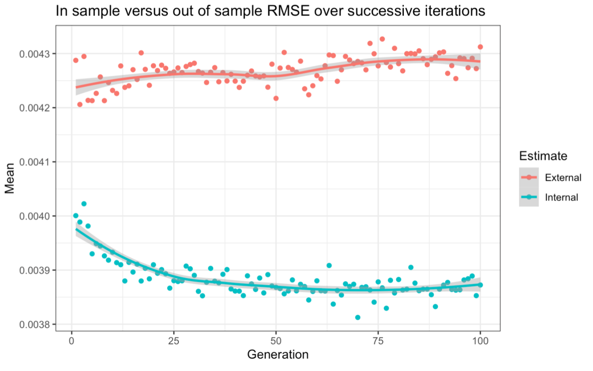

```{r setup, include=FALSE}
knitr::opts_chunk$set(echo = FALSE, comment = NA, message = FALSE, warning = FALSE, fig.align = "center")
```

# Introduction 

This investigation involved forecasting multiple steps ahead using a variety of method. The original dataset of nonfarm employment and the other 3 variables were updated to contain the latest values. In place of GSREG, a genetic algorithm (GA) was employed to fit the best possible model within twelve lags of each variable. This model was compared with 3 others, 2 being models also generated from the GA, and one being the best model from previous investigations.  

\qquad After the best of these was chosen, this model will then be implemented using rolling windows to forecast the next 12 months (2019) and evaluated based on RMSE. The actual nonfarm employment will then be forecasted (instead of the log difference) and then displayed with a plot showing the interval and point forecast. This will then be compared with the empirical method for comparison between empirically generated confidence intervals and confidence intervals that assume normality.  

```{r}
library(caret)
library(tidyverse)

library(patchwork)
library(kableExtra)
library(tsibble)
library(lubridate)
library(fable)
library(fredr)
set.seed(33455)
```

```{r}

#USING FREDR TO GET THE DATA
fredr_set_key("91de61ed607a6478d01c35d9a903017c")


test <- if (requireNamespace("purrr", quietly = TRUE)) {

  library(purrr)
  purrr::map_dfr(c('FLNAN', 'FLLFN', 'LREM25TTUSM156N', 'FLBPPRIV'), fredr)

  # Using purrr::pmap_dfr() allows you to use varying optional parameters
  params <- list(
    series_id = c('FLNAN', 'FLLFN', 'LREM25TTUSM156N', 'FLBPPRIV')
  )

  purrr::pmap_dfr(
    .l = params,
    .f = ~ fredr(series_id = .x)
  )

} 
data <- pivot_wider(test, 
            names_from = series_id,
            values_from = value)

```


```{r P2 Wrangling the data}
#Reshaping and reformatting
data[6:9] <- log(data[2:5]) 

colnames(data)[2:5] <- c("fl_nonfarm", "fl_lf", "us_epr", "fl_bp")
colnames(data)[6:9] <- c("ln_fl_nonfarm", "ln_fl_lf", "ln_us_epr", "ln_fl_bp")
data <- data[613:974,]

#now to difference the data
data['d.fl_nonfarm'] <- difference(data$ln_fl_nonfarm, differences = 1)
data['d.fl_lf'] <- difference(data$ln_fl_lf,  differences = 1) 
data['d.fl_bp'] <- difference(data$ln_fl_bp, differences = 1)
data['d.us_epr'] <- difference(data$ln_us_epr, differences = 1) 

#variables for just the difference, for the end forecasts of the actual nonfarm employment
data['diff.fl_nonfarm'] <-  difference(data$fl_nonfarm, differences = 1)
data['diff.fl_lf'] <- difference(data$fl_lf,  differences = 1) 
data['diff.fl_bp'] <-  difference(data$fl_bp, differences = 1)
data['diff.us_epr'] <- difference(data$us_epr, differences = 1) 

# Make Dummy Vars for Month
data_ts <- data %>% 
  mutate(YearMonth = yearmonth(as.character(data$date))) %>%
  as_tsibble(index = YearMonth)

# data_ts <- data  %>% 
#   as_tsibble(index = month)

```

```{r}
train_set <- data_ts[1:348,] 

test_set <- data_ts[349:360,]

```

```{r GA}
#Defining predictors for Genetic algorithm 
#getting a bunch of lags
lag_predicts <-  seq(12)
lag_names <- paste("lag", formatC(lag_predicts, width = nchar(max(lag_predicts)), flag = "0"), sep = "_")
lag_functions <- setNames(paste("dplyr::lag(., ", lag_predicts, ")"), lag_names)

lag_df <- data_ts %>% mutate_at(vars(d.fl_nonfarm, d.fl_lf, d.fl_bp, d.us_epr), funs_(lag_functions))
```

```{r Removing the first 12 lags}
b_df <- lag_df[13:362,]
b_df[,1:5] <- NULL
b_df[,2:4] <- NULL
```

```{r P3: GA Train control}
# ctrl <- gafsControl(functions = caretGA, 
#                     method = "cv", 
#                     number = 5, 
#                     metric = c(internal = "RMSE", external = "RMSE"),
#                     maximize = FALSE,
#                     allowParallel = TRUE,
#                     genParallel = TRUE,
#                     verbose = TRUE)
```


```{r P3: GA cont}
# #setting up parallel processing
# library(doParallel)
# cl <- makePSOCKcluster(11)
# registerDoParallel(cl)
# 
# library(recipes)
# #setting up a recipe to get the variables needed for gafs
# 
# # not_inc <- list(date, ln_fl_nonfarm, ln_fl_lf, ln_fl_bp, ln_us_epr, d.fl_nonfarm, d.fl_lf, d.fl_bp, d.us_epr)
# lag_rec <- b_df %>% 
#   recipe(d.fl_nonfarm~.) 
# 
# 
# 
# obj <- gafs(lag_rec,
#             iters = 100,
#             popSize = 20,
#             gafsControl = ctrl,
#             data = b_df,
#             elite = 3,
#             ## Now pass options to `train`
#             
#             method = "lm",
#             na.action = na.omit,
#             trControl = trainControl(method = "cv", number = 5,
#                                      allowParallel = TRUE)); beepr::beep("coin")
# 
# stopCluster(cl)

```

# Genetic Algorithm for best subset selection

In order to test a variety of possible models, a Genetic algorithm was employed automatically generate models. These models are created by the algorithm stochastically searching through the different possible combinations of parameters and parameter values to then minimize a metric based on the values. The metrics used here are the in-sample and out-of-sample Root Mean Squared Error (RMSE). In order to decrease the probability of overfitting, 5-fold cross-validation was implemented on top of 100 iterations of size 20 combinations to drive down the value for RMSE. In the interest of saving time, parallel processing was also implemented on 11 cores (threads). Parallel processing drastically decreased the time taken from many hours to under an hour. To visualize the relationship between RMSE and iterations, figure 1 was graphed. This shows both the in-sample and out-of-sample (OOS/external) RMSE changing over time. \cleardoublepage
```{r GA Models Selected, echo = FALSE, out.width="80%", out.height="70%", fig.cap="Genetic Algorithm iterations", fig.show="hold", fig.align='center'}

 
```


Surprisingly, the model shows very little improvement over successive generations in external RMSE. This is a fairly significant demonstration that the model is still overfitting to the training data. Ideally, steps would be taken to improve this like increasing the number of folds or letting the algorithm run for more iterations with higher population sizes. This however would take much longer and it has been decided that the best model can be tuned further outside of the genetic algorithm for higher performance. 

\qquad The following table shows 4 different model performances. The first three models are models generated by the GA that seemed to perform well with model three being the model selected as the best by the GA and tweaked outside of the GA. The tweaking involved running on different seeds and training with more folds to alleviate the overfitting situation. The fourth model in this table is the model generated from multiple previous investigations into the modelling and forecasting of nonfarm employment.

\qquad Each of these models were selected for different reasons. Model 1 has less overall external RMSE performance but does so with a better selection of variables that is more parsimonious and explains an amount of variance that is competitively similar to model 3. Model 2 was chosen because the external RMSE and internal RMSE are fairly close together. This, to me, shows that this model is relatively robust to overfitting. This model is also slightly more parsimonious than model 3. 

```{r P5: 3 Model, model selection}

RMSE <- c(0.00374, 0.00396, 0.00364, 0.004840)
OOS_RMSE <- c(0.00538, 0.003969, 0.002206, 0.0023330)
Rsquared <- c(0.862, 0.8411, 0.869, 0.7704)
N_of_Vars <- c(22, 32, 34, 26)

model_select <- data.frame(RMSE, OOS_RMSE, Rsquared, N_of_Vars)

rows <- c("Model 1", "Model 2", "Model 3", "Prev_Best Model")
rownames(model_select)[1:4] <- rows

model_select %>% kable(format = "latex") %>% 
  kable_styling(position = "center", latex_options = "striped")
```


\begin{center}
Table 1. 4 Model comparison between the previous best and the models generated by the GA
\end{center}

As one can see, the "best" model from the GA slightly overperforms over the others. Because of this, and despite the reasoning above, this model will be selected as the best model. Higher out of sample RMSE is much more indicative of forecasting ability.

\qquad In order to display this further, figure 2 displays both of these models forecasting the entire year of 2019. In this figure, it looks like the red (the GA model) follows the black line (actual data) a lot more than the blue (previous best). The confidence interval of the GA model looks to also include every single black value.

```{r}
model_ardls <- train_set %>% model(
   prev_ardl = TSLM(d.fl_nonfarm ~ lag(d.fl_nonfarm,1) + lag(d.fl_nonfarm,2) + lag(d.fl_nonfarm,3) + lag(d.fl_nonfarm,4) + lag(d.fl_nonfarm,5) +
          lag(d.fl_nonfarm,6) + lag(d.fl_nonfarm,7) + lag(d.fl_nonfarm,8) + lag(d.fl_nonfarm,9) + lag(d.fl_nonfarm,10) + lag(d.fl_nonfarm,11)+
          lag(d.fl_nonfarm,12) + lag(d.fl_lf,1) + lag(d.fl_lf,2) +
          lag(d.us_epr,1) + lag(d.us_epr,2) +
          lag(d.fl_bp,1) + lag(d.fl_bp,2)  +
          YearMonth),
   ga_ardl = TSLM(d.fl_nonfarm ~ lag(d.fl_nonfarm,1)  + lag(d.fl_nonfarm,4) + lag(d.fl_nonfarm,5) + lag(d.fl_nonfarm,8) + 
             lag(d.fl_nonfarm,9) + lag(d.fl_nonfarm,10) + lag(d.fl_nonfarm,11) + lag(d.fl_nonfarm,12) + 
             lag(d.fl_lf,1) + lag(d.fl_lf,3) + lag(d.fl_lf,4) + lag(d.fl_lf,7) + lag(d.fl_lf,8) + lag(d.fl_lf,11) +
             lag(d.us_epr,1) + lag(d.us_epr,2) + lag(d.us_epr,3) + lag(d.us_epr,4) + lag(d.us_epr,5) + 
             lag(d.us_epr,6) + lag(d.us_epr,7) + lag(d.us_epr,8) + lag(d.us_epr,9) + lag(d.us_epr,10) +
             lag(d.fl_bp,1) + lag(d.fl_bp,2)  + lag(d.fl_bp,3) + lag(d.fl_bp,4)  + lag(d.fl_bp,5) +
             lag(d.fl_bp,6) + lag(d.fl_bp,7)  + lag(d.fl_bp,8)  + lag(d.fl_bp,9)  + lag(d.fl_bp,12) +
             YearMonth)
   )
init_fc <- forecast(model_ardls, new_data = test_set)
```

```{r P6: Level 97.5 for both models, out.width="80%", out.height="70%"}
#Plotting Predictions
autoplot(init_fc, data = data_ts[300:360,], level = NULL) +
  ggtitle("Current vs. Previous Best models") +
  xlab("Months") +
  guides(colour = guide_legend(title = "Forecast"))
```
\begin{center}
Figure 2. Forecasting nonfarm employment with both our selected model and the previously selected model. 
\end{center}


# Rolling Window

In order to develop a more accurate forecast, a rolling window procedure is developed to forecast a period of 12 months ahead. The window starts with a window size of 36 (for 36 months) and is not fixed in order to change and develop a window that performs the best at forecasting. The output of this rolling window regression is shown below. 

```{r Training the GA model with Timeslices}
tscontrol <- trainControl(method = "timeslice", 
                          initialWindow = 36,
                          horizon = 12,
                          fixedWindow = FALSE,
                          savePredictions = TRUE)
```


```{r}
rw_model <- train(d.fl_nonfarm ~ lag(d.fl_nonfarm,1)  + lag(d.fl_nonfarm,4) + lag(d.fl_nonfarm,5) + lag(d.fl_nonfarm,8) + 
             lag(d.fl_nonfarm,9) + lag(d.fl_nonfarm,10) + lag(d.fl_nonfarm,11) + lag(d.fl_nonfarm,12) + 
             lag(d.fl_lf,1) + lag(d.fl_lf,3) + lag(d.fl_lf,4) + lag(d.fl_lf,7) + lag(d.fl_lf,8) + lag(d.fl_lf,11) +
             lag(d.us_epr,1) + lag(d.us_epr,2) + lag(d.us_epr,3) + lag(d.us_epr,4) + lag(d.us_epr,5) + 
             lag(d.us_epr,6) + lag(d.us_epr,7) + lag(d.us_epr,8) + lag(d.us_epr,9) + lag(d.us_epr,10) +
             lag(d.fl_bp,1) + lag(d.fl_bp,2)  + lag(d.fl_bp,3) + lag(d.fl_bp,4)  + lag(d.fl_bp,5) +
             lag(d.fl_bp,6) + lag(d.fl_bp,7)  + lag(d.fl_bp,8)  + lag(d.fl_bp,9)  + lag(d.fl_bp,12) +
             YearMonth, 
             data = data_ts[1:360,],
             method = "lm",
             trControl = tscontrol,
             na.action = na.exclude
             )

rw_model
```


The regression summary shows only '4' variables were used but that is just because the lags were included within the regression equation. The model performs with an 0.00453 RMSE and the forecast is shown below in figure 3. The out of sample RMSE is about $0.002387$


```{r Showing Pred/obs for GA model, out.width="80%", out.height="70%"}
ggplot(rw_model$pred, aes(x = obs, y = pred)) +
  geom_point(color = "darkorange") +
  geom_smooth(method = "lm", color = "black") +
  xlab("Observations") +
  ylab("Predictions") +
  ggtitle("Predictions vs Observations of model trained with Rolling Window")
```
\begin{center}
Figure 3. Rolling window forecast predictions.
\end{center}

The graph shows a tight following of true observed values for predication. There are some outliers that could be attributed to starting with a larger window. Figure 4 shows the predictions of log, differenced nonfarm employment for the year of 2019 in a fan chart. 

```{r Forecasting the GA model with intervals (2019), out.width="80%", out.height="70%"}
rw_model_2 <- train_set %>% model(
  ga_ardl = TSLM(d.fl_nonfarm ~ lag(d.fl_nonfarm,1)  + lag(d.fl_nonfarm,4) + lag(d.fl_nonfarm,5) + lag(d.fl_nonfarm,8) + 
             lag(d.fl_nonfarm,9) + lag(d.fl_nonfarm,10) + lag(d.fl_nonfarm,11) + lag(d.fl_nonfarm,12) + 
             lag(d.fl_lf,1) + lag(d.fl_lf,3) + lag(d.fl_lf,4) + lag(d.fl_lf,7) + lag(d.fl_lf,8) + lag(d.fl_lf,11) +
             lag(d.us_epr,1) + lag(d.us_epr,2) + lag(d.us_epr,3) + lag(d.us_epr,4) + lag(d.us_epr,5) + 
             lag(d.us_epr,6) + lag(d.us_epr,7) + lag(d.us_epr,8) + lag(d.us_epr,9) + lag(d.us_epr,10) +
             lag(d.fl_bp,1) + lag(d.fl_bp,2)  + lag(d.fl_bp,3) + lag(d.fl_bp,4)  + lag(d.fl_bp,5) +
             lag(d.fl_bp,6) + lag(d.fl_bp,7)  + lag(d.fl_bp,8)  + lag(d.fl_bp,9)  + lag(d.fl_bp,12) +
             YearMonth)
)

ga_fc <- forecast(rw_model_2, new_data = test_set)

#Plotting Predictions
autoplot(ga_fc, data = test_set, level = c(95, 97.5, 99.8), colour = "darkblue") +
  ggtitle("Forecasts for Nonfarm Employment from GA model: 2019") +
  xlab("Months") +
  guides(colour = guide_legend(title = "Forecast"))
```
\begin{center}
Figure 4. Fan chart of 2019 predictions. 
\end{center}

This fan chart shows that the model is doing fairly well. In order to see a better picture, the fan chart will be made for the next forecast: January 2020. For that chart, the model will include some of previous years data to show the progression over time and how the model adjusts to the seasonality of the data in a larger time context. 


# Forecasting January of 2020

At this stage in the year, the values for nonfarm in 2020 are known up to January. This means the fan chart for the forecast of January can have the actual value for comparison. Remember that this is the predictions as made by the Genetic Algorithm-chosen model. Figure 5 shows this model's predictions of January 2020.

```{r}
train_set_2019 <- data_ts[1:360,]
test_set_2020 <- data_ts[361,]
```


```{r P7: Point and interval Forecasts for 2020 L.d, out.width="80%", out.height="70%"}
rw_model_2020 <- train_set_2019 %>% model(
  ga_ardl = TSLM(d.fl_nonfarm~ lag(d.fl_nonfarm,1)  + lag(d.fl_nonfarm,4) + lag(d.fl_nonfarm,5) + lag(d.fl_nonfarm,8) + 
             lag(d.fl_nonfarm,9) + lag(d.fl_nonfarm,10) + lag(d.fl_nonfarm,11) + lag(d.fl_nonfarm,12) + 
             lag(d.fl_lf,1) + lag(d.fl_lf,3) + lag(d.fl_lf,4) + lag(d.fl_lf,7) + lag(d.fl_lf,8) + lag(d.fl_lf,11) +
             lag(d.us_epr,1) + lag(d.us_epr,2) + lag(d.us_epr,3) + lag(d.us_epr,4) + lag(d.us_epr,5) + 
             lag(d.us_epr,6) + lag(d.us_epr,7) + lag(d.us_epr,8) + lag(d.us_epr,9) + lag(d.us_epr,10) +
             lag(d.fl_bp,1) + lag(d.fl_bp,2)  + lag(d.fl_bp,3) + lag(d.fl_bp,4)  + lag(d.fl_bp,5) +
             lag(d.fl_bp,6) + lag(d.fl_bp,7)  + lag(d.fl_bp,8)  + lag(d.fl_bp,9)  + lag(d.fl_bp,12) +
             YearMonth)
)

ga_fc_2020 <- forecast(rw_model_2020, new_data = test_set_2020)

#Plotting Predictions
autoplot(ga_fc_2020, data = train_set_2019[320:360,], level = c(68, 95, 99.7), colour = "darkblue") +
  ggtitle("Forecast: L.Differenced Nonfarm Employment from GA model: Jan 2020") +
  xlab("Months") +
  ylab("Nonfarm")
```
\begin{center}
Figure 5. Interval and point forecast for January 2020 log/differenced Nonfarm Employment.
\end{center}

It looks like the model predicts about a 2 percent decrease in nonfarm employment at the beginning of 2020. This is relatively consistent with the past year's values for January. All of the past years had an average decline of about 2% of nonfarm employment in January. 

# Actual Nonfarm Employment

Before, the logged, differenced nonfarm employment was forecasted and displayed with confidence intervals that displayed the GA model's predictive power. If the actual nonfarm employment levels are to be known, the data need to be transformed to reflect the actual change in nonfarm employment. With this approach, the true level of nonfarm employment will be forecasted for Jan 2020 and displayed with a fan chart. The intervals in the fan chart are shown based on the assumption that the data are normal. This will be relevant when we use the empirical approach later in this analysis. The fan chart is shown below in figure 6.

```{r P8 and P9: Point and interval forecasts for 2020 ACTUAL, out.width="80%", out.height="70%"}
rw_model_2020_2 <- train_set_2019 %>% model(
  ga_ardl = TSLM(fl_nonfarm~ lag(diff.fl_nonfarm,1)  + lag(diff.fl_nonfarm,4) + lag(diff.fl_nonfarm,5) + lag(diff.fl_nonfarm,8) + 
             lag(diff.fl_nonfarm,9) + lag(diff.fl_nonfarm,10) + lag(diff.fl_nonfarm,11) + lag(diff.fl_nonfarm,12) + 
             lag(diff.fl_lf,1) + lag(diff.fl_lf,3) + lag(diff.fl_lf,4) + lag(diff.fl_lf,7) + lag(diff.fl_lf,8) + lag(diff.fl_lf,11) +
             lag(diff.us_epr,1) + lag(diff.us_epr,2) + lag(diff.us_epr,3) + lag(diff.us_epr,4) + lag(diff.us_epr,5) + 
             lag(diff.us_epr,6) + lag(diff.us_epr,7) + lag(diff.us_epr,8) + lag(diff.us_epr,9) + lag(diff.us_epr,10) +
             lag(diff.fl_bp,1) + lag(diff.fl_bp,2)  + lag(diff.fl_bp,3) + lag(diff.fl_bp,4)  + lag(diff.fl_bp,5) +
             lag(diff.fl_bp,6) + lag(diff.fl_bp,7)  + lag(diff.fl_bp,8)  + lag(diff.fl_bp,9)  + lag(diff.fl_bp,12) +
             YearMonth)
)

ga_fc_2020_2 <- forecast(rw_model_2020_2, new_data = test_set_2020)

#Plotting Predictions
autoplot(ga_fc_2020_2, data = data_ts[200:361,], level = c(68, 95, 99.7), colour = "darkred") +
  ggtitle("Forecast for Nonfarm Employment from GA model: Jan 2020") +
  xlab("Months") +
  ylab("Nonfarm")
```
\begin{center}
Figure 6. Forecasting True Nonfarm Employment in January 2020. 
\end{center}

What happens when we do not or cannot assume normality? There is an empirical approach involving the creation of intervals based on the actual values in the data and the values predicted by the model, along with the residuals. Using this approach, the new forecast interval is created and shown in orange in figure 7.


```{r P9: Interval forecasts for ACTUAL nonfarm 2020 w/ Empirical Method, out.width="80%", out.height="70%"}
rw_model_2020_3 <- train_set_2019 %>% model(
  ga_ardl = TSLM(fl_nonfarm~ lag(diff.fl_nonfarm,1)  + lag(diff.fl_nonfarm,4) + lag(diff.fl_nonfarm,5) + lag(diff.fl_nonfarm,8) + 
             lag(diff.fl_nonfarm,9) + lag(diff.fl_nonfarm,10) + lag(diff.fl_nonfarm,11) + lag(diff.fl_nonfarm,12) + 
             lag(diff.fl_lf,1) + lag(diff.fl_lf,3) + lag(diff.fl_lf,4) + lag(diff.fl_lf,7) + lag(diff.fl_lf,8) + lag(diff.fl_lf,11) +
             lag(diff.us_epr,1) + lag(diff.us_epr,2) + lag(diff.us_epr,3) + lag(diff.us_epr,4) + lag(diff.us_epr,5) + 
             lag(diff.us_epr,6) + lag(diff.us_epr,7) + lag(diff.us_epr,8) + lag(diff.us_epr,9) + lag(diff.us_epr,10) +
             lag(diff.fl_bp,1) + lag(diff.fl_bp,2)  + lag(diff.fl_bp,3) + lag(diff.fl_bp,4)  + lag(diff.fl_bp,5) +
             lag(diff.fl_bp,6) + lag(diff.fl_bp,7)  + lag(diff.fl_bp,8)  + lag(diff.fl_bp,9)  + lag(diff.fl_bp,12) +
             YearMonth)
)

ga_fc_2020_3 <- forecast(rw_model_2020_3, new_data = test_set_2020)

# #For loop to grab the upper bounds for empirical approach
# for(i in 1:nrow(hilo(ga_fc_2020_3, 97.5)['97.5%'])){
#   
#   emp_bounds[i,] <- hilo(ga_fc_2020_3, 97.5)['97.5%'][[1]][[i]]
# }
# 
# #setting the upper and lower bounds empirically
# upbd <- exp(data_ts[349:361,5] + emp_bounds[,2])
# lwbd <- exp(data_ts[349:361,5] + emp_bounds[,1])


#Plotting Predictions
autoplot(ga_fc_2020_2, data = data_ts[200:361,], level = c(97.5), colour = "orange") +
  ggtitle("Forecast for Nonfarm Employment (Empirical) from GA model: Jan 2020") +
  xlab("Months") +
  ylab("Nonfarm") +
  theme(legend.position = "none")
```
\begin{center}
Figure 7. Forecast of Jan 2020 with empirical forecast intervals. 
\end{center}

From the looks of both of these graphs, it seems like the empirical approach is a better choice in terms of representing accurate interval forecasts. It is slightly wider than a 95% confidence interval and so it is more likely to contain the actual value of nonfarm employment. If a range of possible values were needed for an estimation of the employment population, this interval would be ideal. In fact, this interval does contain the actual value. 

# Other forecasting Models and Methods

In this section, we explore other models that are historically robust, precise, and accurate for time series forecasting. Still forecasting logged, differenced nonfarm employment, we will test four diffferent models. These models will be tested with minimal tuning outside of what has already been done to the ARDL models from before. The goal is to get the highest forecasting (out-of-sample) RMSE. The first two models are the previous best model and the GA best model. 

\qquad The other two models are ARIMA (Auto Regressive Integrated Moving Average) and VAR (Vector Autoregression). The ARIMA model is not tuned at all. It comes just as it does natively with the `fable` package in R. The Vector Autoregression is only trained on an iteration of autoregression functions from AR(1) to AR(12). The VAR model is only trained on these autoregressive functions of the log-differenced nonfarm employment. Figure 8 shows these models in comparison. Table 2 shows the evaluation metrics. \cleardoublepage

```{r}
test_set_2020 <- data_ts[349:361,]
```


```{r Forecasting with 4 different Models, out.width="100%", out.height="60%"}
#building the models

 model_1 <- train_set %>% model(
   prev_ardl = TSLM(d.fl_nonfarm ~ lag(d.fl_nonfarm,1) + lag(d.fl_nonfarm,2) + lag(d.fl_nonfarm,3) + lag(d.fl_nonfarm,4) + lag(d.fl_nonfarm,5) +
          lag(d.fl_nonfarm,6) + lag(d.fl_nonfarm,7) + lag(d.fl_nonfarm,8) + lag(d.fl_nonfarm,9) + lag(d.fl_nonfarm,10) + lag(d.fl_nonfarm,11)+
          lag(d.fl_nonfarm,12) + lag(d.fl_lf,1) + lag(d.fl_lf,2) +
          lag(d.us_epr,1) + lag(d.us_epr,2) +
          lag(d.fl_bp,1) + lag(d.fl_bp,2)  +
          YearMonth),
   ga_ardl = TSLM(d.fl_nonfarm ~ lag(d.fl_nonfarm,1)  + lag(d.fl_nonfarm,4) + lag(d.fl_nonfarm,5) + lag(d.fl_nonfarm,8) + 
             lag(d.fl_nonfarm,9) + lag(d.fl_nonfarm,10) + lag(d.fl_nonfarm,11) + lag(d.fl_nonfarm,12) + 
             lag(d.fl_lf,1) + lag(d.fl_lf,3) + lag(d.fl_lf,4) + lag(d.fl_lf,7) + lag(d.fl_lf,8) + lag(d.fl_lf,11) +
             lag(d.us_epr,1) + lag(d.us_epr,2) + lag(d.us_epr,3) + lag(d.us_epr,4) + lag(d.us_epr,5) + 
             lag(d.us_epr,6) + lag(d.us_epr,7) + lag(d.us_epr,8) + lag(d.us_epr,9) + lag(d.us_epr,10) +
             lag(d.fl_bp,1) + lag(d.fl_bp,2)  + lag(d.fl_bp,3) + lag(d.fl_bp,4)  + lag(d.fl_bp,5) +
             lag(d.fl_bp,6) + lag(d.fl_bp,7)  + lag(d.fl_bp,8)  + lag(d.fl_bp,9)  + lag(d.fl_bp,12) +
             YearMonth),
   
   arima = ARIMA(d.fl_nonfarm),
   var = VAR(d.fl_nonfarm  ~ AR(1:12) , ic = "aic" )
   )

# forecasting on the test set 
fc <- forecast(model_1, new_data = test_set_2020)

#Plotting Predictions
autoplot(fc, data = data_ts[300:361,], level = NULL) +
  ggtitle("Forecasts for Nonfarm Employment (4 Models)") +
  xlab("Months") +
  ylab("L.d. Nonfarm Employment")
  guides(colour = guide_legend(title = "Forecast")) +
  theme(legend.position = "bottom")
```

```{r Evaluating Accuracy}
fc_accuracy <- accuracy(fc, test_set,
  measures = list(
    point_accuracy_measures,
    interval_accuracy_measures,
    distribution_accuracy_measures
  )
)

#creating an accuracy table
final_tab <- fc_accuracy %>%
  group_by(.model) %>%
  summarise(
    RMSE = mean(RMSE),
    MAE = mean(MAE),
    MASE = mean(MASE),
    Winkler = mean(winkler),
    CRPS = mean(CRPS)
  ) %>%
  arrange(RMSE) 


```
```{r, message = FALSE, include = FALSE}
final_tab['MASE'] <- NULL
```


```{r}
final_tab %>% kable(format = "latex") %>% kable_styling(position = "center", latex_options = "striped")

```

\begin{center}
Table 2. 4 Different model forecast metrics for 4 different models.
\end{center}

The RMSE and MAE are compared between all four models. It looks like the Vector Autoregression did the best and has the lowest RMSE. Our ARDL models from before fall behind slightly while the ARIMA model falls behind them. This is a surprising result given that the VAR model was not tuned outside of included lags of the dependent variable itself. This table also includes the Winkler Scores and Continuous Rank Probability Scores. The winkler score estimates the accuracy of the interval forecast while the continuous rank probability score is the MAE generalised to probabilistic forecasts. 

\cleardoublepage

# Appendix A: Code

```{r, eval = FALSE,echo=TRUE}
library(caret)
library(tidyverse)

library(patchwork)
library(kableExtra)
library(tsibble)
library(lubridate)
library(fable)
library(fredr)
set.seed(33455)


fredr_set_key("91de61ed607a6478d01c35d9a903017c")


test <- if (requireNamespace("purrr", quietly = TRUE)) {
  
  library(purrr)
  purrr::map_dfr(c('FLNAN', 'FLLFN', 'LREM25TTUSM156N', 'FLBPPRIV'), fredr)
  
  # Using purrr::pmap_dfr() allows you to use varying optional parameters
  params <- list(
    series_id = c('FLNAN', 'FLLFN', 'LREM25TTUSM156N', 'FLBPPRIV')
  )
  
  purrr::pmap_dfr(
    .l = params,
    .f = ~ fredr(series_id = .x)
  )
  
} 
data <- pivot_wider(test, 
                    names_from = series_id,
                    values_from = value)

#Reshaping and reformatting
data[6:9] <- log(data[2:5]) 

colnames(data)[2:5] <- c("fl_nonfarm", "fl_lf", "us_epr", "fl_bp")
colnames(data)[6:9] <- c("ln_fl_nonfarm", "ln_fl_lf", "ln_us_epr", "ln_fl_bp")
data <- data[613:974,]

#now to difference the data
data['d.fl_nonfarm'] <- difference(data$ln_fl_nonfarm, differences = 1)
data['d.fl_lf'] <- difference(data$ln_fl_lf,  differences = 1) 
data['d.fl_bp'] <- difference(data$ln_fl_bp, differences = 1)
data['d.us_epr'] <- difference(data$ln_us_epr, differences = 1) 

#variables for just the difference, for the end forecasts of the actual nonfarm employment
data['diff.fl_nonfarm'] <-  difference(data$fl_nonfarm, differences = 1)
data['diff.fl_lf'] <- difference(data$fl_lf,  differences = 1) 
data['diff.fl_bp'] <-  difference(data$fl_bp, differences = 1)
data['diff.us_epr'] <- difference(data$us_epr, differences = 1) 

# Make Dummy Vars for Month
data_ts <- data %>% 
  mutate(YearMonth = yearmonth(as.character(data$date))) %>%
  as_tsibble(index = YearMonth)

# data_ts <- data  %>% 
#   as_tsibble(index = month)


train_set <- data_ts[1:348,] 

test_set <- data_ts[349:360,]


#Defining predictors for Genetic algorithm 
#getting a bunch of lags
lag_predicts <-  seq(12)
lag_names <- paste("lag", formatC(lag_predicts, width = nchar(max(lag_predicts)), flag = "0"), sep = "_")
lag_functions <- setNames(paste("dplyr::lag(., ", lag_predicts, ")"), lag_names)

lag_df <- data_ts %>% mutate_at(vars(d.fl_nonfarm, d.fl_lf, d.fl_bp, d.us_epr), funs_(lag_functions))

b_df <- lag_df[13:362,]
b_df[,1:5] <- NULL
b_df[,2:4] <- NULL

# ctrl <- gafsControl(functions = caretGA, 
#                     method = "cv", 
#                     number = 5, 
#                     metric = c(internal = "RMSE", external = "RMSE"),
#                     maximize = FALSE,
#                     allowParallel = TRUE,
#                     genParallel = TRUE,
#                     verbose = TRUE)


# #setting up parallel processing
# library(doParallel)
# cl <- makePSOCKcluster(11)
# registerDoParallel(cl)
# 
# library(recipes)
# #setting up a recipe to get the variables needed for gafs
# 
# # not_inc <- list(date, ln_fl_nonfarm, ln_fl_lf, ln_fl_bp, ln_us_epr, d.fl_nonfarm, d.fl_lf, d.fl_bp, d.us_epr)
# lag_rec <- b_df %>% 
#   recipe(d.fl_nonfarm~.) 
# 
# 
# 
# obj <- gafs(lag_rec,
#             iters = 100,
#             popSize = 20,
#             gafsControl = ctrl,
#             data = b_df,
#             elite = 3,
#             ## Now pass options to `train`
#             
#             method = "lm",
#             na.action = na.omit,
#             trControl = trainControl(method = "cv", number = 5,
#                                      allowParallel = TRUE)); beepr::beep("coin")
# 
# stopCluster(cl)


 


RMSE <- c(0.00374, 0.00396, 0.00364, 0.004840)
OOS_RMSE <- c(0.00538, 0.003969, 0.002206, 0.0023330)
Rsquared <- c(0.862, 0.8411, 0.869, 0.7704)
N_of_Vars <- c(22, 32, 34, 26)

model_select <- data.frame(RMSE, OOS_RMSE, Rsquared, N_of_Vars)

rows <- c("Model 1", "Model 2", "Model 3", "Prev_Best Model")
rownames(model_select)[1:4] <- rows

model_select %>% kable(format = "latex") %>% 
  kable_styling(position = "center", latex_options = "striped")


model_ardls <- train_set %>% model(
  prev_ardl = TSLM(d.fl_nonfarm ~ lag(d.fl_nonfarm,1) + lag(d.fl_nonfarm,2) + lag(d.fl_nonfarm,3) + lag(d.fl_nonfarm,4) + lag(d.fl_nonfarm,5) +
                     lag(d.fl_nonfarm,6) + lag(d.fl_nonfarm,7) + lag(d.fl_nonfarm,8) + lag(d.fl_nonfarm,9) + lag(d.fl_nonfarm,10) + lag(d.fl_nonfarm,11)+
                     lag(d.fl_nonfarm,12) + lag(d.fl_lf,1) + lag(d.fl_lf,2) +
                     lag(d.us_epr,1) + lag(d.us_epr,2) +
                     lag(d.fl_bp,1) + lag(d.fl_bp,2)  +
                     YearMonth),
  ga_ardl = TSLM(d.fl_nonfarm ~ lag(d.fl_nonfarm,1)  + lag(d.fl_nonfarm,4) + lag(d.fl_nonfarm,5) + lag(d.fl_nonfarm,8) + 
                   lag(d.fl_nonfarm,9) + lag(d.fl_nonfarm,10) + lag(d.fl_nonfarm,11) + lag(d.fl_nonfarm,12) + 
                   lag(d.fl_lf,1) + lag(d.fl_lf,3) + lag(d.fl_lf,4) + lag(d.fl_lf,7) + lag(d.fl_lf,8) + lag(d.fl_lf,11) +
                   lag(d.us_epr,1) + lag(d.us_epr,2) + lag(d.us_epr,3) + lag(d.us_epr,4) + lag(d.us_epr,5) + 
                   lag(d.us_epr,6) + lag(d.us_epr,7) + lag(d.us_epr,8) + lag(d.us_epr,9) + lag(d.us_epr,10) +
                   lag(d.fl_bp,1) + lag(d.fl_bp,2)  + lag(d.fl_bp,3) + lag(d.fl_bp,4)  + lag(d.fl_bp,5) +
                   lag(d.fl_bp,6) + lag(d.fl_bp,7)  + lag(d.fl_bp,8)  + lag(d.fl_bp,9)  + lag(d.fl_bp,12) +
                   YearMonth)
)
init_fc <- forecast(model_ardls, new_data = test_set)


#Plotting Predictions
autoplot(init_fc, data = data_ts[300:360,], level = NULL) +
  ggtitle("Current vs. Previous Best models") +
  xlab("Months") +
  guides(colour = guide_legend(title = "Forecast"))


tscontrol <- trainControl(method = "timeslice", 
                          initialWindow = 36,
                          horizon = 12,
                          fixedWindow = FALSE,
                          savePredictions = TRUE)


rw_model <- train(d.fl_nonfarm ~ lag(d.fl_nonfarm,1)  + lag(d.fl_nonfarm,4) + lag(d.fl_nonfarm,5) + lag(d.fl_nonfarm,8) + 
                    lag(d.fl_nonfarm,9) + lag(d.fl_nonfarm,10) + lag(d.fl_nonfarm,11) + lag(d.fl_nonfarm,12) + 
                    lag(d.fl_lf,1) + lag(d.fl_lf,3) + lag(d.fl_lf,4) + lag(d.fl_lf,7) + lag(d.fl_lf,8) + lag(d.fl_lf,11) +
                    lag(d.us_epr,1) + lag(d.us_epr,2) + lag(d.us_epr,3) + lag(d.us_epr,4) + lag(d.us_epr,5) + 
                    lag(d.us_epr,6) + lag(d.us_epr,7) + lag(d.us_epr,8) + lag(d.us_epr,9) + lag(d.us_epr,10) +
                    lag(d.fl_bp,1) + lag(d.fl_bp,2)  + lag(d.fl_bp,3) + lag(d.fl_bp,4)  + lag(d.fl_bp,5) +
                    lag(d.fl_bp,6) + lag(d.fl_bp,7)  + lag(d.fl_bp,8)  + lag(d.fl_bp,9)  + lag(d.fl_bp,12) +
                    YearMonth, 
                  data = data_ts[1:360,],
                  method = "lm",
                  trControl = tscontrol,
                  na.action = na.exclude)

rw_model


ggplot(rw_model$pred, aes(x = obs, y = pred)) +
  geom_point(color = "darkorange") +
  geom_smooth(method = "lm", color = "black") +
  xlab("Observations") +
  ylab("Predictions") +
  ggtitle("Predictions vs Observations of model trained with Rolling Window")


rw_model_2 <- train_set %>% model(
  ga_ardl = TSLM(d.fl_nonfarm ~ lag(d.fl_nonfarm,1)  + lag(d.fl_nonfarm,4) + lag(d.fl_nonfarm,5) + lag(d.fl_nonfarm,8) + 
                   lag(d.fl_nonfarm,9) + lag(d.fl_nonfarm,10) + lag(d.fl_nonfarm,11) + lag(d.fl_nonfarm,12) + 
                   lag(d.fl_lf,1) + lag(d.fl_lf,3) + lag(d.fl_lf,4) + lag(d.fl_lf,7) + lag(d.fl_lf,8) + lag(d.fl_lf,11) +
                   lag(d.us_epr,1) + lag(d.us_epr,2) + lag(d.us_epr,3) + lag(d.us_epr,4) + lag(d.us_epr,5) + 
                   lag(d.us_epr,6) + lag(d.us_epr,7) + lag(d.us_epr,8) + lag(d.us_epr,9) + lag(d.us_epr,10) +
                   lag(d.fl_bp,1) + lag(d.fl_bp,2)  + lag(d.fl_bp,3) + lag(d.fl_bp,4)  + lag(d.fl_bp,5) +
                   lag(d.fl_bp,6) + lag(d.fl_bp,7)  + lag(d.fl_bp,8)  + lag(d.fl_bp,9)  + lag(d.fl_bp,12) +
                   YearMonth)
)

ga_fc <- forecast(rw_model_2, new_data = test_set)

#Plotting Predictions
autoplot(ga_fc, data = test_set, level = c(95, 97.5, 99.8), colour = "darkblue") +
  ggtitle("Forecasts for Nonfarm Employment from GA model: 2019") +
  xlab("Months") +
  guides(colour = guide_legend(title = "Forecast"))


train_set_2019 <- data_ts[1:360,]
test_set_2020 <- data_ts[361,]


rw_model_2020 <- train_set_2019 %>% model(
  ga_ardl = TSLM(d.fl_nonfarm~ lag(d.fl_nonfarm,1)  + lag(d.fl_nonfarm,4) + lag(d.fl_nonfarm,5) + lag(d.fl_nonfarm,8) + 
                   lag(d.fl_nonfarm,9) + lag(d.fl_nonfarm,10) + lag(d.fl_nonfarm,11) + lag(d.fl_nonfarm,12) + 
                   lag(d.fl_lf,1) + lag(d.fl_lf,3) + lag(d.fl_lf,4) + lag(d.fl_lf,7) + lag(d.fl_lf,8) + lag(d.fl_lf,11) +
                   lag(d.us_epr,1) + lag(d.us_epr,2) + lag(d.us_epr,3) + lag(d.us_epr,4) + lag(d.us_epr,5) + 
                   lag(d.us_epr,6) + lag(d.us_epr,7) + lag(d.us_epr,8) + lag(d.us_epr,9) + lag(d.us_epr,10) +
                   lag(d.fl_bp,1) + lag(d.fl_bp,2)  + lag(d.fl_bp,3) + lag(d.fl_bp,4)  + lag(d.fl_bp,5) +
                   lag(d.fl_bp,6) + lag(d.fl_bp,7)  + lag(d.fl_bp,8)  + lag(d.fl_bp,9)  + lag(d.fl_bp,12) +
                   YearMonth)
)

ga_fc_2020 <- forecast(rw_model_2020, new_data = test_set_2020)

#Plotting Predictions
autoplot(ga_fc_2020, data = train_set_2019[320:360,], level = c(68, 95, 99.7), colour = "darkblue") +
  ggtitle("Forecast: L.Differenced Nonfarm Employment from GA model: Jan 2020") +
  xlab("Months") +
  ylab("Nonfarm")


rw_model_2020_2 <- train_set_2019 %>% model(
  ga_ardl = TSLM(fl_nonfarm~ lag(diff.fl_nonfarm,1)  + lag(diff.fl_nonfarm,4) + lag(diff.fl_nonfarm,5) + lag(diff.fl_nonfarm,8) + 
                   lag(diff.fl_nonfarm,9) + lag(diff.fl_nonfarm,10) + lag(diff.fl_nonfarm,11) + lag(diff.fl_nonfarm,12) + 
                   lag(diff.fl_lf,1) + lag(diff.fl_lf,3) + lag(diff.fl_lf,4) + lag(diff.fl_lf,7) + lag(diff.fl_lf,8) + lag(diff.fl_lf,11) +
                   lag(diff.us_epr,1) + lag(diff.us_epr,2) + lag(diff.us_epr,3) + lag(diff.us_epr,4) + lag(diff.us_epr,5) + 
                   lag(diff.us_epr,6) + lag(diff.us_epr,7) + lag(diff.us_epr,8) + lag(diff.us_epr,9) + lag(diff.us_epr,10) +
                   lag(diff.fl_bp,1) + lag(diff.fl_bp,2)  + lag(diff.fl_bp,3) + lag(diff.fl_bp,4)  + lag(diff.fl_bp,5) +
                   lag(diff.fl_bp,6) + lag(diff.fl_bp,7)  + lag(diff.fl_bp,8)  + lag(diff.fl_bp,9)  + lag(diff.fl_bp,12) +
                   YearMonth)
)

ga_fc_2020_2 <- forecast(rw_model_2020_2, new_data = test_set_2020)

#Plotting Predictions
autoplot(ga_fc_2020_2, data = data_ts[200:361,], level = c(68, 95, 99.7), colour = "darkred") +
  ggtitle("Forecast for Nonfarm Employment from GA model: Jan 2020") +
  xlab("Months") +
  ylab("Nonfarm")


rw_model_2020_3 <- train_set_2019 %>% model(
  ga_ardl = TSLM(fl_nonfarm~ lag(diff.fl_nonfarm,1)  + lag(diff.fl_nonfarm,4) + lag(diff.fl_nonfarm,5) + lag(diff.fl_nonfarm,8) + 
                   lag(diff.fl_nonfarm,9) + lag(diff.fl_nonfarm,10) + lag(diff.fl_nonfarm,11) + lag(diff.fl_nonfarm,12) + 
                   lag(diff.fl_lf,1) + lag(diff.fl_lf,3) + lag(diff.fl_lf,4) + lag(diff.fl_lf,7) + lag(diff.fl_lf,8) + lag(diff.fl_lf,11) +
                   lag(diff.us_epr,1) + lag(diff.us_epr,2) + lag(diff.us_epr,3) + lag(diff.us_epr,4) + lag(diff.us_epr,5) + 
                   lag(diff.us_epr,6) + lag(diff.us_epr,7) + lag(diff.us_epr,8) + lag(diff.us_epr,9) + lag(diff.us_epr,10) +
                   lag(diff.fl_bp,1) + lag(diff.fl_bp,2)  + lag(diff.fl_bp,3) + lag(diff.fl_bp,4)  + lag(diff.fl_bp,5) +
                   lag(diff.fl_bp,6) + lag(diff.fl_bp,7)  + lag(diff.fl_bp,8)  + lag(diff.fl_bp,9)  + lag(diff.fl_bp,12) +
                   YearMonth)
)

ga_fc_2020_3 <- forecast(rw_model_2020_3, new_data = test_set_2020)

# #For loop to grab the upper bounds for empirical approach
# for(i in 1:nrow(hilo(ga_fc_2020_3, 97.5)['97.5%'])){
#   
#   emp_bounds[i,] <- hilo(ga_fc_2020_3, 97.5)['97.5%'][[1]][[i]]
# }
# 
# #setting the upper and lower bounds empirically
# upbd <- exp(data_ts[349:361,5] + emp_bounds[,2])
# lwbd <- exp(data_ts[349:361,5] + emp_bounds[,1])


#Plotting Predictions
autoplot(ga_fc_2020_2, data = data_ts[200:361,], level = c(97.5), colour = "orange") +
  ggtitle("Forecast for Nonfarm Employment (Empirical) from GA model: Jan 2020") +
  xlab("Months") +
  ylab("Nonfarm") +
  theme(legend.position = "none")


test_set_2020 <- data_ts[349:361,]


#building the models

model_1 <- train_set %>% model(
  prev_ardl = TSLM(d.fl_nonfarm ~ lag(d.fl_nonfarm,1) + lag(d.fl_nonfarm,2) + lag(d.fl_nonfarm,3) + lag(d.fl_nonfarm,4) + lag(d.fl_nonfarm,5) +
                     lag(d.fl_nonfarm,6) + lag(d.fl_nonfarm,7) + lag(d.fl_nonfarm,8) + lag(d.fl_nonfarm,9) + lag(d.fl_nonfarm,10) + lag(d.fl_nonfarm,11)+
                     lag(d.fl_nonfarm,12) + lag(d.fl_lf,1) + lag(d.fl_lf,2) +
                     lag(d.us_epr,1) + lag(d.us_epr,2) +
                     lag(d.fl_bp,1) + lag(d.fl_bp,2)  +
                     YearMonth),
  ga_ardl = TSLM(d.fl_nonfarm ~ lag(d.fl_nonfarm,1)  + lag(d.fl_nonfarm,4) + lag(d.fl_nonfarm,5) + lag(d.fl_nonfarm,8) + 
                   lag(d.fl_nonfarm,9) + lag(d.fl_nonfarm,10) + lag(d.fl_nonfarm,11) + lag(d.fl_nonfarm,12) + 
                   lag(d.fl_lf,1) + lag(d.fl_lf,3) + lag(d.fl_lf,4) + lag(d.fl_lf,7) + lag(d.fl_lf,8) + lag(d.fl_lf,11) +
                   lag(d.us_epr,1) + lag(d.us_epr,2) + lag(d.us_epr,3) + lag(d.us_epr,4) + lag(d.us_epr,5) + 
                   lag(d.us_epr,6) + lag(d.us_epr,7) + lag(d.us_epr,8) + lag(d.us_epr,9) + lag(d.us_epr,10) +
                   lag(d.fl_bp,1) + lag(d.fl_bp,2)  + lag(d.fl_bp,3) + lag(d.fl_bp,4)  + lag(d.fl_bp,5) +
                   lag(d.fl_bp,6) + lag(d.fl_bp,7)  + lag(d.fl_bp,8)  + lag(d.fl_bp,9)  + lag(d.fl_bp,12) +
                   YearMonth),
  
  arima = ARIMA(d.fl_nonfarm),
  var = VAR(d.fl_nonfarm  ~ AR(1:12) , ic = "aic" )
)

# forecasting on the test set 
fc <- forecast(model_1, new_data = test_set_2020)

#Plotting Predictions
autoplot(fc, data = data_ts[300:361,], level = NULL) +
  ggtitle("Forecasts for Nonfarm Employment (4 Models)") +
  xlab("Months") +
  ylab("L.d. Nonfarm Employment")
guides(colour = guide_legend(title = "Forecast")) +
  theme(legend.position = "bottom")


fc_accuracy <- accuracy(fc, test_set,
                        measures = list(
                          point_accuracy_measures,
                          interval_accuracy_measures,
                          distribution_accuracy_measures
                        )
)

#creating an accuracy table
final_tab <- fc_accuracy %>%
  group_by(.model) %>%
  summarise(
    RMSE = mean(RMSE),
    MAE = mean(MAE),
    MASE = mean(MASE),
    Winkler = mean(winkler),
    CRPS = mean(CRPS)
  ) %>%
  arrange(RMSE) 


final_tab['MASE'] <- NULL


final_tab %>% kable(format = "latex") %>% kable_styling(position = "center", latex_options = "striped")


```


