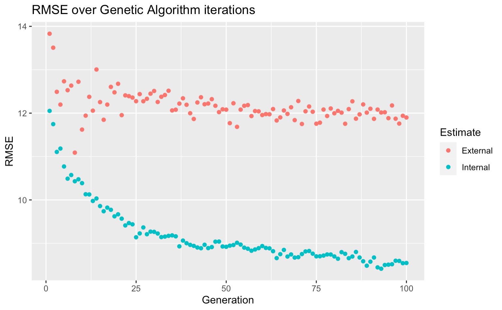

```{r setup, include=FALSE}
knitr::opts_chunk$set(echo = FALSE, warning = FALSE, comments = NA, message = FALSE, fig.align = "center")
```


\cleardoublepage

# Introduction

```{r, echo = FALSE, warning = FALSE, comments = NA}
#library Import
library(caret)
library(tidyverse)

library(fable)
library(feasts)
library(fredr)
library(tsibble)
library(patchwork)
library(kableExtra)
library(ggfortify)
library(lubridate)

```

```{r Getting the Data}
source("Fredr_Script.R")
```


```{r Wrangling the data and changing names}
set.seed(23)

colnames(data)[2:6] <- c("nonfarm", "avg_week_hrs", "avg_hr_earnings",
                         "avg_week_earnings", "all_goods")
data["tot_week_earnings"] <- data[2]*data[5]
```

```{r Differencing the variables}
data['diff.nonfarm'] <-  difference(data$nonfarm, differences = 2)
data['diff.avg_week_hrs'] <- difference(data$avg_week_hrs,  differences = 1) 
data['diff.avg_hr_earn'] <-  difference(data$avg_hr_earnings, differences = 1)
data['diff.avg_w_earn'] <- difference(data$avg_week_earnings, differences = 1) 
data['diff.all_goods'] <- difference(data$all_goods, differences = 1) 
data['diff.tot_w_earn'] <- difference(data$tot_week_earnings, differences = 1) 
```


```{r Monthly dummy variables}
# Make Dummy Vars for Month 
data_ts <- data %>% 
  mutate(YearMonth = yearmonth(as.character(data$date))) %>%
  as_tsibble(index = YearMonth)

data_ts <- data_ts %>% 
    mutate(month = month(date)) %>% 
    mutate(jan = (month == 1),
         feb = (month == 2),
         mar = (month == 3),
         apr = (month == 4),
         may = (month == 5),
         jun = (month == 6),
         jul = (month == 7),
         aug = (month == 8),
         sep = (month == 9),
         oct = (month == 10),
         nov = (month == 11),
         dec = (month == 12))
```


There are a number of MSA's in Florida that have a pretty significant number of metrics used to describe and analyse them in a macroeconomical sense. MSA's are Metropolitan Statistical Areas, a designation given for areas with largely dense populations that have close economic ties to their surrounding areas. For this investigation, the Miami-West Palm-Fort Lauderdale MSA will be analysed with the final intent of delivering the best model possible for predicting the total nonfarm employment. The different models illustrated in this investigation all involve adjustments and reflections of the time series quality of the data. The best model will be chosen from a host of other generated models that will be compared with a number of comparison statistics. Namely: AIC, BIC, RMSE, and Out-of-sample RMSE. 
   
\qquad The relevant predictors include the average weekly hours worked, the average hourly earnings of employees, the average weekly earnings, all of the good produced, and the total weekly earnings of all employees. It makes intuitive sense that there could be some positive relationship between the nonfarm employment and the amount of goods produced. It is important to note that none of these variables will have log transformations applied to them. To me it is much more important to have a clear understanding of what each value is and how they affect the response variable directly. Log transformations are helpful in a variety of circumstances involving interest but, from experience, they do not help to form a better forecast on this kind of data.

\qquad First, a full year will be predicted without rolling window to assess the individual models' performance. After this, the models will be compared with a 1-step forecast using rolling windows of various sizes while also comparing them to a baseline model constructed with basic parameters. Pending the results, the best model will be selected for predicting the total nonfarm employment in March of 2020. The actual numbers of which will be released later in the month of April. 


# Analysis of Variables

All of the different variables are at least semi-related to nonfarm employment. To enhance the goal of creating an accurate model that precisely explains the variance in nonfarm employment however, these variables need to be analysed. In order to get a sense of these variables, we will generate a table of summary statistics about each variable. 


```{r}
summary(data[2:5]) %>%
  kable(format = "latex") %>% 
  row_spec(0,bold=TRUE) %>% 
  kable_styling(full_width = FALSE, position = "center", latex_options = c("striped", "HOLD_position"))

summary(data[6:7]) %>%
  kable(format = "latex") %>% 
  row_spec(0,bold=TRUE) %>% 
  kable_styling(full_width = FALSE, position = "center", latex_options = c("striped", "HOLD_position"))
```

\begin{center}
Table 1. Summary statistics of all of the variables in the analysis
\end{center}

From this, it can be seen that there are actually a lot of NA values in place for actual values for a lot of the variables. This is due to specific metrics not being recorded adequately (or at all) before 2007. NA values normally present an issue for any kind of regression analysis, but in this case the NA values are all before 2007 which could intuitively believed is a reasonable starting point for modeling. If all of the data were to go back to 1980, then its likely the model would pick up relationships between the predictor variables and response variable that are no longer the case.

\qquad To demonstrate each of these variables, time series plots were created in figure 1 to illustrate their changes over time. 

```{r, fig.height = 8, fig.width = 9}
t1 <- data_ts %>% autoplot(nonfarm, ts.colour = "red") +
  xlab("Date") +
  ylab("Nonfarm")
t3 <- data_ts %>% autoplot(avg_week_hrs) +
  xlab("Date") +
  ylab("Avg Weekly Hours")
t4 <- data_ts %>% autoplot(avg_hr_earnings) +
  xlab("Date") +
  ylab("Avg Hourly Earnings")
t5 <- data_ts %>% autoplot(avg_week_earnings)+
  xlab("Date") +
  ylab("Avg Weekly Earnings")
t6 <- data_ts %>% autoplot(all_goods)+
  xlab("Date") +
  ylab("All Goods Produced")
t7 <- data_ts %>% autoplot(tot_week_earnings)+
  xlab("Date") +
  ylab("Total Weekly Earnings")

(t1 + t3) /
(t4 + t5) /
(t6 + t7) 
```
\begin{center}
Figure 1. Time Series plots of every variable.
\end{center}

Figure 1 shows lots of interesting things about the data. First off, most of these values take a dip at around 2008. This is after the housing market collapse and the recession. Average hourly and weekly earnings actually raised at this time which culminated in a slight decrease in total weekly earnings, followed by a bounce back in around 2012. It is possible that this was due to relief programs aimed at stabilizing lower income families and federal aid to businesses during this time. 

\qquad The most important aspect of these plots is the presence of seasonality and time-dependent acceleration. This rapid growth in values for each of the predictors is most likely a result of their placement in time in relation to past values as well as population growth. In a very real sense, building a model on these values alone will result in inaccurate predictions and misleading inferences because of the distinct lack of *weak dependence* in the series'. Viewing autocorrelograms and partial autocorrelograms will give insight into nature of this *autocorrelation*. Figure 2 shows these. 

```{r, fig.height = 6, fig.width = 10}

ac_data <- data_ts %>% na.omit()

a1 <- autoplot(acf(ac_data$nonfarm, plot = FALSE), main = "Nonfarm") + theme(axis.title.x = element_blank())
a3 <- autoplot(acf(ac_data$avg_week_hrs, plot = FALSE), main = "Weekly Hours")  + theme(axis.title.y = element_blank(),
                                                                                        axis.title.x = element_blank())
a4 <- autoplot(acf(ac_data$avg_hr_earnings, plot = FALSE), main = "Hourly Earnings") + theme(axis.title.y = element_blank(),
                                                                                             axis.title.x = element_blank())
a5 <- autoplot(acf(ac_data$avg_week_earnings, plot = FALSE), main = "Weekly Earnings")  
a6 <- autoplot(acf(ac_data$all_goods, plot = FALSE), main = "All Goods Produced ")  + theme(axis.title.y = element_blank())
a7 <- autoplot(acf(ac_data$tot_week_earnings, plot = FALSE), main = "Total Weekly Earnings")+ theme(axis.title.y = element_blank())


wrap_plots(a1, a3 , a4, a5, a6, a7, ncol = 3, byrow = TRUE)
```
\begin{center}
Figure 2. Autocorrelograms of all variables 
\end{center}

All of these variables exhibit non-weakly dependent time series. Each shows a peak at 1 for the autocorrelation function that slowly dies off. In a more mechanical sense, this results in the effects of past shocks persisting indefinitely as the time series goes on. The partial autocorrelation function is instrumental in seeing this further. All of these autocorrelograms display AR(1) process and the PACFs will display this further in figure 3. 

```{r, fig.height = 7, fig.width = 10}
p1 <- autoplot(pacf(ac_data$nonfarm, plot = FALSE), main = "Nonfarm") + theme(axis.title.x = element_blank())
p3 <- autoplot(pacf(ac_data$avg_week_hrs, plot = FALSE), main = "Weekly Hours")  + theme(axis.title.y = element_blank(),
                                                                                         axis.title.x = element_blank())
p4 <- autoplot(pacf(ac_data$avg_hr_earnings, plot = FALSE), main = "Hourly Earnings")+ theme(axis.title.y = element_blank(),
                                                                                             axis.title.x = element_blank())
p5 <- autoplot(pacf(ac_data$avg_week_earnings, plot = FALSE), main = "Weekly Earnings") 
p6 <- autoplot(pacf(ac_data$all_goods, plot = FALSE), main = "All Goods Produced ")  + theme(axis.title.y = element_blank())
p7 <- autoplot(pacf(ac_data$tot_week_earnings, plot = FALSE), main = "Total Weekly Earnings") + theme(axis.title.y = element_blank())


wrap_plots(p1, p3 , p4, p5, p6, p7, ncol = 3, byrow = TRUE)
```
\begin{center}
Figure 3. Partial Autocorrelograms of all variables
\end{center}

As thought before, the partial autocorrelograms show a definite AR(1) process at least for each variable. Each variable shows a peak at the first lag that dies off immediately after. The nonfarm employment variables seems to have another peak at around lag 12, so that may be useful to include in a model. Weekly hours also has a couple of peaks in lags 2 and 3 that may also be useful in the ARDL models explored later in this investigation. In order to account for AR(1) process, the series' need to be different to eradicate the persistence of shocks from past lags in the data. There does not seem to be any variables that need to be modeled by a moving average component.

# Model Selection 

In the interest of developing models for comparative selection, the variables themselves need to be adjusted to this time series context and differenced accordingly. Differencing will allow for the series' to become weakly dependent. Figures 4 and 5 display the autocorrelograms and partial autocorrelograms of the differenced variables, repectively.

```{r AC and PAC of the differenced variables, fig.height = 6, fig.width = 10}
# Autoplots for AC
da1 <- autoplot(acf(ac_data$diff.nonfarm, plot = FALSE), main = "Nonfarm") + theme(axis.title.x = element_blank())
da3 <- autoplot(acf(ac_data$diff.avg_week_hrs, plot = FALSE), main = "Weekly Hours")  + theme(axis.title.y = element_blank(),
                                                                                        axis.title.x = element_blank())
da4 <- autoplot(acf(ac_data$diff.avg_hr_earn, plot = FALSE), main = "Hourly Earnings") + theme(axis.title.y = element_blank(),
                                                                                             axis.title.x = element_blank())
da5 <- autoplot(acf(ac_data$diff.avg_w_earn, plot = FALSE), main = "Weekly Earnings")  
da6 <- autoplot(acf(ac_data$diff.all_goods, plot = FALSE), main = "All Goods Produced ")  + theme(axis.title.y = element_blank())
da7 <- autoplot(acf(ac_data$diff.tot_w_earn, plot = FALSE), main = "Total Weekly Earnings")+ theme(axis.title.y = element_blank())


wrap_plots(da1, da3, da4, da5, da6, da7, ncol = 3, byrow = TRUE)
```
\begin{center}
Figure 4. Autocorrelograms for the differenced variables.
\end{center}

```{r, fig.height = 7, fig.width = 10}
#Autoplots for PAC
dp1 <- autoplot(pacf(ac_data$diff.nonfarm, plot = FALSE), main = "Nonfarm") + theme(axis.title.x = element_blank())
dp3 <- autoplot(pacf(ac_data$diff.avg_week_hrs, plot = FALSE), main = "Weekly Hours")  + theme(axis.title.y = element_blank(),
                                                                                      axis.title.x = element_blank())
dp4 <- autoplot(pacf(ac_data$diff.avg_hr_earn, plot = FALSE), main = "Hourly Earnings") + theme(axis.title.y = element_blank(),
                                                                                           axis.title.x = element_blank())
dp5 <- autoplot(pacf(ac_data$diff.avg_w_earn, plot = FALSE), main = "Weekly Earnings")  
dp6 <- autoplot(pacf(ac_data$diff.all_goods, plot = FALSE), main = "All Goods Produced ")  + theme(axis.title.y = element_blank())
dp7 <- autoplot(pacf(ac_data$diff.tot_w_earn, plot = FALSE), main = "Total Weekly Earnings")+ theme(axis.title.y = element_blank())


wrap_plots(dp1, dp3, dp4, dp5, dp6, dp7, ncol = 3, byrow = TRUE)
```
\begin{center}
Figure 5. Partial Autocorrelograms for the differenced variables.
\end{center}

From looking at the new correlograms, the variables look a lot more consistent. The all goods produced variable seems to have a weird interaction however. It looks as though there is still significant autocorrelation. Other lags for the different variables seem to be more significant once differenced. In order to get a better sense of the autocorrelation present in the model, the Augmented Dickey-Fuller test is employed with the alternative hypothesis the series is stationary. Including lags up to order 13 for each of the variables yields the results found in table 2.

```{r Augmented Dickey Fuller Test, results=FALSE}
tseries::adf.test(c(ac_data$diff.nonfarm, ac_data$diff.avg_week_hrs, 
              ac_data$diff.avg_hr_earn, ac_data$diff.avg_w_earn, 
              ac_data$diff.all_goods, ac_data$diff.tot_w_earn,
              ac_data$YearMonth),
              alternative = "stationary",
              k = 13)
```


| Dickey-Fuller = -2.4583, | Lag order = 13 | p-value = 0.3843 |
| :-----------------------|:-------------:|---------------:|
| alternative hypothesis: Stationary                       |

\begin{center}
Table 2. Augmented Dickey-Fuller Test Results with time trend
\end{center}

The test for a unit root at a lag order of 13 give a p-value that is not significant enough to reject the null hypothesis that there is a unit root in the sample. So it is very likely that a set of variables including a 13 order lag structure will be stationary. 

From the results above, the following lag structure seems to be the best selectable lags:  
- Nonfarm Employment (1, 2, 12)  
- Average Weekly Hours (1, 2)  
- Average Hourly Earnings (1, 2)  
- All goods Produced (1, 2, 12)  
- Total Weekly Earnings (1, 2)  

These are chosen in this way because of the high values for the AC and PAC in figures 4 and 5 at these lags. This indicates that the time series is strongly dependent on those lags. Including them will allow a model to be weakly dependent, or rather, past shocks in the models parameters will not have such a large effect on the predictions of "tomorrow" or the value of the present Total Nonfarm Employment. Based on intuition this model should perform fine. For comparison purposes however, a Genetic algorithm shall be employed to generate a "best" model, followed by a model generated with LASSO/Ridge Regression (GLMNET) approach.  

# Genetic Algorithm

The genetic algorithm as applied here is a binary search algorithm that performs best subset selection over successive iterations. Each beta can be set a value from 0 to 1 for not included or included, respectively as well as the final fit of the model determining the coefficient values for the betas in the model. Typically, genetic algorithms can be prone to overfitting when not applied properly so here it was employed over 100 iterations across 10-folds in 10-fold cross validation to obtain the best possible results. Figure 7 shows the training results. 

```{r}
#FOR THE GENETIC ALGORITHM
## not very robust but it gets the job done.
## num_of_lags is set up, requires your main dataframe be a time series object labelled "data_ts" 
## remove lag_df after each chunk run.

# num_of_lags <- 12
# source("GA_script.R")
# 
# rm(lag_df)

```


```{r, echo = FALSE, out.width="80%", out.height="70%", fig.cap="Genetic Algorithm iterations", fig.show="hold", fig.align='center'}

```
\begin{center}
Figure 7. Out of Sample (kfolds) RMSE vs. In-sample  RMSE over successive iterations.
\end{center}


The out of sample (external) RMSE Flattens out after a few iterations but the model will still be useful for comparison purposes. Especially once rolling window is applied. For now, the model selected a bit over forty parameters in the final train model. Normally, multiple models would be selected from a training group, but in this investigation, multiple different types of models will be generated and compared amongst each other. So the best from the Genetic Algorithm is selected and we move on. 

# Lasso for Model Selection 

For the lasso/ridge technique, the first twelve lags and the monthly dummy variables are included. The glmnet model is trained with 10-fold cross validation, using iterations of different values for alpha (0 being ridge regression and 1 for lasso). Alpha is known as the elastic-net mixing parameter and can be 0 or 1 for lasso or ridge regression. 

\qquad This allows for a "one-model to rule them all" style approach that involves the removal and addition of predictors based on the 
$L1: \lambda \Sigma|\beta_j|$ and $L2: \lambda \Sigma\beta^2$ norms. The L1 norm belonging to lasso shrinks the coefficients of non-important parameters to zero, where as the L2 norm belonging to ridge regression in this case has a penalty equal to the square of the magnitude of the coefficients. The other parameter is $lambda$, which is the regularization penalty. $lambda = 0$ is the same as normal Ordinary Least Squares Regression.

\qquad The model selection process is ran and a lambda value of $0.6456$ and an alpha of 1 (Lasso). The model runs much quicker than the Genetic Algorithm and generated a sparse model that can be seen in table 3. 


```{r Train Test Set split}
#training test set split
train_set <- data_ts[1:348,] # only up to 2018

test_set_2019 <- data_ts[349:360,] #Includes only the year 2019
```

```{r glmnet grid}
#GLMNET grid
#grid for glmnet
fit_grid2 <- expand.grid(alpha = 0:1, 
                        lambda = seq(-5, 5, length = 1000))
```

```{r Control for glmnet}
#Control with cross validation 
control <- trainControl(method = "cv", number = 10, savePredictions = TRUE)
```


```{r Training Glmnet}
#porque no los dos? 
#training
glmnet_fit <- train(diff.nonfarm ~ lag(diff.nonfarm, 1) + lag(diff.nonfarm, 2) + lag(diff.nonfarm, 3) + lag(diff.nonfarm, 4) + 
                      lag(diff.nonfarm, 5) +
           lag(diff.nonfarm, 6) + lag(diff.nonfarm, 7) + lag(diff.nonfarm, 8) + lag(diff.nonfarm, 9) + lag(diff.nonfarm, 10) +
           lag(diff.nonfarm, 11) + lag(diff.nonfarm, 12) + 
           
           lag(diff.avg_week_hrs, 1) + lag(diff.avg_week_hrs, 2) + lag(diff.avg_week_hrs, 3) + lag(diff.avg_week_hrs, 4) + 
           lag(diff.avg_week_hrs, 5) + lag(diff.avg_week_hrs, 6) + lag(diff.avg_week_hrs, 7) + lag(diff.avg_week_hrs, 8) +
           lag(diff.avg_week_hrs, 9) + lag(diff.avg_week_hrs, 10) + lag(diff.avg_week_hrs, 11) + lag(diff.avg_week_hrs, 12) +
           
           lag(diff.avg_hr_earn, 1) + lag(diff.avg_hr_earn, 2) + lag(diff.avg_hr_earn, 3) + lag(diff.avg_hr_earn, 4) + 
           lag(diff.avg_hr_earn, 5) + lag(diff.avg_hr_earn, 6) + lag(diff.avg_hr_earn, 7) + lag(diff.avg_hr_earn, 8)+
           lag(diff.avg_hr_earn, 9) + lag(diff.avg_hr_earn, 10) + lag(diff.avg_hr_earn, 11) + lag(diff.avg_hr_earn, 12)+
           
           lag(diff.avg_w_earn, 1)+ lag(diff.avg_w_earn, 12) + lag(diff.avg_w_earn, 3) + lag(diff.avg_w_earn, 4) +
           lag(diff.avg_w_earn, 5) + lag(diff.avg_w_earn, 6) + lag(diff.avg_w_earn, 7) + lag(diff.avg_w_earn, 8) +
           lag(diff.avg_w_earn, 9) + lag(diff.avg_w_earn, 10) + lag(diff.avg_w_earn, 11) + lag(diff.avg_w_earn, 12)+
           
           lag(diff.all_goods, 1)+ lag(diff.all_goods, 12) + lag(diff.all_goods, 3) + lag(diff.all_goods, 4) +
           lag(diff.all_goods, 5) + lag(diff.all_goods, 6) + lag(diff.all_goods, 7) + lag(diff.all_goods, 8) +
           lag(diff.all_goods, 9) + lag(diff.all_goods, 10) + lag(diff.all_goods, 11) + lag(diff.all_goods, 12) +
           
           lag(diff.tot_w_earn, 1)+ lag(diff.tot_w_earn, 12) + lag(diff.tot_w_earn, 3) + lag(diff.tot_w_earn, 4) +
           lag(diff.tot_w_earn, 5) + lag(diff.tot_w_earn, 6) + lag(diff.tot_w_earn, 7) + lag(diff.tot_w_earn, 8) +
           lag(diff.tot_w_earn, 9) + lag(diff.tot_w_earn, 10) + lag(diff.tot_w_earn, 11) + lag(diff.tot_w_earn, 12) + YearMonth +
             jan + feb + mar + apr + may + jun + jul + aug + sep + oct + nov + dec, 
           data = train_set,
                   method = "glmnet", 
                   tuneGrid = fit_grid2,
                   trControl = control,
                   na.action = na.exclude,
                   preProcess = c("center", "scale"))
```


```{r}
best_lam <- glmnet_fit$bestTune$lambda
```


```{r, comment = NA}
net_frame <- as.data.frame(as.matrix(predict(glmnet_fit$finalModel, s = best_lam, type = "coefficients")))
net_frame[,1][net_frame[,1] == 0] <- "-"

net_frame %>% 
  kable(format = "latex", longtable = TRUE) %>% 
  kable_styling(position = "center", latex_options = "striped")
```


\begin{center}
Table 3. Glmnet results. Variables selected.
\end{center}

The result of the glmnet model is a sparse matrix of predictors with the coefficients seen above. The model has developed a parsimonious solution to predicting nonfarm employment by taking advantage of the L1 regularization penalty. The results of testing with both the Ridge and Lasso penalties are shown below in figure 8. There is little to no change when the L2 regularizer is applied, but the RMSE reduces significantly around $\lambda = 0.6$ which is consistent with the result stated above. 

\qquad The model shows that a change in the first lag of nonfarm employment of one job will result in a decline in nonfarm employment difference of about 4.14. It also shows that the value of nonfarm employment from a full year ago is still relevant to the level for today. A one unit increase a year ago is related to an 8.72 change in today's nonfarm employment. 


```{r}
ggplot(glmnet_fit)
```
\begin{center}
Figure 8. (Blue) Lasso penalty. (Red) Ridge Regression penalty. RMSE over different values of lambda.
\end{center}


# Model Selection Part 2

### ARIMA

ARIMA is a modelling technique that includes differencing, autoregressive processes, and moving average processes that is very adept at forecast but suffers in its inferential ability. They are based on a set of three parameters denoted by p, d, and q (or (p, d, q)). These parameters are the three explained above. The parameter p is the level of autoregressive orders, d is the order of differences (integration), q is the order of moving average processes. The AR and MA components are combined under the Wold Representation Theorem to model any time series process while the integration order is used to difference the data for weak dependence. 


\qquad For model selection, the three models mentioned before will be compared with an ARIMA model with orders pdq(1, 1, 0) and a Dynamic Autoregression model with AR(1:12). There will also be a baseline model included that has the first twelve lags of just the nonfarm employment, average weekly earnings, and 11 of the monthly indicators. The objective of this model selection is to forecast the period of 12 months for the year of 2019 with each model for comparison. 

```{r Predicting 2019 with the models, fig.align="center"}
prelim_model <- train_set %>% model(
  intuition = TSLM(diff.nonfarm ~ lag(diff.nonfarm, 1) + lag(diff.nonfarm, 2) + lag(diff.nonfarm, 12) +
                                  lag(diff.avg_week_hrs, 1) + lag(diff.avg_week_hrs, 2) +
                                  lag(diff.avg_hr_earn, 1) + lag(diff.avg_hr_earn, 2) + 
                                  lag(diff.avg_w_earn, 1) + lag(diff.avg_w_earn, 2) +
                                  lag(diff.all_goods, 1) + lag(diff.all_goods, 2) +
                                  lag(diff.tot_w_earn, 1) + lag(diff.tot_w_earn, 2) + 
                                  jan + feb + mar + apr + may + jun + jul + aug + sep + oct + nov + dec + YearMonth),
  
  GA_model = TSLM(diff.nonfarm ~ lag(diff.nonfarm, 1) + lag(diff.nonfarm, 2) + lag(diff.nonfarm, 3) + lag(diff.nonfarm, 4) + 
                                  lag(diff.nonfarm, 6) + lag(diff.nonfarm, 7) +  
                                  lag(diff.nonfarm, 10) + lag(diff.nonfarm, 11) + lag(diff.nonfarm, 12) + 
                                  lag(diff.avg_week_hrs, 1) + lag(diff.avg_week_hrs, 6) + lag(diff.avg_week_hrs, 12) + 
                                  lag(diff.avg_w_earn, 2) + lag(diff.avg_w_earn, 5) + lag(diff.avg_w_earn, 6) +
                                  lag(diff.avg_w_earn, 12) + 
                                  lag(diff.tot_w_earn, 3) + lag(diff.tot_w_earn, 5) + lag(diff.tot_w_earn, 10) +
                                  lag(diff.tot_w_earn, 12) + 
                                  lag(diff.avg_hr_earn, 7) + lag(diff.tot_w_earn, 9) + lag(diff.tot_w_earn, 10) + lag(diff.tot_w_earn, 12) +
                                  lag(diff.all_goods, 2) + lag(diff.all_goods, 5) + lag(diff.all_goods, 9) + lag(diff.all_goods, 10) +
                                  lag(diff.all_goods, 12) + YearMonth +
                                  jan + may + jun + jul + aug + oct + nov),
  
  glmnet_mod = TSLM(diff.nonfarm ~ lag(diff.nonfarm, 1) + lag(diff.nonfarm, 2) + lag(diff.nonfarm, 6) + lag(diff.nonfarm, 10) +
                      lag(diff.nonfarm, 12) +
                                  lag(diff.avg_week_hrs, 2) + lag(diff.avg_week_hrs, 4) + lag(diff.avg_week_hrs, 6) +
                      lag(diff.avg_week_hrs, 12) +
                                  lag(diff.avg_hr_earn, 1) + lag(diff.avg_hr_earn, 7) + lag(diff.avg_hr_earn, 8) + 
                        lag(diff.avg_hr_earn, 11) + lag(diff.avg_hr_earn, 12) +
                                  lag(diff.avg_w_earn, 5) +
                                  lag(diff.all_goods, 1) + lag(diff.all_goods, 4) + lag(diff.all_goods, 5) + lag(diff.all_goods, 6) +
                        lag(diff.all_goods, 9) +
                                  lag(diff.tot_w_earn, 1) + YearMonth + 
                                  jan + feb + may + jun + aug + sep + oct + nov),
  arima = ARIMA(diff.nonfarm ~ pdq(1,1,0)),
  DAR = VAR(diff.nonfarm ~ AR(1:12)),
  baseline = TSLM(diff.nonfarm ~lag(diff.nonfarm, 1) + lag(diff.nonfarm, 2) + lag(diff.nonfarm, 3) + lag(diff.nonfarm, 4) + 
                      lag(diff.nonfarm, 5) + lag(diff.nonfarm, 6) + lag(diff.nonfarm, 7) + lag(diff.nonfarm, 8) + 
                    lag(diff.nonfarm, 9) + lag(diff.nonfarm, 10) + lag(diff.nonfarm, 11) + lag(diff.nonfarm, 12) + 
                    lag(diff.avg_w_earn, 1)+ lag(diff.avg_w_earn, 12) + lag(diff.avg_w_earn, 3) + lag(diff.avg_w_earn, 4) +
                    lag(diff.avg_w_earn, 5) + lag(diff.avg_w_earn, 6) + lag(diff.avg_w_earn, 7) + lag(diff.avg_w_earn, 8) +
                    lag(diff.avg_w_earn, 9) + lag(diff.avg_w_earn, 10) + lag(diff.avg_w_earn, 11) + lag(diff.avg_w_earn, 12) +
                    feb + mar + apr + may + jun + jul + aug + sep+ oct + nov + dec)
)

init_fc <- forecast(prelim_model, new_data = test_set_2019)
```

```{r}
fc_accuracy <- accuracy(init_fc, test_set_2019,
  measures = list(
    point_accuracy_measures,
    interval_accuracy_measures,
    distribution_accuracy_measures
  )
)

#creating an accuracy table
fc_acc_table <- fc_accuracy %>%
  group_by(.model) %>%
  summarise(
    RMSE = mean(RMSE),
    MAE = mean(MAE),
    Winkler = mean(winkler),
    CRPS = mean(CRPS)
  ) %>%
  arrange(RMSE) 

fc_acc_table %>% kable(format = "latex") %>% kable_styling(position = "center", latex_options = "striped")

```

\begin{center}
Table. 4 Multi-step forecast of 2019 Results
\end{center}

The Lasso (Glmnet) model performs the best in out of sample RMSE for the year of 2019. This is followed closely by the Dynamic Autoregression model which is followed by the baseline model. The Genetic algorithm generated model lags behind the other models in its performance for the year long forecast as well as ARIMA and the intuition-based model. This table also includes the Winkler Scores and Continuous Rank Probability Scores. The winkler score estimates the accuracy of the interval forecast while the continuous rank probability score is the MAE generalised to probabilistic forecasts. All of these forecasts were done without the use of rolling windows. A rolling window would very likely increase the accuracy of these forecasts. Figure 9 shows the forecasts of each model. 


```{r}
#Plotting Predictions
autoplot(init_fc, data = data_ts[300:360,], level = NULL) +
  geom_point() +
  ggtitle("Model selection ") +
  xlab("Months") +
  guides(colour = guide_legend(title = "Forecast"))
```
\begin{center}
Figure 9. Model Comparison of the 8 different model forecasts of 2019
\end{center}

Since the Lasso and DAR models performed the best, figure 10 and 11 will display their individual point and interval forecasts repectively. 

```{r}
best_2019_model_1 <- train_set %>% model(
  glmnet_mod = TSLM(diff.nonfarm ~ lag(diff.nonfarm, 1) + lag(diff.nonfarm, 2) + lag(diff.nonfarm, 6) + lag(diff.nonfarm, 10) +
                      lag(diff.nonfarm, 12) +
                                  lag(diff.avg_week_hrs, 2) + lag(diff.avg_week_hrs, 4) + lag(diff.avg_week_hrs, 6) +
                      lag(diff.avg_week_hrs, 12) +
                                  lag(diff.avg_hr_earn, 1) + lag(diff.avg_hr_earn, 7) + lag(diff.avg_hr_earn, 8) + 
                        lag(diff.avg_hr_earn, 11) + lag(diff.avg_hr_earn, 12) +
                                  lag(diff.avg_w_earn, 5) +
                                  lag(diff.all_goods, 1) + lag(diff.all_goods, 4) + lag(diff.all_goods, 5) + 
                      lag(diff.all_goods, 6) +
                        lag(diff.all_goods, 9) +
                                  lag(diff.tot_w_earn, 1) + YearMonth + 
                                  jan + feb + may + jun + aug + sep + oct + nov),
)

fc_lasso <- forecast(best_2019_model_1, new_data = test_set_2019)
```

```{r, fig.height=4, fig.width = 8}
#Plotting Predictions
autoplot(fc_lasso, data = data_ts[340:360,], level = c(68, 95, 99), color = "red") +
  geom_point() +
  ggtitle("GLMNET 2019 Predictions ") +
  xlab("Months") +
  guides(colour = guide_legend(title = "Forecast"))
```

\begin{center}
Figure 10. Glmnet model point and interval forecasts for the difference in Nonfarm Employment 2019
\end{center}

The interval forecast shows that a majority of the points are within the 95% confidence level. The model misses July, September, and November in the 68% confidence level however. 

```{r}
best_2019_model_2 <- train_set %>% model(
  dar = VAR(diff.nonfarm ~ AR(1:12)),
)

fc_dar <- forecast(best_2019_model_2, new_data = test_set_2019)
```

```{r, fig.height = 4, fig.width=8}
#Plotting Predictions
autoplot(fc_dar, data = data_ts[340:360,], level = c(68, 95, 99), color = "lightblue") +
  geom_point() +
  ggtitle("DAR 2019 Predictions ") +
  xlab("Months") +
  guides(colour = guide_legend(title = "Forecast"))
```
\begin{center}
Figure 11. DAR model 2019 point forecast and interval forecast.
\end{center}

Every single point except for December and January are within the forecast interval and the point forecasts match up pretty well to the up and down movements. 

\qquad After viewing the point and interval forecasts, its worth it to delve into the validity of the confidence intervals. These confidence intervals are based on a normal distribution and it is sometimes the case that the residuals from a forecast are not normal. Figure 12 shows a plot of the residuals. 

```{r}
best_2019_model_1 <- train_set[1:250,] %>% model(
  glmnet_mod = TSLM(diff.nonfarm ~ lag(diff.nonfarm, 1) + lag(diff.nonfarm, 2) + lag(diff.nonfarm, 6) + lag(diff.nonfarm, 10) +
                      lag(diff.nonfarm, 12) +
                                  lag(diff.avg_week_hrs, 2) + lag(diff.avg_week_hrs, 4) + lag(diff.avg_week_hrs, 6) +
                      lag(diff.avg_week_hrs, 12) +
                                  lag(diff.avg_hr_earn, 1) + lag(diff.avg_hr_earn, 7) + lag(diff.avg_hr_earn, 8) + 
                        lag(diff.avg_hr_earn, 11) + lag(diff.avg_hr_earn, 12) +
                                  lag(diff.avg_w_earn, 5) +
                                  lag(diff.all_goods, 1) + lag(diff.all_goods, 4) + lag(diff.all_goods, 5) + 
                      lag(diff.all_goods, 6) +
                        lag(diff.all_goods, 9) +
                                  lag(diff.tot_w_earn, 1) + YearMonth + 
                                  jan + feb + may + jun + aug + sep + oct + nov),
)

fc_lasso <- forecast(best_2019_model_1, new_data = data_ts[251:360,])
```


```{r}
fc_lasso <- fc_lasso %>% as.data.frame()

lasso_resid <- fc_lasso['diff.nonfarm'] - data_ts[251:360, 8]
lasso_resid['fitted'] <- fc_lasso['diff.nonfarm']

ggplot(lasso_resid, aes(x = diff.nonfarm, fill = "red")) +
          geom_histogram() + 
          xlab("Residuals") + 
          ylab("Count") +
          ggtitle("Histogram of residuals for Glmnet model") +
          theme(legend.position = "none")
```
\begin{center}
Figure 12. Histogram of the Glmnet residuals predicted on the last 110 datapoints. 
\end{center}

From the look of this histogram, the residuals seemed to be fairly normal. For this reason, assuming normality will be fine in the case of forming accurate prediction intervals. The 95% Confidence intervals will still be the main way of demonstrating the likely values for prediction from here on out. 

```{r}
Bcontrol <- trainControl(method = "timeslice",
                                  initialWindow = 60,
                                  horizon = 1,
                                  fixedWindow = FALSE,
                         savePredictions = TRUE)

baseline <- train(diff.nonfarm ~lag(diff.nonfarm, 1) + lag(diff.nonfarm, 2) + lag(diff.nonfarm, 3) + lag(diff.nonfarm, 4) + 
                      lag(diff.nonfarm, 5) +
           lag(diff.nonfarm, 6) + lag(diff.nonfarm, 7) + lag(diff.nonfarm, 8) + lag(diff.nonfarm, 9) + lag(diff.nonfarm, 10) +
           lag(diff.nonfarm, 11) + lag(diff.nonfarm, 12) + 
             lag(diff.avg_w_earn, 1)+ lag(diff.avg_w_earn, 12) + lag(diff.avg_w_earn, 3) + lag(diff.avg_w_earn, 4) +
           lag(diff.avg_w_earn, 5) + lag(diff.avg_w_earn, 6) + lag(diff.avg_w_earn, 7) + lag(diff.avg_w_earn, 8) +
           lag(diff.avg_w_earn, 9) + lag(diff.avg_w_earn, 10) + lag(diff.avg_w_earn, 11) + lag(diff.avg_w_earn, 12) +
             feb + mar + apr + may + jun + jul + aug + sep+ oct + nov + dec,
           method = "lm",
           data = data_ts,
           trControl = Bcontrol,
           na.action = na.exclude)
```

```{r}
predict_baseline <- data.frame(baseline['pred'])
baseline_feb <- sqrt(mean(predict_baseline[85, 1] - predict_baseline[85, 2])^2)
```


# Rolling Window Prediction of February 2020

Since the goal of this investigation is to generate a 1-step ahead forecast of March 2020, it is ideal to train the best models to include all of the data. In this section, we will explore the forecasting of February 2020 using all of the data up to January 2020. To accomplish the most accurate prediction possible, a rolling window forecast will be implemented using an initial window of 60 observations and rolling through the data in a cross-validation style approach that selects the best window size and best predicted value based on the training data. Running all of the models from before, we get the results shown in table 5. 

```{r}
Tcontrol <- trainControl(method = "timeslice",
                                  initialWindow = 60,
                                  horizon = 1,
                                  fixedWindow = FALSE,
                         savePredictions = TRUE)
```


```{r Rolling window 1 Step GA}
ga_roll <- train(diff.nonfarm ~ lag(diff.nonfarm, 1) + lag(diff.nonfarm, 2) + lag(diff.nonfarm, 3) + lag(diff.nonfarm, 4) + 
                                  lag(diff.nonfarm, 6) + lag(diff.nonfarm, 7) +  
                                  lag(diff.nonfarm, 10) + lag(diff.nonfarm, 11) + lag(diff.nonfarm, 12) + 
                                  lag(diff.avg_week_hrs, 1) + lag(diff.avg_week_hrs, 6) + lag(diff.avg_week_hrs, 12) + 
                                  lag(diff.avg_w_earn, 2) + lag(diff.avg_w_earn, 5) + lag(diff.avg_w_earn, 6) +
                                  lag(diff.avg_w_earn, 12) + 
                                  lag(diff.tot_w_earn, 3) + lag(diff.tot_w_earn, 5) + lag(diff.tot_w_earn, 10) +
                                  lag(diff.tot_w_earn, 12) + 
                                  lag(diff.avg_hr_earn, 7) + lag(diff.tot_w_earn, 9) + lag(diff.tot_w_earn, 10) + lag(diff.tot_w_earn, 12) +
                                  lag(diff.all_goods, 2) + lag(diff.all_goods, 5) + lag(diff.all_goods, 9) + lag(diff.all_goods, 10) +
                                  lag(diff.all_goods, 12) + YearMonth +
                                  jan + may + jun + jul + aug + oct + nov,
                 method = 'lm',
                 trControl = Tcontrol,
                 data = data_ts,
                 na.action = na.exclude)

predict_ga <- data.frame(ga_roll['pred'])
ga_feb <- sqrt(mean(predict_ga[85, 1] - predict_ga[85, 2])^2)
```


```{r Rolling window 1 Step GLMNET}
glmnet_roll <- train(diff.nonfarm ~ lag(diff.nonfarm, 1) + lag(diff.nonfarm, 2) + lag(diff.nonfarm, 6) + lag(diff.nonfarm, 10) +
                      lag(diff.nonfarm, 12) +
                                  lag(diff.avg_week_hrs, 2) + lag(diff.avg_week_hrs, 4) + lag(diff.avg_week_hrs, 6) +
                      lag(diff.avg_week_hrs, 12) +
                                  lag(diff.avg_hr_earn, 1) + lag(diff.avg_hr_earn, 7) + lag(diff.avg_hr_earn, 8) + 
                        lag(diff.avg_hr_earn, 11) + lag(diff.avg_hr_earn, 12) +
                                  lag(diff.avg_w_earn, 5) +
                                  lag(diff.all_goods, 1) + lag(diff.all_goods, 4) + lag(diff.all_goods, 5) + lag(diff.all_goods, 6) +
                        lag(diff.all_goods, 9) +
                                  lag(diff.tot_w_earn, 1) + YearMonth + 
                                  jan + feb + may + jun + aug + sep + oct + nov,
                     method = "lm",
                     trControl = Tcontrol,
                     data = data_ts,
                     na.action = na.exclude)

predict_glmnet <- data.frame(glmnet_roll['pred'])
glmnet_feb <- sqrt(mean(predict_glmnet[85, 1] - predict_glmnet[85, 2])^2)
```


```{r Rolling window 1 Step Intuition Model}
intuit_roll <- train(diff.nonfarm ~ lag(diff.nonfarm, 1) + lag(diff.nonfarm, 2) + lag(diff.nonfarm, 12) +
                                  lag(diff.avg_week_hrs, 1) + lag(diff.avg_week_hrs, 2) +
                                  lag(diff.avg_hr_earn, 1) + lag(diff.avg_hr_earn, 2) + 
                                  lag(diff.avg_w_earn, 1) + lag(diff.avg_w_earn, 2) +
                                  lag(diff.all_goods, ) + lag(diff.all_goods, 2) +
                                  lag(diff.tot_w_earn, 1) + lag(diff.tot_w_earn, 2) + 
                                  jan + feb + mar + apr + may + jun + jul + aug + sep + oct + nov + dec,
            method = "lm",
            trControl = Tcontrol,
            data = data_ts,
            na.action = na.exclude)

predict_intuit <- data.frame(intuit_roll['pred'])
intuit_feb <- sqrt(mean(predict_intuit[95, 1] - predict_intuit[95, 2])^2)
```

```{r}
# Train test set split for 2020 February prediction
train_2020_feb <- data_ts[1:361,]
test_2020_feb <- data_ts[362,]
```


```{r ARIMA and VAR Feb 2020}

varima <- train_2020_feb %>% model(
  arima_feb = ARIMA(diff.nonfarm ~ pdq(1, 1, 0)),
  var_feb = VAR(diff.nonfarm ~ AR(12))
)
#forecasting a single step ahead 
varima_fc <- forecast(varima, h = 1)
```

```{r}
varima_fc <- as.data.frame(varima_fc)
#getting the results of the arima and var forecasts
var_feb <- varima_fc[2, 3]
arima_feb <- varima_fc[1, 3]

var_feb <- sqrt(mean(var_feb - predict_intuit[95, 2])^2)
arima_feb <-  sqrt(mean(arima_feb - predict_intuit[95, 2])^2)
```


```{r}
fc_acc_table['Feb20 rwRMSE'] <- c(glmnet_feb, var_feb, baseline_feb, intuit_feb, arima_feb, ga_feb)
# fc_acc_table['Vars'] <- c()
# colnames(fc_acc_table)[2] <- '2019 RMSE'
fc_acc_table %>% kable(format = "latex") %>% kable_styling(position = "center", latex_options = "striped")
```

\begin{center}
Table 5. Rolling window RMSE for February 2020 predictions 
\end{center}

The glmnet model seemed to perform the best before at predicting differenced nonfarm employment. The DAR model with AR(12) outperforms this significantly in out of sample prediction by just including the Autoregressive term! The models perform much better with the addition of rolling window and with the change to a 1-step prediction from a multi-step prediction. This makes sense since the further a forecast is, the less accurate it is typically. From now on, these two models will be used to generate the forecast for March of 2020. The following figures show the point and interval forecast for the lasso model and DAR model predictions. 


```{r, fig.height = 4, fig.width = 8}
best_models <- train_2020_feb %>% 
  model(
        glmnet = TSLM(diff.nonfarm ~ lag(diff.nonfarm, 1) + lag(diff.nonfarm, 2) + lag(diff.nonfarm, 6) + 
                      lag(diff.nonfarm, 10) + lag(diff.nonfarm, 12) +
                      lag(diff.avg_week_hrs, 2) + lag(diff.avg_week_hrs, 4) + lag(diff.avg_week_hrs, 6) +
                      lag(diff.avg_week_hrs, 12) +
                      lag(diff.avg_hr_earn, 1) + lag(diff.avg_hr_earn, 7) + lag(diff.avg_hr_earn, 8) + 
                      lag(diff.avg_hr_earn, 11) + lag(diff.avg_hr_earn, 12) +
                      lag(diff.avg_w_earn, 5) +
                      lag(diff.all_goods, 1) + lag(diff.all_goods, 4) + lag(diff.all_goods, 5) + 
                      lag(diff.all_goods, 6) + lag(diff.all_goods, 9) +
                      lag(diff.tot_w_earn, 1) + YearMonth + 
                      jan + feb + may + jun + aug + sep + oct + nov)
        )

#getting the forecast
best_fc <- forecast(best_models, new_data = test_2020_feb)


#Plotting Predictions
autoplot(best_fc, data = data_ts[300:362,], level = c(68, 95, 99), color = "red") +
  geom_point() +
  ggtitle("Glmnet Model Forecast for February 2020 ") +
  xlab("Months") +
  guides(colour = guide_legend(title = "Forecast"))
```

\begin{center}
Figure 13. Point and interval forecast for the differenced nonfarm employment in February 2020
\end{center}

```{r, fig.height = 4, fig.width = 8}
best_models2 <- train_2020_feb %>% 
  model(
        dar= VAR(diff.nonfarm ~ AR(12))
        )

#getting the forecast
best_fc2 <- forecast(best_models2, new_data = test_2020_feb)


#Plotting Predictions
autoplot(best_fc2, data = data_ts[300:362,], level = c(68, 95, 99), color = "lightblue") +
  geom_point() +
  ggtitle("DAR Model Forecast for February 2020 ") +
  xlab("Months") +
  guides(colour = guide_legend(title = "Forecast"))
```

\begin{center}
Figure 14. Point and Interval forecasts with the DAR model for February 2020.
\end{center}

Both models are performing exceptionally well. The point forecast is fairly spot-on while the true value is well within the confidence intervals. 

# Forecasting Total Nonfarm Employment and Average Weekly Earnings in March 2020

Using these models, it is now time to forecast nonfarm employment in March 2020. To do this, the model will forecast the difference in nonfarm employment as usual, but with the extra step of converting back to true nonfarm employment. The same goes for average weekly earnings. The forecast is run as before with the initial rolling window at size 60 but this time with all of the data up to February 2020. The results of the forecasts are below. 

```{r}
# Creating a new row in the dataset for prediction 
data_ts_new <- data_ts
data_ts_new[363, ] <-  data_ts[351,]


#Time slice for rolling window
Tcontrol <- trainControl(method = "timeslice",
                                  initialWindow = 60,
                                  horizon = 1,
                                  fixedWindow = FALSE,
                         savePredictions = TRUE)

#Setting up the final model for GLMNET 
rolling_net_mar <- train(diff.nonfarm ~ lag(diff.nonfarm, 1) + lag(diff.nonfarm, 2) + lag(diff.nonfarm, 6) + 
                        lag(diff.nonfarm, 10) +lag(diff.nonfarm, 12) +
                        lag(diff.avg_week_hrs, 2) + lag(diff.avg_week_hrs, 4) + lag(diff.avg_week_hrs, 6) +
                        lag(diff.avg_week_hrs, 12) +
                        lag(diff.avg_hr_earn, 1) + lag(diff.avg_hr_earn, 7) + lag(diff.avg_hr_earn, 8) + 
                        lag(diff.avg_hr_earn, 11) + lag(diff.avg_hr_earn, 12) +
                        lag(diff.avg_w_earn, 5) + lag(diff.all_goods, 1) + lag(diff.all_goods, 4) + lag(diff.all_goods, 5) +
                        lag(diff.all_goods, 6) + lag(diff.all_goods, 9) +
                        lag(diff.tot_w_earn, 1) + YearMonth + 
                                  jan + feb + may + jun + aug + sep + oct + nov,
                     method = "lm",
                     trControl = Tcontrol,
                     data = data_ts_new,
                     na.action = na.exclude)

glmnet_pred_mar <- data.frame(rolling_net_mar['pred']) %>% as.data.frame()

# -11.77
glmnet_oos <-   2750.6 + cumsum(-11.77)
```


```{r}
varmodel <- data_ts %>% 
  model(
        var= VAR(diff.nonfarm ~ AR(12))
        )

#getting the forecast
var_final <- forecast(varmodel, new_data = test_2020_feb) %>% as.data.frame()

var_oos <-  2750.6 + cumsum(var_final[,3])
```

```{r}
#Setting up the final model for GLMNET 
rolling_net_mar2 <- train(diff.avg_w_earn ~ lag(diff.nonfarm, 1) + lag(diff.nonfarm, 2) + lag(diff.nonfarm, 6) + 
                        lag(diff.nonfarm, 10) +lag(diff.nonfarm, 12) +
                        lag(diff.avg_week_hrs, 2) + lag(diff.avg_week_hrs, 4) + lag(diff.avg_week_hrs, 6) +
                        lag(diff.avg_week_hrs, 12) +
                        lag(diff.avg_hr_earn, 1) + lag(diff.avg_hr_earn, 7) + lag(diff.avg_hr_earn, 8) + 
                        lag(diff.avg_hr_earn, 11) + lag(diff.avg_hr_earn, 12) +
                        lag(diff.avg_w_earn, 5) + lag(diff.all_goods, 1) + lag(diff.all_goods, 4) + lag(diff.all_goods, 5) +
                        lag(diff.all_goods, 6) + lag(diff.all_goods, 9) +
                        lag(diff.tot_w_earn, 1) + YearMonth + 
                                  jan + feb + may + jun + aug + sep + oct + nov,
                     method = "lm",
                     trControl = Tcontrol,
                     data = data_ts_new,
                     na.action = na.exclude)

glmnet_pred_mar_avg <- data.frame(rolling_net_mar2['pred']) %>% as.data.frame()

# -11.77
glmnet_oos2 <-   910.03 + cumsum(-12.66)
```


```{r}
varmodel2 <- data_ts %>% 
  model(
        var= VAR(diff.avg_w_earn ~ AR(12))
        )

#getting the forecast
var_final2 <- forecast(varmodel2, new_data = test_2020_feb) %>% as.data.frame()

var_oos2 <-  910.03 + cumsum(var_final2[,3])
```

```{r}
final_results <-  data.frame(c("GLMNET", "VAR"), c(glmnet_oos, var_oos), c(glmnet_oos2, var_oos2))
colnames(final_results)[1:3] <- c("Model", "Nonfarm", "Avg Weekly") 
final_results %>% kable(format = "latex") %>% kable_styling(position = "center", latex_options = "striped")
```

\begin{center}
Table 6. Prediction for Nonfarm employment and Average Weekly Earnings for March 2020 
\end{center}

The two predictions are relatively close to one another. Based on the performance from previous sections I would mostly trust that the DAR model is the closest to the actual value. The total nonfarm employment in the Miami MSA will decrease by a bit over ten units or ten thousand working persons. The average weekly earnings will decrease as well by about 11 units from the previous month. The final results will be posted on April 17th. 


# Conclusion 

The development of a good forecasting model for Nonfarm employment followed a narrative guided by numerous steps involving data wrangling, exploratory data analysis, and model selection and tuning. This model was constructed with the data obtained from `FRED` for the MSA of Miami, West Palm, and Fort Lauderdale. It began with differencing the data, creating lags for the data, testing those lags using the Dickey Fuller test, then subsetting the lag structure with automated model techniques for best subset selection. Namely LASSO and a genetic algorithm. 

\qquad After this, multi-step forecasts for 2019 were made with those models, along with ARIMA, DAR, and a baseline for comparison to see which models performed best with the lowest RMSE. From this, it was seen that DAR, the lasso, and baseline models performed the best with the lasso barely taking the spot at the best RMSE. With this, the models were then trained to make a 1-step forecast using all of the data up until January 2020. The models were then compared after this and showed very similar results. The Genetic Algorithm selected model did much better on the 1-step forecast but still did not compare to the two best models. 

\qquad The two best models: the lasso model and the DAR model were then plotted with their respective point and interval forecasts. The Lasso model also was plotted for a smaller window in order to demonstrate the normality of the forecast residuals. The models were then prepared for a 1-step ahead forecast to predict the value of total nonfarm employment for March of 2020. Adjusting the data for this, the values were predicted to both be around 2738 thousand and 2734 thousand for the lass and DAR model respectively. The average weekly earnings values were predicted to be 897.37 and 898.74 for glmnet and DAR respectively. 


\cleardoublepage
# Appendix A: Code

```{r, eval = FALSE, echo = TRUE}
## ----setup, include=FALSE-----------------------------------------------------------------------------------------------------------------
knitr::opts_chunk$set(echo = FALSE, warning = FALSE, comments = NA, message = FALSE)


## ---- echo = FALSE, warning = FALSE, comments = NA----------------------------------------------------------------------------------------
#library Import
library(caret)
library(tidyverse)

library(fable)
library(feasts)
library(fredr)
library(tsibble)
library(patchwork)
library(kableExtra)
library(ggfortify)
library(lubridate)


source("Fredr_Script.R")

 {r Wrangling the data and changing names}
set.seed(23)

colnames(data)[2:6] <- c("nonfarm", "avg_week_hrs", "avg_hr_earnings",
                         "avg_week_earnings", "all_goods")
data["tot_week_earnings"] <- data[2]*data[5]
 

 {r Differencing the variables}
data['diff.nonfarm'] <-  difference(data$nonfarm, differences = 2)
data['diff.avg_week_hrs'] <- difference(data$avg_week_hrs,  differences = 1) 
data['diff.avg_hr_earn'] <-  difference(data$avg_hr_earnings, differences = 1)
data['diff.avg_w_earn'] <- difference(data$avg_week_earnings, differences = 1) 
data['diff.all_goods'] <- difference(data$all_goods, differences = 1) 
data['diff.tot_w_earn'] <- difference(data$tot_week_earnings, differences = 1) 
 


 {r Monthly dummy variables}
# Make Dummy Vars for Month 
data_ts <- data %>% 
  mutate(YearMonth = yearmonth(as.character(data$date))) %>%
  as_tsibble(index = YearMonth)

data_ts <- data_ts %>% 
  mutate(month = month(date)) %>% 
  mutate(jan = (month == 1),
         feb = (month == 2),
         mar = (month == 3),
         apr = (month == 4),
         may = (month == 5),
         jun = (month == 6),
         jul = (month == 7),
         aug = (month == 8),
         sep = (month == 9),
         oct = (month == 10),
         nov = (month == 11),
         dec = (month == 12))
 


  
summary(data[2:5]) %>%
  kable(format = "latex") %>% 
  row_spec(0,bold=TRUE) %>% 
  kable_styling(full_width = FALSE, position = "center", latex_options = c("striped", "HOLD_position"))

summary(data[6:7]) %>%
  kable(format = "latex") %>% 
  row_spec(0,bold=TRUE) %>% 
  kable_styling(full_width = FALSE, position = "center", latex_options = c("striped", "HOLD_position"))
 


 {r, fig.height = 8, fig.width = 9}
t1 <- data_ts %>% autoplot(nonfarm, ts.colour = "red") +
  xlab("Date") +
  ylab("Nonfarm")
t3 <- data_ts %>% autoplot(avg_week_hrs) +
  xlab("Date") +
  ylab("Avg Weekly Hours")
t4 <- data_ts %>% autoplot(avg_hr_earnings) +
  xlab("Date") +
  ylab("Avg Hourly Earnings")
t5 <- data_ts %>% autoplot(avg_week_earnings)+
  xlab("Date") +
  ylab("Avg Weekly Earnings")
t6 <- data_ts %>% autoplot(all_goods)+
  xlab("Date") +
  ylab("All Goods Produced")
t7 <- data_ts %>% autoplot(tot_week_earnings)+
  xlab("Date") +
  ylab("Total Weekly Earnings")

(t1 + t3) /
  (t4 + t5) /
  (t6 + t7) 
 


 {r, fig.height = 6, fig.width = 10}

ac_data <- data_ts %>% na.omit()

a1 <- autoplot(acf(ac_data$nonfarm, plot = FALSE), main = "Nonfarm") + theme(axis.title.x = element_blank())
a3 <- autoplot(acf(ac_data$avg_week_hrs, plot = FALSE), main = "Weekly Hours")  + theme(axis.title.y = element_blank(),
                                                                                        axis.title.x = element_blank())
a4 <- autoplot(acf(ac_data$avg_hr_earnings, plot = FALSE), main = "Hourly Earnings") + theme(axis.title.y = element_blank(),
                                                                                             axis.title.x = element_blank())
a5 <- autoplot(acf(ac_data$avg_week_earnings, plot = FALSE), main = "Weekly Earnings")  
a6 <- autoplot(acf(ac_data$all_goods, plot = FALSE), main = "All Goods Produced ")  + theme(axis.title.y = element_blank())
a7 <- autoplot(acf(ac_data$tot_week_earnings, plot = FALSE), main = "Total Weekly Earnings")+ theme(axis.title.y = element_blank())


wrap_plots(a1, a3 , a4, a5, a6, a7, ncol = 3, byrow = TRUE)
 


 {r, fig.height = 7, fig.width = 10}
p1 <- autoplot(pacf(ac_data$nonfarm, plot = FALSE), main = "Nonfarm") + theme(axis.title.x = element_blank())
p3 <- autoplot(pacf(ac_data$avg_week_hrs, plot = FALSE), main = "Weekly Hours")  + theme(axis.title.y = element_blank(),
                                                                                         axis.title.x = element_blank())
p4 <- autoplot(pacf(ac_data$avg_hr_earnings, plot = FALSE), main = "Hourly Earnings")+ theme(axis.title.y = element_blank(),
                                                                                             axis.title.x = element_blank())
p5 <- autoplot(pacf(ac_data$avg_week_earnings, plot = FALSE), main = "Weekly Earnings") 
p6 <- autoplot(pacf(ac_data$all_goods, plot = FALSE), main = "All Goods Produced ")  + theme(axis.title.y = element_blank())
p7 <- autoplot(pacf(ac_data$tot_week_earnings, plot = FALSE), main = "Total Weekly Earnings") + theme(axis.title.y = element_blank())


wrap_plots(p1, p3 , p4, p5, p6, p7, ncol = 3, byrow = TRUE)
 


 {r AC and PAC of the differenced variables, fig.height = 6, fig.width = 10}
# Autoplots for AC
da1 <- autoplot(acf(ac_data$diff.nonfarm, plot = FALSE), main = "Nonfarm") + theme(axis.title.x = element_blank())
da3 <- autoplot(acf(ac_data$diff.avg_week_hrs, plot = FALSE), main = "Weekly Hours")  + theme(axis.title.y = element_blank(),
                                                                                              axis.title.x = element_blank())
da4 <- autoplot(acf(ac_data$diff.avg_hr_earn, plot = FALSE), main = "Hourly Earnings") + theme(axis.title.y = element_blank(),
                                                                                               axis.title.x = element_blank())
da5 <- autoplot(acf(ac_data$diff.avg_w_earn, plot = FALSE), main = "Weekly Earnings")  
da6 <- autoplot(acf(ac_data$diff.all_goods, plot = FALSE), main = "All Goods Produced ")  + theme(axis.title.y = element_blank())
da7 <- autoplot(acf(ac_data$diff.tot_w_earn, plot = FALSE), main = "Total Weekly Earnings")+ theme(axis.title.y = element_blank())


wrap_plots(da1, da3, da4, da5, da6, da7, ncol = 3, byrow = TRUE)
 

 {r, fig.height = 7, fig.width = 10}
#Autoplots for PAC
dp1 <- autoplot(pacf(ac_data$diff.nonfarm, plot = FALSE), main = "Nonfarm") + theme(axis.title.x = element_blank())
dp3 <- autoplot(pacf(ac_data$diff.avg_week_hrs, plot = FALSE), main = "Weekly Hours")  + theme(axis.title.y = element_blank(),
                                                                                               axis.title.x = element_blank())
dp4 <- autoplot(pacf(ac_data$diff.avg_hr_earn, plot = FALSE), main = "Hourly Earnings") + theme(axis.title.y = element_blank(),
                                                                                                axis.title.x = element_blank())
dp5 <- autoplot(pacf(ac_data$diff.avg_w_earn, plot = FALSE), main = "Weekly Earnings")  
dp6 <- autoplot(pacf(ac_data$diff.all_goods, plot = FALSE), main = "All Goods Produced ")  + theme(axis.title.y = element_blank())
dp7 <- autoplot(pacf(ac_data$diff.tot_w_earn, plot = FALSE), main = "Total Weekly Earnings")+ theme(axis.title.y = element_blank())


wrap_plots(dp1, dp3, dp4, dp5, dp6, dp7, ncol = 3, byrow = TRUE)
 


 {r Augmented Dickey Fuller Test, results=FALSE}
tseries::adf.test(c(ac_data$diff.nonfarm, ac_data$diff.avg_week_hrs, 
                    ac_data$diff.avg_hr_earn, ac_data$diff.avg_w_earn, 
                    ac_data$diff.all_goods, ac_data$diff.tot_w_earn,
                    ac_data$YearMonth),
                  alternative = "stationary",
                  k = 13)
 


  
#FOR THE GENETIC ALGORITHM
## not very robust but it gets the job done.
## num_of_lags is set up, requires your main dataframe be a time series object labelled "data_ts" 
## remove lag_df after each chunk run.

# num_of_lags <- 12
# source("GA_script.R")
# 
# rm(lag_df)

 


 {r Train Test Set split}
#training test set split
train_set <- data_ts[1:348,] # only up to 2018

test_set_2019 <- data_ts[349:360,] #Includes only the year 2019
 

 {r glmnet grid}
#GLMNET grid
#grid for glmnet
fit_grid2 <- expand.grid(alpha = 0:1, 
                         lambda = seq(-5, 5, length = 1000))
 

 {r Control for glmnet}
#Control with cross validation 
control <- trainControl(method = "cv", number = 10, savePredictions = TRUE)
 


 {r Training Glmnet}
#porque no los dos? 
#training
glmnet_fit <- train(diff.nonfarm ~ lag(diff.nonfarm, 1) + lag(diff.nonfarm, 2) + lag(diff.nonfarm, 3) + lag(diff.nonfarm, 4) + 
                      lag(diff.nonfarm, 5) +
                      lag(diff.nonfarm, 6) + lag(diff.nonfarm, 7) + lag(diff.nonfarm, 8) + lag(diff.nonfarm, 9) + lag(diff.nonfarm, 10) +
                      lag(diff.nonfarm, 11) + lag(diff.nonfarm, 12) + 
                      
                      lag(diff.avg_week_hrs, 1) + lag(diff.avg_week_hrs, 2) + lag(diff.avg_week_hrs, 3) + lag(diff.avg_week_hrs, 4) + 
                      lag(diff.avg_week_hrs, 5) + lag(diff.avg_week_hrs, 6) + lag(diff.avg_week_hrs, 7) + lag(diff.avg_week_hrs, 8) +
                      lag(diff.avg_week_hrs, 9) + lag(diff.avg_week_hrs, 10) + lag(diff.avg_week_hrs, 11) + lag(diff.avg_week_hrs, 12) +
                      
                      lag(diff.avg_hr_earn, 1) + lag(diff.avg_hr_earn, 2) + lag(diff.avg_hr_earn, 3) + lag(diff.avg_hr_earn, 4) + 
                      lag(diff.avg_hr_earn, 5) + lag(diff.avg_hr_earn, 6) + lag(diff.avg_hr_earn, 7) + lag(diff.avg_hr_earn, 8)+
                      lag(diff.avg_hr_earn, 9) + lag(diff.avg_hr_earn, 10) + lag(diff.avg_hr_earn, 11) + lag(diff.avg_hr_earn, 12)+
                      
                      lag(diff.avg_w_earn, 1)+ lag(diff.avg_w_earn, 12) + lag(diff.avg_w_earn, 3) + lag(diff.avg_w_earn, 4) +
                      lag(diff.avg_w_earn, 5) + lag(diff.avg_w_earn, 6) + lag(diff.avg_w_earn, 7) + lag(diff.avg_w_earn, 8) +
                      lag(diff.avg_w_earn, 9) + lag(diff.avg_w_earn, 10) + lag(diff.avg_w_earn, 11) + lag(diff.avg_w_earn, 12)+
                      
                      lag(diff.all_goods, 1)+ lag(diff.all_goods, 12) + lag(diff.all_goods, 3) + lag(diff.all_goods, 4) +
                      lag(diff.all_goods, 5) + lag(diff.all_goods, 6) + lag(diff.all_goods, 7) + lag(diff.all_goods, 8) +
                      lag(diff.all_goods, 9) + lag(diff.all_goods, 10) + lag(diff.all_goods, 11) + lag(diff.all_goods, 12) +
                      
                      lag(diff.tot_w_earn, 1)+ lag(diff.tot_w_earn, 12) + lag(diff.tot_w_earn, 3) + lag(diff.tot_w_earn, 4) +
                      lag(diff.tot_w_earn, 5) + lag(diff.tot_w_earn, 6) + lag(diff.tot_w_earn, 7) + lag(diff.tot_w_earn, 8) +
                      lag(diff.tot_w_earn, 9) + lag(diff.tot_w_earn, 10) + lag(diff.tot_w_earn, 11) + lag(diff.tot_w_earn, 12) + YearMonth +
                      jan + feb + mar + apr + may + jun + jul + aug + sep + oct + nov + dec, 
                    data = train_set,
                    method = "glmnet", 
                    tuneGrid = fit_grid2,
                    trControl = control,
                    na.action = na.exclude,
                    preProcess = c("center", "scale"))
 


  
best_lam <- glmnet_fit$bestTune$lambda
 


 {r, comment = NA}
net_frame <- as.data.frame(as.matrix(predict(glmnet_fit$finalModel, s = best_lam, type = "coefficients")))
net_frame[,1][net_frame[,1] == 0] <- "-"

net_frame %>% 
  kable(format = "latex", longtable = TRUE) %>% 
  kable_styling(position = "center", latex_options = "striped")
 


 {r Predicting 2019 with the models}
prelim_model <- train_set %>% model(
  intuition = TSLM(diff.nonfarm ~ lag(diff.nonfarm, 1) + lag(diff.nonfarm, 2) + lag(diff.nonfarm, 12) +
                     lag(diff.avg_week_hrs, 1) + lag(diff.avg_week_hrs, 2) +
                     lag(diff.avg_hr_earn, 1) + lag(diff.avg_hr_earn, 2) + 
                     lag(diff.avg_w_earn, 1) + lag(diff.avg_w_earn, 2) +
                     lag(diff.all_goods, 1) + lag(diff.all_goods, 2) +
                     lag(diff.tot_w_earn, 1) + lag(diff.tot_w_earn, 2) + 
                     jan + feb + mar + apr + may + jun + jul + aug + sep + oct + nov + dec + YearMonth),
  
  GA_model = TSLM(diff.nonfarm ~ lag(diff.nonfarm, 1) + lag(diff.nonfarm, 2) + lag(diff.nonfarm, 3) + lag(diff.nonfarm, 4) +
                    lag(diff.nonfarm, 5) + lag(diff.nonfarm, 6) + lag(diff.nonfarm, 7) + lag(diff.nonfarm, 8) + 
                    lag(diff.nonfarm, 10) + lag(diff.nonfarm, 11) + lag(diff.nonfarm, 12) + 
                    lag(diff.avg_week_hrs, 2) + lag(diff.avg_week_hrs, 7) + lag(diff.avg_week_hrs, 8) +
                    lag(diff.avg_week_hrs, 12) + 
                    lag(diff.avg_w_earn, 2) + lag(diff.avg_w_earn, 3) + lag(diff.avg_w_earn, 4) +
                    lag(diff.avg_w_earn, 5) + lag(diff.avg_w_earn, 6) + lag(diff.avg_w_earn, 7) + 
                    lag(diff.tot_w_earn, 3) + lag(diff.tot_w_earn, 5) + lag(diff.tot_w_earn, 3) +
                    lag(diff.tot_w_earn, 8) + 
                    lag(diff.avg_hr_earn, 6) + lag(diff.tot_w_earn, 7) + lag(diff.tot_w_earn, 12) +
                    lag(diff.all_goods, 3) + lag(diff.all_goods, 4) + lag(diff.all_goods, 5) + lag(diff.all_goods, 6) +
                    lag(diff.all_goods, 12) + YearMonth +
                    jan + feb + mar + apr + may + jun + jul + aug + sep + oct + nov + dec),
  
  glmnet_mod = TSLM(diff.nonfarm ~ lag(diff.nonfarm, 1) + lag(diff.nonfarm, 2) + lag(diff.nonfarm, 16) + lag(diff.nonfarm, 10) +
                      lag(diff.nonfarm, 12) +
                      lag(diff.avg_week_hrs, 2) + lag(diff.avg_week_hrs, 4) + lag(diff.avg_week_hrs, 6) +
                      lag(diff.avg_week_hrs, 12) +
                      lag(diff.avg_hr_earn, 1) + lag(diff.avg_hr_earn, 7) + lag(diff.avg_hr_earn, 8) + 
                      lag(diff.avg_hr_earn, 11) + lag(diff.avg_hr_earn, 12) +
                      lag(diff.avg_w_earn, 5) +
                      lag(diff.all_goods, 1) + lag(diff.all_goods, 4) + lag(diff.all_goods, 5) + lag(diff.all_goods, 6) +
                      lag(diff.all_goods, 9) +
                      lag(diff.tot_w_earn, 1) + YearMonth + 
                      jan + feb + may + jun + aug + sep + oct + nov)
)

init_fc <- forecast(prelim_model, new_data = test_set_2019)
 

  
fc_accuracy <- accuracy(init_fc, test_set_2019,
                        measures = list(
                          point_accuracy_measures,
                          interval_accuracy_measures,
                          distribution_accuracy_measures
                        )
)

#creating an accuracy table
fc_acc_table <- fc_accuracy %>%
  group_by(.model) %>%
  summarise(
    RMSE = mean(RMSE),
    MAE = mean(MAE),
    Winkler = mean(winkler),
    CRPS = mean(CRPS)
  ) %>%
  arrange(RMSE) 

fc_acc_table %>% kable()

 


  
#Plotting Predictions
autoplot(init_fc, data = data_ts[300:360,], level = NULL) +
  geom_point() +
  ggtitle("Model selection ") +
  xlab("Months") +
  guides(colour = guide_legend(title = "Forecast"))
 


# Baseline Rolling window model

  
Bcontrol <- trainControl(method = "timeslice",
                         initialWindow = 60,
                         horizon = 1,
                         fixedWindow = FALSE,
                         savePredictions = TRUE)

baseline <- train(diff.nonfarm ~lag(diff.nonfarm, 1) + lag(diff.nonfarm, 2) + lag(diff.nonfarm, 3) + lag(diff.nonfarm, 4) + 
                    lag(diff.nonfarm, 5) +
                    lag(diff.nonfarm, 6) + lag(diff.nonfarm, 7) + lag(diff.nonfarm, 8) + lag(diff.nonfarm, 9) + lag(diff.nonfarm, 10) +
                    lag(diff.nonfarm, 11) + lag(diff.nonfarm, 12) + 
                    lag(diff.avg_w_earn, 1)+ lag(diff.avg_w_earn, 12) + lag(diff.avg_w_earn, 3) + lag(diff.avg_w_earn, 4) +
                    lag(diff.avg_w_earn, 5) + lag(diff.avg_w_earn, 6) + lag(diff.avg_w_earn, 7) + lag(diff.avg_w_earn, 8) +
                    lag(diff.avg_w_earn, 9) + lag(diff.avg_w_earn, 10) + lag(diff.avg_w_earn, 11) + lag(diff.avg_w_earn, 12) +
                    feb + mar + apr + may + jun + jul + aug + sep+ oct + nov + dec,
                  method = "lm",
                  data = data_ts,
                  trControl = Bcontrol,
                  na.action = na.exclude)


 

  
predict_baseline <- data.frame(baseline['pred'])
sqrt(mean(predict_baseline[85, 1] - predict_baseline[85, 2])^2)
 


  
Tcontrol <- trainControl(method = "timeslice",
                         initialWindow = 60,
                         horizon = 1,
                         fixedWindow = FALSE,
                         savePredictions = TRUE)
 


 {r Rolling window 1 Step GA}
ga_roll <- train(diff.nonfarm ~ lag(diff.nonfarm, 1) + lag(diff.nonfarm, 2) + lag(diff.nonfarm, 12) +
                   lag(diff.avg_week_hrs, 1) + lag(diff.avg_week_hrs, 2) +
                   lag(diff.avg_hr_earn, 1) + lag(diff.avg_hr_earn, 2) + 
                   lag(diff.avg_w_earn, 1) + lag(diff.avg_w_earn, 2) +
                   lag(diff.all_goods, 1) + lag(diff.all_goods, 2) +
                   lag(diff.tot_w_earn, 1) + lag(diff.tot_w_earn, 2) + 
                   jan + feb + mar + apr + may + jun + jul + aug + sep + oct + nov + dec + YearMonth,
                 method = 'lm',
                 trControl = Tcontrol,
                 data = data_ts,
                 na.action = na.exclude)

 

  
predict_ga <- data.frame(ga_roll['pred'])
ga_feb <- sqrt(mean(predict_ga[95, 1] - predict_ga[95, 2])^2)
 


 {r Rolling window 1 Step GLMNET}
glmnet_roll <- train(diff.nonfarm ~ lag(diff.nonfarm, 1) + lag(diff.nonfarm, 2) + lag(diff.nonfarm, 16) + lag(diff.nonfarm, 10) +
                       lag(diff.nonfarm, 12) +
                       lag(diff.avg_week_hrs, 2) + lag(diff.avg_week_hrs, 4) + lag(diff.avg_week_hrs, 6) +
                       lag(diff.avg_week_hrs, 12) +
                       lag(diff.avg_hr_earn, 1) + lag(diff.avg_hr_earn, 7) + lag(diff.avg_hr_earn, 8) + 
                       lag(diff.avg_hr_earn, 11) + lag(diff.avg_hr_earn, 12) +
                       lag(diff.avg_w_earn, 5) +
                       lag(diff.all_goods, 1) + lag(diff.all_goods, 4) + lag(diff.all_goods, 5) + lag(diff.all_goods, 6) +
                       lag(diff.all_goods, 9) +
                       lag(diff.tot_w_earn, 1) + YearMonth + 
                       jan + feb + may + jun + aug + sep + oct + nov,
                     method = "lm",
                     trControl = Tcontrol,
                     data = data_ts,
                     na.action = na.exclude)
 

  
predict_glmnet <- data.frame(glmnet_roll['pred'])
glmnet_feb <- sqrt(mean(predict_glmnet[85, 1] - predict_glmnet[85, 2])^2)
 

 {r Rolling window 1 Step Intuition Model}
intuit_roll <- train(diff.nonfarm ~ lag(diff.nonfarm, 1) + lag(diff.nonfarm, 2) + lag(diff.nonfarm, 12) +
                       lag(diff.avg_week_hrs, 1) + lag(diff.avg_week_hrs, 2) +
                       lag(diff.avg_hr_earn, 1) + lag(diff.avg_hr_earn, 2) + 
                       lag(diff.avg_w_earn, 1) + lag(diff.avg_w_earn, 2) +
                       lag(diff.all_goods, 1) + lag(diff.all_goods, 2) +
                       lag(diff.tot_w_earn, 1) + lag(diff.tot_w_earn, 2) + 
                       jan + feb + mar + apr + may + jun + jul + aug + sep + oct + nov + dec,
                     method = "lm",
                     trControl = Tcontrol,
                     data = data_ts,
                     na.action = na.exclude)


 

  
predict_intuit <- data.frame(intuit_roll['pred'])
intuit_feb <- sqrt(mean(predict_intuit[95, 1] - predict_intuit[95, 2])^2)
 

### Results 

  
fc_acc_table['Feb RMSE'] <- c(glmnet_feb, ga_feb, intuit_feb)
fc_acc_table 
 


varima <- train_2020_feb %>% model(
  arima_feb = ARIMA(diff.nonfarm ~ pdq(1, 1, 0)),
  var_feb = VAR(diff.nonfarm ~ AR(12))
)
#forecasting a single step ahead 
varima_fc <- forecast(varima, h = 1)

varima_fc <- as.data.frame(varima_fc)
#getting the results of the arima and var forecasts
var_feb <- varima_fc[2, 3]
arima_feb <- varima_fc[1, 3]

var_feb <- sqrt(mean(var_feb - predict_intuit[95, 2])^2)
arima_feb <-  sqrt(mean(arima_feb - predict_intuit[95, 2])^2)

fc_acc_table['Feb20 rwRMSE'] <- c(glmnet_feb, var_feb, baseline_feb, intuit_feb, arima_feb, ga_feb)
# fc_acc_table['Vars'] <- c()
# colnames(fc_acc_table)[2] <- '2019 RMSE'
fc_acc_table %>% kable(format = "latex") %>% kable_styling(position = "center", latex_options = "striped")

best_models <- train_2020_feb %>% 
  model(
        glmnet = TSLM(diff.nonfarm ~ lag(diff.nonfarm, 1) + lag(diff.nonfarm, 2) + lag(diff.nonfarm, 6) + 
                      lag(diff.nonfarm, 10) + lag(diff.nonfarm, 12) +
                      lag(diff.avg_week_hrs, 2) + lag(diff.avg_week_hrs, 4) + lag(diff.avg_week_hrs, 6) +
                      lag(diff.avg_week_hrs, 12) +
                      lag(diff.avg_hr_earn, 1) + lag(diff.avg_hr_earn, 7) + lag(diff.avg_hr_earn, 8) + 
                      lag(diff.avg_hr_earn, 11) + lag(diff.avg_hr_earn, 12) +
                      lag(diff.avg_w_earn, 5) +
                      lag(diff.all_goods, 1) + lag(diff.all_goods, 4) + lag(diff.all_goods, 5) + 
                      lag(diff.all_goods, 6) + lag(diff.all_goods, 9) +
                      lag(diff.tot_w_earn, 1) + YearMonth + 
                      jan + feb + may + jun + aug + sep + oct + nov)
        )

#getting the forecast
best_fc <- forecast(best_models, new_data = test_2020_feb)


#Plotting Predictions
autoplot(best_fc, data = data_ts[300:362,], level = c(68, 95, 99), color = "red") +
  geom_point() +
  ggtitle("Glmnet Model Forecast for February 2020 ") +
  xlab("Months") +
  guides(colour = guide_legend(title = "Forecast"))

best_models2 <- train_2020_feb %>% 
  model(
        dar= VAR(diff.nonfarm ~ AR(12))
        )

#getting the forecast
best_fc2 <- forecast(best_models2, new_data = test_2020_feb)


#Plotting Predictions
autoplot(best_fc2, data = data_ts[300:362,], level = c(68, 95, 99), color = "lightblue") +
  geom_point() +
  ggtitle("DAR Model Forecast for February 2020 ") +
  xlab("Months") +
  guides(colour = guide_legend(title = "Forecast"))


# Creating a new row in the dataset for prediction 
data_ts_new <- data_ts
data_ts_new[363, ] <-  data_ts[351,]


#Time slice for rolling window
Tcontrol <- trainControl(method = "timeslice",
                                  initialWindow = 60,
                                  horizon = 1,
                                  fixedWindow = FALSE,
                         savePredictions = TRUE)

#Setting up the final model for GLMNET 
rolling_net_mar <- train(diff.nonfarm ~ lag(diff.nonfarm, 1) + lag(diff.nonfarm, 2) + lag(diff.nonfarm, 6) + 
                        lag(diff.nonfarm, 10) +lag(diff.nonfarm, 12) +
                        lag(diff.avg_week_hrs, 2) + lag(diff.avg_week_hrs, 4) + lag(diff.avg_week_hrs, 6) +
                        lag(diff.avg_week_hrs, 12) +
                        lag(diff.avg_hr_earn, 1) + lag(diff.avg_hr_earn, 7) + lag(diff.avg_hr_earn, 8) + 
                        lag(diff.avg_hr_earn, 11) + lag(diff.avg_hr_earn, 12) +
                        lag(diff.avg_w_earn, 5) + lag(diff.all_goods, 1) + lag(diff.all_goods, 4) + lag(diff.all_goods, 5) +
                        lag(diff.all_goods, 6) + lag(diff.all_goods, 9) +
                        lag(diff.tot_w_earn, 1) + YearMonth + 
                                  jan + feb + may + jun + aug + sep + oct + nov,
                     method = "lm",
                     trControl = Tcontrol,
                     data = data_ts_new,
                     na.action = na.exclude)

glmnet_pred_mar <- data.frame(rolling_net_mar['pred']) %>% as.data.frame()

# -11.77
glmnet_oos <-   2750.6 + cumsum(-11.77)


varmodel <- data_ts %>% 
  model(
        var= VAR(diff.nonfarm ~ AR(12))
        )

#getting the forecast
var_final <- forecast(varmodel, new_data = test_2020_feb) %>% as.data.frame()

var_oos <-  2750.6 + cumsum(var_final[,3])

final_results <-  data.frame(c("GLMNET", "VAR"), c(glmnet_oos, var_oos))
colnames(final_results)[1:2] <- c("Model", "Prediction") 
final_results %>% kable(format = "latex") %>% kable_styling(position = "center", latex_options = "striped")

